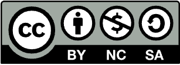

# License and attribution

[{ width="100" }](https://creativecommons.org/licenses/by-nc-sa/4.0/){target=_blank}

2026. [**Arizona Institute for Artificial Intelligence (AI2S)**](https://responsibleai.arizona.edu/ai2s){target=_blank}.
[**Office of Responsible Artificial Intelligence**](https://responsibleai.arizona.edu/){target=_blank}.
The University of Arizona.

The course authors publish *AI Automation and Agents* under the
[Creative Commons Attribution-NonCommercial-ShareAlike 4.0 International
license (CC BY-NC-SA 4.0)](https://creativecommons.org/licenses/by-nc-sa/4.0/){target=_blank}.
This is the notice that appears in the footer of every page of the source
wiki, and this site carries it in its own footer.

## What the license lets you do

Under CC BY-NC-SA 4.0 you may **share** (copy and redistribute in any medium
or format) and **adapt** (remix, transform and build upon) the course
material, provided that you:

- **Attribute** the work to its authors and the Arizona Institute for
  Artificial Intelligence, link to the license, and indicate if changes were
  made;
- use it for **non-commercial** purposes only;
- **share alike**: distribute any adaptation under the same license.

The full legal text is at
[creativecommons.org/licenses/by-nc-sa/4.0/legalcode](https://creativecommons.org/licenses/by-nc-sa/4.0/legalcode){target=_blank}.
Instructors at other institutions are welcome to reuse and adapt the modules
for their own non-commercial teaching under these terms.

## How to attribute

A suggested attribution line:

> *AI Automation and Agents* (v2), Arizona Institute for Artificial
> Intelligence (AI2S), Office of Responsible Artificial Intelligence, The
> University of Arizona, 2026. Licensed under CC BY-NC-SA 4.0.
> https://tyson-swetnam.github.io/AI-Automation-and-Agents/

When you reuse a single page, cite that page's URL; every page on this site
has a stable address and a Markdown source you can link to (append
`index.md` to the page URL).

## Authors

The course content was written by the AI2S course team. The page footers in
the source wiki credit **Carlos Lizárraga-Celaya** and **Michelle Yung** with
creation and updates; the wiki's git history also records contributions from
**Michele Cosi**. Each page's frontmatter on this site lists the wiki page it
came from and its last wiki change under `sources`, and the `authorship` key
carries the created/updated dates and initials from the original footer.

## Third-party material

The readings and reading guides summarise and quote works that keep their own
terms: the LangChain documentation, Wooldridge and Jennings' *Intelligent
Agents: Theory and Practice* (1995), vendor documentation for the frameworks
used in the labs, published standards such as the NIST AI RMF and the OWASP
Top 10 for LLM Applications, and the videos and articles linked from the
resource lists. Those remain the property of their authors and are cited
where they appear. The University of Arizona name, logo and wordmark are
trademarks of the University and are not covered by the Creative Commons
license.

## Two license statements

!!! warning "CC BY-NC-SA 4.0 (course footer) versus CC0 1.0 (repository LICENSE)"

    The `LICENSE` file at the root of the course repository - in this fork,
    in the upstream `UA-AI2S/AI-Automation-and-Agents` repository, and in the
    v2 repository - is **CC0 1.0 Universal** (public domain dedication), while
    the course authors' footer states **CC BY-NC-SA 4.0**. The two are not
    compatible: CC0 waives the attribution, non-commercial and share-alike
    conditions that CC BY-NC-SA imposes.

    This site follows the **authors' footer notice (CC BY-NC-SA 4.0)**, which
    is the statement the people who wrote the content chose and repeated on
    every wiki page. The `LICENSE` file has been left untouched pending a
    decision by the course owners, who will reconcile the two (either by
    changing `LICENSE` to CC BY-NC-SA 4.0 or by confirming CC0 and updating
    the footer). The conflict is recorded in the [update log](../log.md);
    when it is resolved this page and the site footer will be updated.

## The site itself

The site is built with [Zensical](https://zensical.org){target=_blank} and
structured as an [Open Knowledge Format (OKF) v0.2](https://github.com/GoogleCloudPlatform/knowledge-catalog/blob/main/okf/SPEC.md){target=_blank}
knowledge bundle; see [Contributing](contributing.md) for how it is
maintained and [For AI agents](ai-agents.md) for how machines should read it.
The conversion scripts in the repository's `scripts/` directory are
maintainer tooling, not course content.
