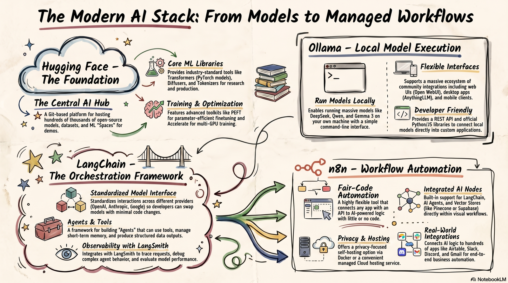

# Module 1 Overview (June 2026 Draft)

**Time:** 8 hours

!!! warning "Superseded"

    This page is kept for history. The current version is [Module 1 Overview: From Prompts to Pipelines](../../modules/module-1/overview.md).

{ width="900" }

## Introduction

Every powerful automation begins not with a tool, but with a question: what is actually happening in this workflow,
and where is the human effort most replaceable? Module 1 is intentionally tool-light. Before you touch Claude
Cowork, n8n, or any agent framework, you need a mental model that will make every subsequent module
coherent. This module builds that model.

We begin by defining what an AI agent is — precisely, not loosely — and distinguishing it from a chatbot, a script,
or a search engine. We trace the agent loop (perceive → plan → act → observe) that underlies every automated
system you will build in this course, from a simple Cowork file-organization task to a multi-agent LangGraph
workflow. We then survey the full automation landscape — from no-code tools like n8n to orchestration
frameworks like LangChain and CrewAI — so that you can see the whole map before we begin exploring
individual territories.

The module's anchor activity is the Workflow Audit: a structured analysis of three repetitive tasks from your own
work or studies. You will return to this audit in every subsequent module, progressively automating, connecting,
and refining the workflows you identify here. Begin it thoughtfully.

### Topics Covered

* What is an AI agent? Precise definitions: perception, planning, action, and observation
* The agent loop: perceive → plan → act → observe — illustrated with real examples
* Prompts vs. pipelines: why automation requires a different mindset than a single conversation
* The anatomy of a workflow: triggers, tasks, conditional logic, tools, and outputs
* Identifying automation candidates: high-repetition, rule-based, and time-consuming tasks
* Overview of the automation landscape: no-code (n8n, Cowork), low-code (LangChain), and code-first
(custom Python agents)
* Introduction to key open-source frameworks: LangChain, LangGraph, CrewAI, Ollama — what each does
and when to use it
* What agents can and cannot do: setting realistic expectations and avoiding common over-automation
mistakes
* Introduction to the Claude Desktop app: Chat, Cowork, and Code tabs explained
* Key vocabulary: agent, pipeline, trigger, tool call, MCP, RAG, sandbox, orchestration, and 15+ additional
terms

## Learning Objectives for Module 1

These objectives establish the conceptual vocabulary and representational schemas for the entire
course. They address the foundational definitions — what an AI agent is, how it reasons, and how
automation paradigms differ — that all subsequent applied work presupposes. In the self-paced
format, prior knowledge activation is accomplished through the diagnostic self-check embedded
in the Reading unit, ensuring learners connect new vocabulary to existing professional experience
before proceeding to lab activities.

!!! info "Tier I — Units 1–2 (~2 Hours)"

    **LO 1.1:** Define an AI agent and accurately distinguish it from a chatbot, an API call, a rule-based automation script, and a search engine; diagram the four-stage agent loop (perceive → plan → act → observe) with correctly labeled components and brief explanations of each stage's function.

    **LO 1.2**: Describe the three major automation paradigms — no-code (Claude Cowork, n8n), low-code (LangChain, CrewAI), and code-first (Claude Code, custom Python agents) — naming at least two representative tools per paradigm and explaining the primary trade-offs between paradigms on the dimensions of accessibility, flexibility, cost, and data governance.

    **Tier II — Units 3–4  (~4.5 Hours)**

    **LO 1.3:**  Operate the Claude Desktop application (or n8n Community Edition on the free-tier path) to complete a basic agentic task — including locating the Chat and Cowork interfaces, granting folder access, submitting a structured task instruction, and reviewing the agent's output — producing a documented Lab Log with screenshots as evidence of each completed step.

    **LO 1.4:** Install Ollama on a local machine and run three structured LLM interactions — a direct factual question, a multi-step reasoning prompt, and a question where the model should acknowledge uncertainty — completing a Model Behavior Observation form for each interaction that records the prompt, the model's response, an accuracy judgment, and a comparison to what an agent with tool access would do differently.

    **LO 1.5:** Decompose three real workflows from personal professional or academic practice using the provided Workflow Mapping Template — specifying trigger, minimum four sequential steps, tools and resources at each step, conditional branches where applicable, and the final output — producing workflow maps legible enough for another person to execute without requesting clarification.

    **LO 1.6:** Evaluate each of the three mapped workflows using the two-dimensional automation assessment framework — scoring each on rule-based specification degree (1–5) and consequence severity of errors (1–5) — to produce a scored assessment matrix, rank the workflows by automation potential with a written justification (minimum 100 words per workflow), and identify one workflow that is a poor automation candidate with an explanation of why.

    **Tier III — Unit 5  (~1 Hour)**

    **LO 1.7:** Complete a comparative analysis diagram contrasting the no-code, low-code, and code-first automation paradigms across six dimensions (primary tools, target user profile, setup effort, flexibility, cost, and data governance) and apply the completed framework to a provided workflow scenario — selecting the most appropriate paradigm with a written trade-off justification (minimum 150 words) that cites at least two specific dimensions as evidence.

    **Tier IV — Unit 6  (~0.5 Hour)**

    **LO 1.8:** Produce a two-part metacognitive Learning Journal entry — (a) identifying which of the five module-specific skills you feel most and least confident about, with specific evidence from module activities, and (b) connecting at least one module concept explicitly to a professional challenge in your own work context — and complete the Self-Assessment Checklist rating each skill as'achieved,' 'partially achieved,' or 'not yet achieved' with a brief evidence note.

## HANDS-ON PROJECT

!!! example "Your Workflow Audit"

    Identify three repetitive tasks from your actual job or studies that currently take more than 30 minutes per week. For each task, complete the workflow mapping worksheet: document the trigger (what starts it), the steps involved, the tools or files touched, and the final output.

    Assess each task on two dimensions: (1) how rule-based it is — can each step be precisely specified? — and (2) how high-stakes a mistake would be — what is the cost of an error? Rank all three tasks by automation potential.

    Write a 200-word reflection on which automation paradigm (no-code, low-code, or code-first) you believe is most appropriate for your top-ranked task, and why. You will return to this audit in every subsequent module.

### Curated Resources

* [5-Day AI Agents Intensive Course](https://www.kaggle.com/learn-guide/5-day-agents){target=_blank}. Google.
* [Building Effective Agents](https://www.anthropic.com/engineering/building-effective-agents){target=_blank}. Anthropic.
* [Building Effective Agents Cookbook - Jupyter Notebooks examples](https://github.com/anthropics/claude-cookbooks/tree/main/patterns/agents){target=_blank}. Anthropic. 
* [Claude Managed Agents overview](https://platform.claude.com/docs/en/managed-agents/overview){target=_blank}. Anthropic.
* [Hugging Face: Models, Spaces & Datasets](https://huggingface.co/){target=_blank}
* [Introduction to Agents](https://www.kaggle.com/whitepaper-introduction-to-agents){target=_blank}. Google.
* [LangChain: Introduction to Agents](https://docs.langchain.com/oss/javascript/langchain/agents){target=_blank}
* [n8n Official Documentation](https://docs.n8n.io/){target=_blank}
* [Ollama LLM Models](https://ollama.com/){target=_blank}
* [What is the Model Context Protocol (MCP)?](https://modelcontextprotocol.io/docs/getting-started/intro){target=_blank}. Anthropic.
* [YouTube: Guide to Agentic AI – Build a Python Coding Agent with Gemini](https://youtu.be/YtHdaXuOAks?si=056lozHd73-2RbIS){target=_blank}. freeCodeCamp.

Migrated from the [course wiki](https://github.com/UA-AI2S/AI-Automation-and-Agents-v2/wiki/Module-1:-Overview2){target=_blank} (wiki page last changed 2026-07-14). Spotted a problem? [Edit this page](https://github.com/tyson-swetnam/AI-Automation-and-Agents/edit/main/docs/archive/module-1/overview-draft-2026-06.md){target=_blank}.

