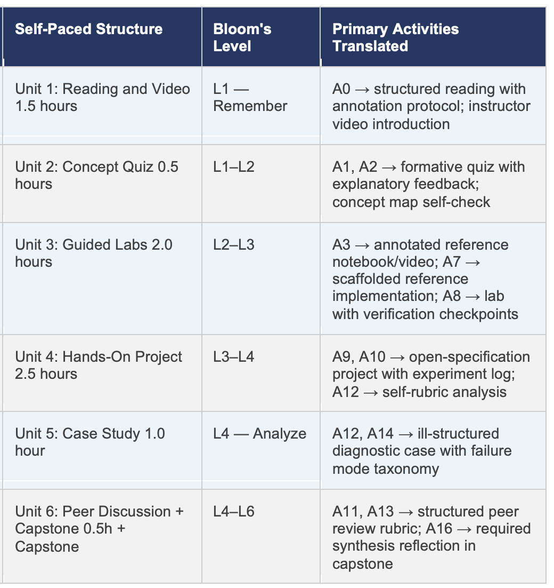
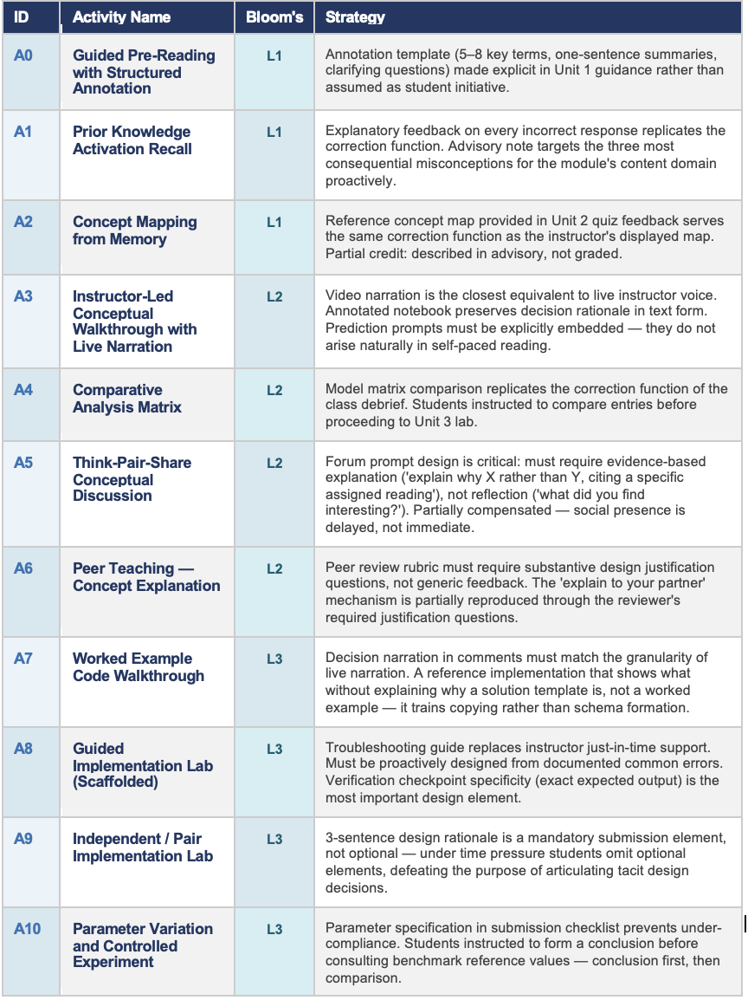
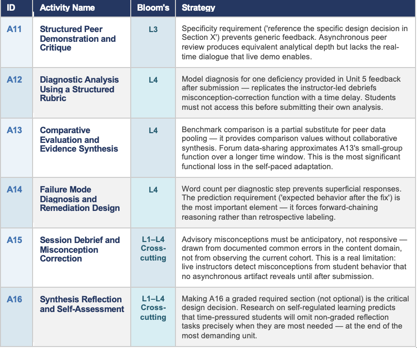
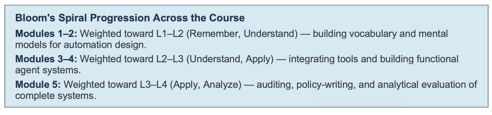

# Formal Learning Design

## Standard Activity Structure per Module (Bloom's Taxonomy)

Each module is structured to develop cognitive competencies across Bloom's Taxonomy Levels 1–4, from
foundational recall to analytical reasoning. The following activity types are present in every module, yielding
approximately 8 hours of instructional engagement per module.

{ width="600" }

{ width="800" }

{ width="800" }

{ width="800" }

## General Skills of the Course

The five General Course Skills represent transferable professional competencies developed cumulatively across all five modules.

These five skills represent the course’s terminal professional competencies. They are progressively developed across Modules 1–5 and should be treated as program-level outcomes against which the entire course is evaluated. Each is grounded in the AI literacy and instructional design literature.

!!! abstract "General course competencies"

    **1. AI Systems Reasoning and Computational Thinking**
    The capacity to decompose complex AI workflows into structured, traceable sequences of perception, deliberation, and action; to model agent behavior formally; and to reason systematically about the computational processes underlying intelligent system outputs. Students possessing this skill treat AI systems not as opaque black boxes but as tractable computational structures amenable to principled design, rigorous analysis, and transparent critique.

    **2. Critical Evaluation of AI Frameworks and Tools**
    The ability to independently assess, compare, and select appropriate AI libraries, model families, and architectural patterns based on empirically grounded criteria: task requirements, performance benchmarks, deployment constraints, cost profiles, and community maintenance status. This skill requires both technical acuity and epistemological discipline — resisting vendor-driven narratives in favor of evidence-based judgment.

    **3. Responsible and Ethical AI Design**
    Competency in proactively identifying potential risks, systemic biases, and unintended societal consequences embedded in AI agent systems, and in applying established normative principles (fairness, transparency, accountability, human oversight, privacy) to mitigate them across the full design lifecycle. This skill situates technical decisions within broader sociotechnical contexts, recognizing that AI systems are not ethically neutral artifacts.

    **4. Technical Implementation of AI Automation Pipelines**
    The practical ability to design, build, test, debug, and iteratively refine functional AI agent workflows using current industry frameworks (LangChain, LangGraph, OpenAI function calling), applying software engineering best practices throughout: modular design, version control, reproducibility, and systematic testing. Graduates will be capable of translating abstract agent architectures into deployable, maintainable systems.

## Module 1 Specific Skills
These five skills are the observable, assessable competencies that Module 1 is specifically designed to develop.
They are the prerequisite sub-skills for all subsequent modules. Each is narrower and more immediately
measurable than the general course skills; a learner who cannot demonstrate these five skills at the end of
Module 1 is not yet ready to engage with Modules 2–5.

| Skill | Description |
| :-- | :-- |
| **1.1 Agent Architecture Comprehension**  **Bloom's Level:** *Remember, Understand (Levels 1–2)* | The student can accurately define an AI agent — distinguishing it precisely from a chatbot, an API call, a rule-based script, and a search engine — and diagram the four-stage agent loop (perceive → plan → act → observe) with correctly labeled components. The student can apply this mental model to classify real-world AI system descriptions as agent-based or non-agent-based. |
| **1.2 Workflow Decomposition And Mapping**  **Bloom's Level:** *Understand, Apply (Levels 2–3)* | The student can systematically decompose any multi-step workplace or academic process into its canonical components using the provided workflow mapping template: trigger (what initiates the process), sequential steps, tools and resources required at each step, conditional branches (if any), and the final output or deliverable. The resulting workflow map is legible, complete, and unambiguous enough to be executed by another person. |
| **1.3 Automation Opportunity Assessment** **Bloom's Level:** *Apply (Level 3 approaching Level 4)* | The student can evaluate a candidate workflow against two independent scoring dimensions — degree of rule-based specification and consequence severity of errors — producing a two-dimensional assessment score that justifies a rank-ordering of automation potential. The student can articulate the reasoning behind each score in writing, using the vocabulary of the course (rule-based, high-stakes, reversibility, blast radius). |
| **1.4 Automation Paradigm Classification**  **Bloom's Level:** *Understand Level 2 (with Level 4 Analyze in comparative reflection)* | The student can describe and distinguish the three major automation paradigms — no-code (n8n, Claude Cowork), low-code (LangChain, CrewAI), and code-first (custom Python agents, Claude Code) — by naming representative tools, describing the primary user interaction model for each, identifying the target user profile, and explaining the trade-offs between paradigms on the dimensions of accessibility, flexibility, cost, and data governance. |
| **1.5 Metacognitive Reflection On Professional Practice**  **Bloom's Level:** *Understand, Apply (Levels 2–3)* | The student can apply structured self-observation strategies to their own professional or academic context, identifying repetitive, time-consuming, or rule-based tasks that are viable automation candidates. The student can estimate the time cost and risk profile of each identified task with sufficient specificity to serve as the basis for subsequent module projects. This skill operationalizes Zimmerman's self-regulated learning theory in the professional automation context. |

## Module 2 Specific Skills

The five skills below are the targeted learning outcomes specific to Module 2. They are positioned at
the intersection of the course-wide competency framework and the substantive content of this module
(agent reasoning architectures and tool integration). Each skill is mapped to the relevant cognitive
level of Bloom's Revised Taxonomy.

| Skill | Description |
| :-- | :-- |
| **2.1 Reasoning Architecture Analysis Bloom’s Level:** *Analyze (Level 4)* | The ability to compare and contrast foundational LLM reasoning paradigms — including Chain-of-Thought, ReAct, Tree of Thoughts, and Language Agent Tree Search — along operationally defined evaluation criteria: computational cost (token budget), task accuracy on structured benchmarks, susceptibility to hallucination, and suitability to different problem topologies (linear, branching, iterative). |
| **2.2 Tool-Integrated Agent Pipeline Construction Bloom’s Level:** *Apply (Level 3)* | Competency in configuring and implementing multi-tool agent pipelines using LangChain's AgentExecutor and tool registry, including the authoring of precise tool descriptions that enable reliable LLM tool selection, implementation of error-handling patterns for failed or malformed tool invocations, and integration of heterogeneous tool types (retrieval, computation, API call, code execution) within a single agent workflow. |
| **2.3 Reasoning Trace Interpretation and Critique Bloom’s Level:** *Analyze / Evaluate (Levels 4-5)* | Skill in reading, annotating, and systematically evaluating agent reasoning traces — the explicit textual records of an agent's thought-action-observation cycle — using a structured evaluation rubric. Students will identify logical gaps, reasoning loops, hallucinated tool calls, premature termination, and sub-optimal action sequencing. |
| **2.4 Prompt Engineering for Agent Behavioral Control Bloom’s Level:** *Apply / Create (Levels 3-6)* | The ability to design, iteratively test, and systematically refine prompt components that govern agent behavior: system-level instructions, tool descriptions, few-shot demonstration examples, chain-of-thought scaffolds, and output format constraints. Students will apply evidence-based prompt engineering principles drawn from current research literature and apply them in controlled experimentation to achieve reliable, goal-directed agent outputs. |
| **2.5 Architectural Trade-off Assessment for Production Deployment Bloom’s Level:** *Evaluate / Create (Levels 5-6)* | Competency in systematically evaluating the practical trade-offs of architectural design choices when specifying production-ready AI agent systems: latency and throughput under load, cost per inference at scale, reliability and robustness under adversarial or out-of-distribution inputs, scalability requirements, interpretability for regulatory compliance (e.g., EU AI Act), and integration with existing organizational infrastructure. |

## Module 3 Specific Skills

The five competencies below are the targeted skill outcomes for Module 3. Each is mapped to the
relevant cognitive level of Bloom's Revised Taxonomy. Together these skills
advance the five General Course Skills, contributing differentiated module-level evidence toward the course-wide competency portfolio.

| Skill | Description |
| :-- | :-- |
| **3.1 Vector Embedding and Semantic Retrieval Bloom’s Level:** *Apply (Level 3)* | The ability to implement text embedding pipelines using pre-trained models (OpenAI Ada-002, sentence-transformers), configure vector stores (FAISS, Chroma, Pinecone), and execute similarity and maximum marginal relevance (MMR) searches to retrieve contextually relevant document chunks for agent augmentation. |
| **3.2 RAG Pipeline Design and Configuration Bloom’s Level:** *Apply / Evaluate (Levels 3-5)* | Competency in architecting and implementing end-to-end Retrieval-Augmented Generation workflows: document loading, text splitting with optimal chunk size and overlap, embedding generation, vector store ingestion, retrieval configuration, and generation with retrieved context. Students will apply established RAG design patterns (naive RAG, advanced RAG, modular RAG) and justify their architectural choices. |
| **3.3 Conversational Memory Management Bloom’s Level:** *Apply / Analyze (Levels 3-4)* | The ability to select, configure, and evaluate the appropriate memory type —ConversationBufferMemory, ConversationSummaryMemory, ConversationEntityMemory, or VectorStoreRetrieverMemory — for a given conversational agent context, balancing context fidelity, token budget, and retrieval latency. Students will demonstrate correct integration of memory modules with LangChain's ConversationChain and LangGraph's state schema. |
| **3.4 Context Window Optimization and Token Budget Management Bloom’s Level:** *Analyze / Evaluate (Levels 4-5)* | Skill in managing the finite context window of LLM backbones through intelligent design of chunking strategies (fixed-size, recursive, semantic, sentence-window), retrieval filtering (metadata filters, re-ranking), context compression (LLMLingua, contextual compression), and dynamic prompt construction. Students will measure the impact of optimization decisions on retrieval quality and generation coherence. |
| **3.5 RAG System Quality Evaluation Bloom’s Level:** *Evaluate / Create (Levels 5-6)* | Competency in designing and executing structured evaluation protocols for RAG systems using the RAGAS framework (faithfulness, answer relevance, context precision, context recall) and human evaluation rubrics. Students will interpret metric results, identify failure modes — hallucination, retrieval failure, context irrelevance — and implement targeted remediation strategies informed by empirical evidence. |

## Module 4 Specific Skills

The five competencies below are the targeted skill outcomes for Module 4. Each is mapped to the
relevant cognitive level of Bloom's Revised Taxonomy. Together these skills
advance the five General Course Skills, contributing differentiated module-level evidence toward the course-wide competency portfolio.

| Skill | Description |
| :-- | :-- |
| **4.1 Multi-Agent Architecture Pattern Recognition and Selection Bloom’s Taxonomy:** *Analyze / Evaluate (Levels 4-5)* | The ability to identify, classify, and justify the selection of multi-agent coordination architectures — hierarchical supervisor-worker, peer collaboration, role-based sequential pipeline, and market-mechanism allocation — based on task decomposability, interdependency structure, coordination overhead, and failure tolerance requirements. Students will apply defined selection criteria to novel task specifications and defend their architectural choices with explicit reasoning. |
| **4.2 Agent Role Specialization and Interface Design Bloom’s Taxonomy:** *Apply / Create (Levels 3-6)* | Competency in decomposing complex, multi-step tasks into a minimal set of specialized agent roles with clearly defined responsibilities, and in specifying the input-output interfaces through which agents communicate. Students will apply task decomposition principles drawn from software engineering (modular design, separation of concerns) and cognitive science (distributed cognition, Hutchins, 1995) to produce role specifications that minimize coordination overhead while maximizing agent specialization. |
| **4.3 Orchestration Framework Implementation Bloom’s Taxonomy:** *Apply (Level 3)* | Skill in implementing functional multi-agent workflows using at least one current orchestration framework — LangGraph multi-agent patterns, AutoGen, or CrewAI — demonstrating correct agent instantiation, inter-agent message passing, task delegation, and workflow termination. Students will instrument their implementations with logging to observe actual coordination behavior and diagnose deviations from the intended workflow specification. |
| **4.4 Multi-Agent Coordination Failure Analysis and Remediation Bloom’s Taxonomy:** *Analyze / Evaluate (Levels 4-5)* | The ability to systematically identify and remediate the characteristic failure modes of multi-agent systems: task duplication (multiple agents performing the same sub-task), coordination deadlock (agents awaiting outputs that are never produced), contradictory outputs (agents producing conflicting results without resolution), and communication bottlenecks (excessive inter-agent messaging degrading throughput). Students will apply structured diagnostic protocols and implement targeted architectural interventions. |
| **4.5 Multi-Agent System Performance Evaluation Bloom’s Taxonomy:** *Evaluate / Create (Levels 5-6)* | Competency in designing and executing comparative evaluations of multi-agent systems against single-agent baselines on complex, decomposable tasks, measuring task accuracy, total token consumption, wall-clock latency, and coordination overhead. Students will develop evidence-based criteria for determining when multi-agent orchestration adds demonstrable value and when it introduces unnecessary complexity — a critical practical judgment for production system design. |

## Module 5 Specific Skills

The five competencies below are the targeted skill outcomes for Module 5. Each is mapped to the
relevant cognitive level of Bloom's Revised Taxonomy. Together these skills
advance the five General Course Skills, contributing differentiated module-level evidence toward the course-wide competency portfolio.

| Skill | Description |
| :-- | :-- |
| **5.1 Production Infrastructure Design for AI Agent Systems Bloom’s Taxonomy:** *Apply / Analyze (Levels 3-4)* | Competency in specifying the infrastructure architecture required to operate AI agent systems reliably at production scale: containerization and orchestration (Docker, Kubernetes), API gateway patterns, asynchronous task queuing, response caching, autoscaling policies, and latency SLA management. Students will translate an agent prototype into a production deployment specification, identifying the infrastructure components required at each tier of the architecture. |
| **5.2 Systematic AI Agent Evaluation Framework Design Bloom’s Taxonomy:** *Apply / Evaluate (Levels 3-5)* | The ability to design and execute multi-dimensional evaluation frameworks for AI agent systems spanning: task performance accuracy (exact match, F1, LLM-as-judge), instruction-following fidelity, tool use precision and recall, safety behavior under adversarial prompts, and user experience quality. Students will develop evaluation test suites that separate capability assessment from safety assessment, and will implement automated evaluation pipelines that run on every model or prompt update. |
| **5.3 Observability and Production Monitoring Implementation Bloom’s Taxonomy:** *Apply (Level 3)* |Skill in instrumenting AI agent systems with full-stack observability tooling — including LangSmith or LangFuse for LLM-specific tracing, OpenTelemetry for distributed tracing, and custom dashboards for token usage, latency distribution, error rates, and cost tracking — and in using observability data to diagnose performance regressions and inform system improvements. |
| **5.4 Responsible AI Risk Assessment and Mitigation Bloom’s Taxonomy:** *Analyze / Evaluate / Create (Levels 4-6)* | Competency in applying structured risk assessment methodologies — the EU Artificial Intelligence Act risk classification framework and the NIST AI Risk Management Framework's GOVERN-MAP-MEASURE-MANAGE cycle — to identify, classify, quantify, and develop mitigation strategies for risks embedded in AI agent deployments. Students will produce risk registers and mitigation plans that are technically grounded, legally aware, and ethically coherent. |
| **5.5 AI System Documentation and Governance Artifact Production Bloom’s Taxonomy:** *Apply / Create (Levels 3-6)* | The ability to produce the complete set of governance documentation artifacts required for responsible AI system deployment: system cards (Mitchell et al., 2019), model cards, data provenance and lineage documentation, algorithmic impact assessments, incident response plans, and user-facing transparency notices. Students will apply established templates and governance standards, situating technical documentation within broader organizational accountability structures. |

## Academic References

* Anderson, L. W., & Krathwohl, D. R. (Eds.). (2001). A taxonomy for learning, teaching, and assessing: A revision of Bloom's
Taxonomy of educational objectives. Longman.

* Ausubel, D. P. (1968). Educational psychology: A cognitive view. Holt, Rinehart & Winston.
* Black, P., & Wiliam, D. (1998). Assessment and classroom learning. Assessment in Education: Principles, Policy & Practice,
5(1), 7–74. https://doi.org/10.1080/0969595980050102

* Collins, A., Brown, J. S., & Newman, S. E. (1989). Cognitive apprenticeship: Teaching the crafts of reading, writing, and
mathematics. In L. B. Resnick (Ed.), [Knowing, learning, and instruction: Essays in honor of Robert Glaser (pp. 453–494)](https://apps.dtic.mil/sti/tr/pdf/ADA178530.pdf){target=_blank}. Lawrence Erlbaum Associates.

* Craik, F. I. M., & Lockhart, R. S. (1972). Levels of processing: A framework for memory research. Journal of Verbal Learning
and Verbal Behavior, 11(6), 671–684. https://doi.org/10.1016/S0022-5371(72)80001-X

* Flavell, J. H. (1979). [Metacognition and cognitive monitoring: A new area of cognitive-developmental inquiry](https://corepractice-linlithgowacademy.co.uk/_documents/%5B1060731%5Dflavell1979MetacognitionAndCogntiveMonitoring.pdf){target=_blank}. American
Psychologist, 34(10), 906–911. https://doi.org/10.1037/0003-066X.34.10.906

* Floridi, L., Cowls, J., Beltrametti, M., Chatila, R., Chazerand, P., Dignum, V., Lukovits, C., Madelin, R., Pagallo, U., Rossi, F.,
Schafer, B., Valcke, P., & Vayena, E. (2018). AI4People — An ethical framework for a good AI society: Opportunities, risks,
principles, and recommendations. Minds and Machines, 28(4), 689–707. https://doi.org/10.1007/s11023-018-9482-5

* Gagne, R. M., Briggs, L. J., & Wager, W. W. (1992). Principles of instructional design (4th ed.). Harcourt Brace Jovanovich.
* Garrison, D. R., Anderson, T., & Archer, W. (2000). Critical inquiry in a text-based environment: Computer conferencing in
higher education. The Internet and Higher Education, 2(2–3), 87–105. https://doi.org/10.1016/S1096-7516(00)00016-6

* Kolb, D. A. (1984). Experiential learning: Experience as the source of learning and development. Prentice Hall.
* Long, D., & Magerko, B. (2020). What is AI literacy? Competencies and design considerations. Proceedings of the 2020 CHI
Conference on Human Factors in Computing Systems (pp. 1–16). ACM. https://doi.org/10.1145/3313831.3376727

* Mayer, R. E. (2009). Multimedia learning (2nd ed.). Cambridge University Press.
* Merrill, M. D. (2002). First principles of instruction. Educational Technology Research and Development, 50(3), 43–59.
https://doi.org/10.1007/BF02505024

* National Institute of Standards and Technology. (2023). AI risk management framework (AI RMF 1.0). U.S. Department of
Commerce. https://doi.org/10.6028/NIST.AI.100-1

* Ng, D. T. K., Leung, J. K. L., Chu, S. K. W., & Qiao, M. S. (2021). Conceptualizing AI literacy: An exploratory review. Computers
and Education: Artificial Intelligence, 2, 100041. https://doi.org/10.1016/j.caeai.2021.100041

* Novak, J. D. (1990). Concept mapping: A useful tool for science education. Journal of Research in Science Teaching, 27(10),
937–949. https://doi.org/10.1002/tea.3660271003

* Roediger, H. L., & Karpicke, J. D. (2006). Test-enhanced learning: Taking memory tests improves long-term retention.
Psychological Science, 17(3), 249–255. https://doi.org/10.1111/j.1467-9280.2006.01693.x

* Schön, D. A. (1983). The reflective practitioner: How professionals think in action. Basic Books.
* Swan, K., Garrison, D. R., & Richardson, J. C. (2009). A constructivist approach to online learning: The Community of Inquiry
framework. In C. R. Payne (Ed.), Information technology and constructivism in higher education: Progressive learning
frameworks (pp. 43–57). IGI Global.

* Sweller, J. (1988). Cognitive load during problem solving: Effects on learning. Cognitive Science, 12(2), 257–285.
https://doi.org/10.1207/s15516709cog1202_4

* Sweller, J. (1994). Cognitive load theory, learning difficulty, and instructional design. Learning and Instruction, 4(4), 295–312.
https://doi.org/10.1016/0959-4752(94)90003-5

* Vygotsky, L. S. (1978). Mind in society: The development of higher psychological processes. Harvard University Press.
* Wiggins, G., & McTighe, J. (2005). Understanding by design (2nd ed.). ASCD.
Wing, J. M. (2006). Computational thinking. Communications of the ACM, 49(3), 33–35.
https://doi.org/10.1145/1118178.1118215

* Wooldridge, M., & Jennings, N. R. (1995). Intelligent agents: Theory and practice. The Knowledge Engineering Review, 10(2),
115–152. https://doi.org/10.1017/S0269888900008122

* Zimmerman, B. J. (2002). Becoming a self-regulated learner: An overview. Theory Into Practice, 41(2), 64–70.
https://doi.org/10.1207/s15430421tip4102_2

Migrated from the [course wiki](https://github.com/UA-AI2S/AI-Automation-and-Agents-v2/wiki/Formal-Learning-Design-Information){target=_blank} (wiki page last changed 2026-07-14). Spotted a problem? [Edit this page](https://github.com/tyson-swetnam/AI-Automation-and-Agents/edit/main/docs/course-design/learning-design.md){target=_blank}.

