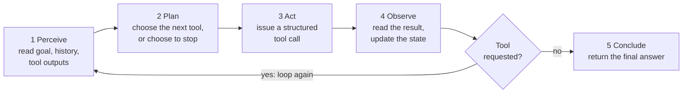
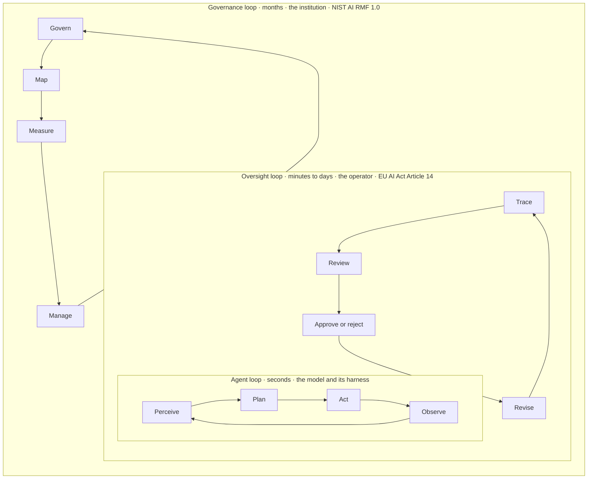

# Guest Lecture: Agentic AI Loops

*Estimated time: ~75 min as delivered (about 40 min on your own)*

**Sequence, selection, iteration.** This is Tyson Swetnam's Fall 2026 guest
lecture for UNM's *Ethical AI for Autonomous Systems* course, part of the
[RAISE](https://raise.unm.edu/){target=_blank} NSF Research Traineeship.
The audience builds robots, vehicles and swarms and already thinks in control
loops, so the lecture makes one argument: an AI agent is a loop, the three
structures of structured programming are still the right questions to ask of
it, and what has changed is *who writes them*.

It draws on this course (Modules 1, 2, 4 and 5), the
[GPT 101 workshop](https://tyson-swetnam.github.io/intro-gpt/){target=_blank}
and [Awesome Open Science](https://tyson-swetnam.github.io/awesome-open-science/){target=_blank},
and ends with 36 numbered references.

[Open the lecture full screen](../materials/guest-lectures/agentic-ai-loops.html){ .md-button .md-button--primary target=_blank }
[Download the slides (PDF)](../assets/files/Agentic-AI-Loops-Guest-Lecture.pdf){ .md-button target=_blank }

<iframe class="course-embed course-embed--slides" src="../materials/guest-lectures/agentic-ai-loops.html" title="Agentic AI Loops lecture slides" loading="lazy" allow="fullscreen" allowfullscreen></iframe>

!!! tip "Driving the slides"

    Click inside the slides first, then use ++arrow-right++ and ++arrow-left++
    (or ++space++) to move, ++home++ and ++end++ to jump to either end, ++n++
    for the speaker notes and ++f++ for full screen. On a touch screen, swipe.
    The menu in the toolbar jumps to any slide, every bracketed citation is a
    link to its source, and each slide has its own address (for example
    `agentic-ai-loops.html#agent-loop`), so you can link to one. The file is
    self-contained: fonts and images are embedded and it makes no network
    requests, so it also works offline.

## The argument in one table

The structured program theorem (Böhm and Jacopini, 1966) says three control
structures are enough to write any program. Dijkstra's case for using only
those three was about people: a program built from them is one a person can
reason about by reading it. Agents still have all three. The author changed.

| Structure | In a program you wrote | In an agent at run time |
| :-- | :-- | :-- |
| **Sequence** | Statements in the order you typed them | Plan steps the model composes, appended to a growing message state |
| **Selection** | `if` and `else` on a predicate you can read and test | The model picks a tool, or a branch, from natural-language descriptions |
| **Iteration** | A loop whose exit condition you wrote | The loop ends when the model stops asking for tools, or a step cap fires |

Every ethics topic in the lecture is one of those three rows: fairness is
about selection learned from data, runaway agents are about iteration without
an exit condition, and accountability is about who can still read the
sequence afterwards.

=== "Sequence"

    Statements run one after another, in the exact order they are written.

    ```python
    read_sensor()
    estimate_state()
    send_command()
    ```

    **In an agent:** the message state. Every tool call and every observation
    is appended in order, and each pass of the loop sees all of it. Chain-of-
    Thought prompting is a sequence too: one linear chain with no
    backtracking, so an early error compounds.

=== "Selection"

    Conditionals: the ability to make a decision in code with `if` and `else`.

    ```python
    if obstacle_ahead:
        brake()
    else:
        cruise()
    ```

    **In an agent:** the plan step. The model reads the tool descriptions and
    names one tool, or none. Selection becomes a reading-comprehension task,
    which is why description quality is the largest determinant of reliable
    tool use, and why a human approval gate is itself a selection statement
    that somebody has to design.

=== "Iteration"

    Loops: repeat a block of code until a condition says stop.

    ```python
    while not at_goal:
        step()
    ```

    **In an agent:** repeat until the model requests no tool. The only hard
    stop is a step cap that you set. In the MAST study of multi-agent
    failures, step repetition, not knowing the termination condition and
    premature termination together make up about a third of all observed
    failures.

## The agent loop

The loop is the same family as the ones autonomous-systems engineers already
build (feedback control, sense-plan-act, OODA, MAPE-K). What is new is the
component doing the planning.



Module 1's [foundational concepts](../modules/module-1/foundational-concepts.md)
define the four stages, and Module 2's
[foundational concepts](../modules/module-2/foundational-concepts.md) show
the runtime behind them, including the rule that stops the loop.

## Three nested loops

The lecture closes on this picture. Each loop needs its own exit condition,
and each outer loop must be able to stop the one inside it.



The July 2026 OpenAI and Hugging Face incident, covered in Part 3, is what it
looks like when the inner loop runs for weeks and the outer two never fire.

## Lecture outline

Each link opens the slides at that point.

| Part | Slides | What it covers | In this course |
| :-- | :-- | :-- | :-- |
| [Opening](../materials/guest-lectures/agentic-ai-loops.html#cover) | 1-4 | The scale of the AI buildout, and where agents meet RAISE's four research themes | [How this course works](../start-here/how-this-course-works.md) |
| [Part 1: Three structures](../materials/guest-lectures/agentic-ai-loops.html#p1) | 5-8 | The structured program theorem, the loops you already know, and who writes the control flow | [Module 1](../modules/module-1/index.md) |
| [Part 2: The agent loop](../materials/guest-lectures/agentic-ai-loops.html#p2) | 9-16 | What counts as an agent; model, agent, harness, protocol; reasoning paradigms as control structures; tools and MCP; five levels of autonomy | [Module 1](../modules/module-1/foundational-concepts.md), [Module 2](../modules/module-2/foundational-concepts.md) |
| [Discussion 1](../materials/guest-lectures/agentic-ai-loops.html#d1) | 17-18 | Find the loop condition in a system you work on | |
| [Part 3: Loops of loops](../materials/guest-lectures/agentic-ai-loops.html#p3) | 19-24 | Four ways agents coordinate, why multi-agent systems fail (MAST), the July 2026 incident and its lessons, AI sandboxes | [Module 4](../modules/module-4/foundational-concepts.md) |
| [Part 4: Closing the loop](../materials/guest-lectures/agentic-ai-loops.html#p4) | 25-31 | Hallucination as an engineering problem, the human gate, the OWASP Top 10 for agentic applications, machine-readable knowledge, three nested loops, accountability | [Module 5](../modules/module-5/foundational-concepts.md) |
| [Discussion 2 and close](../materials/guest-lectures/agentic-ai-loops.html#d2) | 32-35 | Design the gate; where to keep learning; compute at CARC | [Module 5 activities](../modules/module-5/activities.md) |
| [References](../materials/guest-lectures/agentic-ai-loops.html#refs-1) | 36-38 | 36 sources, numbered in order of first citation | |

## Discussion prompts

Use these with a class, a reading group, or on your own. They have no answer
key: the point is the argument you make.

??? question "Discussion 1: Find the loop condition"

    Work in pairs first, then bring it to the room.

    1. Pick an autonomous system you work on. Where are its sequence, its
       selection and its iteration written down today?
    2. Which of the three would you hand to a language model first? Which one
       never?
    3. What stops the loop: a condition you wrote, a step cap, or a person?

    *For facilitators:* push on question 3. For most deployed agents the
    honest answer is that the model decides when it is done, with a step cap
    as the backstop. Ask what the equivalent would be for a vehicle, a grid
    or a swarm.

??? question "Discussion 2: Design the gate"

    Pick one RAISE setting: a drone swarm, a smart grid, or a spacecraft
    beyond real-time contact.

    1. Which actions are irreversible, and who may approve them?
    2. What must the reviewer see: the output, the trace, the sources, the
       confidence?
    3. The loop runs faster than a person can review. What do you change?
    4. Who is accountable when the gate is skipped?

    *For facilitators:* question 3 is the crux for space and defense
    autonomy. If the loop is faster or farther away than a person, the gate
    has to move from run time to design time: constraints, envelopes and
    pre-approved action sets instead of approvals.

## Reusing the lecture

The slides, this page and the PDF are licensed
[CC BY 4.0](../about/license-and-attribution.md) like the rest of the course.
The HTML file is a single self-contained document, so you can download it and
present from it without a network connection. Six slides are reused from
Tyson Swetnam's MESA talk at the NCEMS Annual Summit (August 2026); MESA is
supported by the U.S. National Science Foundation under Award #2632685.

## References

Numbered in order of first citation on the slides, in PLOS style. The last
three slides carry the same list with the slide numbers that cite each entry.

1. Federal Highway Administration. Highway statistics series. Washington: US Department of Transportation. Available from: [fhwa.dot.gov/policyinformation/statistics.cfm](https://www.fhwa.dot.gov/policyinformation/statistics.cfm){target=_blank}
2. Epoch AI. AI capital expenditure. Data insights. Available from: [epoch.ai/data-insights/ai-capex](https://epoch.ai/data-insights/ai-capex){target=_blank}
3. NASA History Office. NASA history. Available from: [nasa.gov/history](https://www.nasa.gov/history/){target=_blank}
4. Gartner. Gartner forecasts worldwide AI spending to grow 47 percent in 2026 \[press release\]. 2026 May 19. Available from: [gartner.com/en/newsroom](https://www.gartner.com/en/newsroom/press-releases/2026-05-19-gartner-forecasts-worldwide-ai-spending-to-grow-47-percent-in-2026){target=_blank}
5. Moorhouse F. \[Chart comparing AI data-center spending with historical megaprojects; post on X\]. 2026. Available from: [x.com/finmoorhouse/status/2044933442236776794](https://x.com/finmoorhouse/status/2044933442236776794){target=_blank}
6. RAISE: Responsive and Resilient AI for Autonomous Systems Engineering. Research. University of New Mexico. Available from: [raise.unm.edu/research](https://raise.unm.edu/research/index.html){target=_blank}
7. Böhm C, Jacopini G. Flow diagrams, Turing machines and languages with only two formation rules. Commun ACM. 1966;9(5):366–371. [doi:10.1145/355592.365646](https://doi.org/10.1145/355592.365646){target=_blank}
8. Dijkstra EW. Go to statement considered harmful. Commun ACM. 1968;11(3):147–148. [doi:10.1145/362929.362947](https://doi.org/10.1145/362929.362947){target=_blank}
9. Boyd JR. The essence of winning and losing \[unpublished briefing\]. 1996. Available from: [slightlyeastofnew.com](https://slightlyeastofnew.com/wp-content/uploads/2010/03/essence_of_winning_losing.pdf){target=_blank}
10. Kephart JO, Chess DM. The vision of autonomic computing. Computer. 2003;36(1):41–50. [doi:10.1109/MC.2003.1160055](https://doi.org/10.1109/MC.2003.1160055){target=_blank}
11. Center for Advanced Research Computing, University of New Mexico. AI Automation and Agents \[online course\]. 2026. Developed at the Arizona Institute for Artificial Intelligence, University of Arizona. CC BY 4.0. Available from: [tyson-swetnam.github.io/AI-Automation-and-Agents](https://tyson-swetnam.github.io/AI-Automation-and-Agents/){target=_blank}
12. Wooldridge M, Jennings NR. Intelligent agents: theory and practice. Knowl Eng Rev. 1995;10(2):115–152. [doi:10.1017/S0269888900008122](https://doi.org/10.1017/S0269888900008122){target=_blank}
13. Swetnam TL. MESA: Multidisciplinary Environment for Scientific Advancement. NCEMS Annual Summit; 2026 Aug. Available from: [idss-mesa.github.io](https://idss-mesa.github.io/){target=_blank}
14. Model Context Protocol. Specification and documentation. Available from: [modelcontextprotocol.io](https://modelcontextprotocol.io/){target=_blank}
15. LangChain. Agents. LangChain documentation. Available from: [docs.langchain.com/oss/python/langchain/agents](https://docs.langchain.com/oss/python/langchain/agents){target=_blank}
16. Wei J, Wang X, Schuurmans D, Bosma M, Ichter B, Xia F, et al. Chain-of-thought prompting elicits reasoning in large language models. Adv Neural Inf Process Syst. 2022;35:24824–24837. Available from: [proceedings.neurips.cc](https://proceedings.neurips.cc/paper_files/paper/2022/file/9d5609613524ecf4f15af0f7b31abca4-Paper-Conference.pdf){target=_blank}
17. Yao S, Zhao J, Yu D, Du N, Shafran I, Narasimhan K, et al. ReAct: synergizing reasoning and acting in language models. [arXiv:2210.03629](https://arxiv.org/abs/2210.03629){target=_blank} \[Preprint\]. 2022.
18. Yao S, Yu D, Zhao J, Shafran I, Griffiths TL, Cao Y, et al. Tree of thoughts: deliberate problem solving with large language models. Adv Neural Inf Process Syst. 2023;36:11809–11822. Available from: [proceedings.neurips.cc](https://proceedings.neurips.cc/paper_files/paper/2023/file/271db9922b8d1f4dd7aaef84ed5ac703-Paper-Conference.pdf){target=_blank}
19. Zhou A, Yan K, Shlapentokh-Rothman M, Wang H, Wang YX. Language agent tree search unifies reasoning, acting, and planning in language models. [arXiv:2310.04406](https://arxiv.org/abs/2310.04406){target=_blank} \[Preprint\]. 2023.
20. UNM Center for Advanced Research Computing. GPT 101: a workshop on generative AI and prompt engineering. 2026. CC BY 4.0. Available from: [tyson-swetnam.github.io/intro-gpt](https://tyson-swetnam.github.io/intro-gpt/){target=_blank}
21. OWASP GenAI Security Project. OWASP Top 10 for Agentic Applications for 2026. Available from: [genai.owasp.org](https://genai.owasp.org/resource/owasp-top-10-for-agentic-applications-for-2026/){target=_blank}
22. SAE International. Taxonomy and definitions for terms related to driving automation systems for on-road motor vehicles. Standard J3016_202104. 2021. Available from: [sae.org/standards/content/j3016_202104](https://www.sae.org/standards/content/j3016_202104/){target=_blank}
23. Stone P, Veloso M. Multiagent systems: a survey from a machine learning perspective. Auton Robots. 2000;8(3):345–383. [doi:10.1023/A:1008942012299](https://doi.org/10.1023/A:1008942012299){target=_blank}
24. Cemri M, Pan MZ, Yang S, Agrawal LA, Chopra B, Tiwari R, et al. Why do multi-agent LLM systems fail? Adv Neural Inf Process Syst. 2025;38 (Datasets and Benchmarks Track). [arXiv:2503.13657](https://arxiv.org/abs/2503.13657){target=_blank}
25. OpenAI. The Hugging Face incident and the road ahead. 2026 Aug 26. Available from: [openai.com/index/hugging-face-incident-and-the-road-ahead](https://openai.com/index/hugging-face-incident-and-the-road-ahead/){target=_blank}
26. Hugging Face. Anatomy of a frontier lab agent intrusion: a technical timeline. 2026 Jul 27. Available from: [huggingface.co/blog/agent-intrusion-technical-timeline](https://huggingface.co/blog/agent-intrusion-technical-timeline){target=_blank}
27. METR, Redwood Research. Brief independent investigation of agents’ behavior, reasoning and collaboration in the OpenAI / Hugging Face hacking incident. 2026 Aug 26. Available from: [metr.org/blog](https://metr.org/blog/2026-08-26-openai-hugging-face-incident-investigation/){target=_blank}
28. Anthropic. Beyond permission prompts: making Claude Code more secure and autonomous. 2025 Oct 20. Available from: [anthropic.com/engineering/claude-code-sandboxing](https://www.anthropic.com/engineering/claude-code-sandboxing){target=_blank}
29. Merchant A, Batzner S, Schoenholz SS, Aykol M, Cheon G, Cubuk ED. Scaling deep learning for materials discovery. Nature. 2023;624:80–85. [doi:10.1038/s41586-023-06735-9](https://doi.org/10.1038/s41586-023-06735-9){target=_blank}
30. European Parliament and Council. Regulation (EU) 2024/1689 laying down harmonised rules on artificial intelligence (Artificial Intelligence Act). Off J Eur Union. 2024 Jul 12. Available from: [eur-lex.europa.eu/eli/reg/2024/1689/oj](https://eur-lex.europa.eu/eli/reg/2024/1689/oj){target=_blank}
31. National Institute of Standards and Technology. Artificial Intelligence Risk Management Framework (AI RMF 1.0). NIST AI 100-1. 2023. [doi:10.6028/NIST.AI.100-1](https://doi.org/10.6028/NIST.AI.100-1){target=_blank}
32. Google Cloud. Open Knowledge Format (OKF) specification. Knowledge Catalog. Available from: [github.com/GoogleCloudPlatform/knowledge-catalog](https://github.com/GoogleCloudPlatform/knowledge-catalog/blob/main/okf/SPEC.md){target=_blank}
33. Floridi L, Cowls J, Beltrametti M, Chatila R, Chazerand P, Dignum V, et al. AI4People—an ethical framework for a good AI society: opportunities, risks, principles, and recommendations. Minds Mach. 2018;28(4):689–707. [doi:10.1007/s11023-018-9482-5](https://doi.org/10.1007/s11023-018-9482-5){target=_blank}
34. Swetnam TL. Awesome Open Science. Available from: [tyson-swetnam.github.io/awesome-open-science](https://tyson-swetnam.github.io/awesome-open-science/){target=_blank}
35. RAISE. Graduate Certificate on Ethical AI for Autonomous Systems. University of New Mexico. Available from: [raise.unm.edu](https://raise.unm.edu/){target=_blank}
36. UNM Center for Advanced Research Computing. CARC documentation: facilities description and general FAQ. Available from: [carc.unm.edu/docs](https://carc.unm.edu/docs/){target=_blank}
