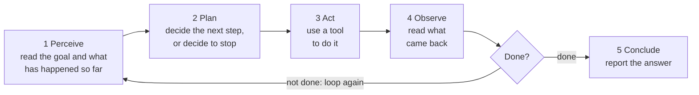
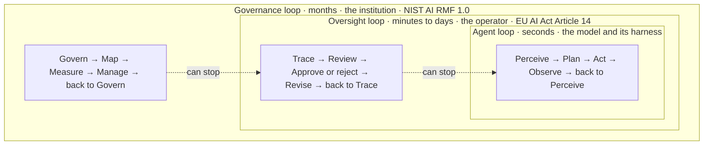

# Guest Lecture: Agentic AI Loops

*Estimated time: ~75 min as delivered, ~40 min on your own*

**Sequence, selection, iteration.** This is the guest lecture Tyson Swetnam
gave in Fall 2026 to UNM's *Ethical AI for Autonomous Systems* course, part of
the [RAISE](https://raise.unm.edu/){target=_blank} NSF Research Traineeship.
The class is deliberately mixed: computer, electrical, mechanical and civil
engineers sit next to students of security policy and of organization,
information and learning sciences. So the lecture needs no programming. It
starts with what agentic AI is and how it differs from the statistical models
and chatbots people already know, and then makes one argument: an AI agent is
a loop, three old ideas from programming are still the right questions to ask
of it, and what has changed is *who decides what happens next*.

It draws on this course (Modules 1, 2, 4 and 5), the
[GPT 101 workshop](https://tyson-swetnam.github.io/intro-gpt/){target=_blank}
and [Awesome Open Science](https://tyson-swetnam.github.io/awesome-open-science/){target=_blank}.
The talk itself is 32 slides. Eight backup slides go deeper for
questions and for the engineers, and 39 numbered references close the
deck.

[Open the lecture full screen](../materials/guest-lectures/agentic-ai-loops.html){ .md-button .md-button--primary target=_blank }
[Download the slides (PDF)](../assets/files/Agentic-AI-Loops-Guest-Lecture.pdf){ .md-button target=_blank }

<iframe class="course-embed course-embed--slides" src="../materials/guest-lectures/agentic-ai-loops.html" title="Agentic AI Loops lecture slides" loading="lazy" allow="fullscreen" allowfullscreen></iframe>

!!! tip "Driving the slides"

    Click inside the slides first, then use ++arrow-right++ and ++arrow-left++
    (or ++space++) to move, ++home++ and ++end++ to jump to either end, ++n++
    for the speaker notes and ++f++ for full screen. On a touch screen, swipe.
    The menu in the toolbar jumps to any slide, every bracketed citation is a
    link to its source, and each slide has its own address (for example
    `agentic-ai-loops.html#agent-loop`), so you can link to one. The file is
    self-contained: fonts and images are embedded and it makes no network
    requests, so it also works offline.

## Agentic AI in one sentence

Software that is given a **goal**, decides its own **steps**, and **acts**,
using tools, until it judges the job done. The agents in the news fit it:
coding agents that change files, run the tests and try again; assistants that
click through websites and fill in forms on your behalf; research agents that
read the sources, run the analysis and write the report.

## Three kinds of AI

The instructors asked for this comparison, because most students know agentic
AI only from the news. An agent is not a third kind of learning. It is a
language model placed in a loop and handed tools, so that it acts.

| | Predictive model | Language model | AI agent |
| :-- | :-- | :-- | :-- |
| **Also called** | Regression, classifiers | LLMs, chatbots | A language model in a loop |
| **How it works** | Learns a pattern from examples with known answers | Learns the patterns of language from a vast amount of text | A language model placed in a loop and given tools |
| **In and out** | Measurements in, a number or a label out | A prompt in words in, text out | A goal in, actions out, then a report |
| **Who acts on it** | A person, or code someone wrote | The person reading it | The agent itself, step after step |
| **On a robot or a vehicle** | "Is that a pedestrian?" "How far will this battery go?" | "Explain this fault code." "Draft the inspection report." | "Move tomorrow's drone survey to a dry time slot." |

Each wraps the one before: an agent is a language model in a loop, and the
tools it calls are often predictive models.

### One bridge inspection, three kinds of AI

| | Predictive model | Language model | AI agent |
| :-- | :-- | :-- | :-- |
| **You give it** | A photo of the bridge deck | Your field notes | A goal: "Inspect the bridge and report" |
| **You get back** | "Crack: 92% likely" | A draft inspection report | A flight plan, photos, crack scores, a second pass over the blurry spots, then a draft report |
| **It stops** | After one answer | After one reply | When it judges the job done |
| **When it is wrong** | A wrong number that a person can check | A confident sentence that is false | A wrong action in the world, possibly repeated |

Three things are new with an agent: it acts, it takes many steps, and it
decides for itself when to stop. The last row is the ethics row. This is an
illustration, not a description of a product you can buy today.

## Eight words for today

| Word | What it means |
| :-- | :-- |
| **Model** | The trained AI that writes text. On its own it can only talk. |
| **Agent** | A model placed in a loop so it can take steps toward a goal. |
| **Tool** | Anything the agent can use to act: search, email, a calendar, a robot arm. |
| **Harness** | The program around the agent. It owns the loop and the permissions. |
| **Sandbox** | A fenced-off place where an agent can work without touching the real world. |
| **Hallucination** | A confident answer that is wrong or made up. |
| **Trace** | The step-by-step record of what the agent thought and did. |
| **Gate** | A point where the agent must stop and ask a person. |

## Three building blocks

The structured program theorem (Böhm and Jacopini, 1966) says three moves are
enough to write any program. Dijkstra's case for using only those three was
about people: a program built from them is one a person can follow by reading
it. The ethical question for agents is whether a person can still follow what
the machine will do.

=== "Sequence"

    Do this, then this, then this, in order. Like following a recipe.

    ```python
    read_sensor()
    estimate_state()
    send_command()
    ```

    **In an agent:** everything so far is kept in order, and the agent rereads
    all of it on every lap.

=== "Selection"

    If this, do that; otherwise do something else. Like a traffic light.

    ```python
    if obstacle_ahead:
        brake()
    else:
        cruise()
    ```

    **In an agent:** on each lap the AI picks one tool by reading its
    description, or picks none. A human approval gate is itself a selection,
    and somebody has to decide what goes after the `if`.

=== "Iteration"

    Keep doing this until something says stop. Like stirring until it
    thickens.

    ```python
    while not at_goal:
        step()
    ```

    **In an agent:** it keeps going until it decides it is finished. The only
    hard stop is a step limit a person sets.

### Who decides what happens next

This table is the thesis of the lecture.

| Building block | In ordinary software | In an AI agent |
| :-- | :-- | :-- |
| **Sequence** | A programmer wrote the steps, in order | The AI makes up the steps as it goes |
| **Selection** | A programmer wrote every `if` and `else`, and anyone can read and test them | The AI chooses, by reading descriptions written in plain English |
| **Iteration** | A programmer wrote the rule for when to stop | The AI decides when it is done, unless a step limit cuts it off |

The three building blocks are still there. Their author is now an AI,
deciding one step at a time, and that is where the questions about
accountability, fairness and oversight come in.

## The agent loop

Loops are everywhere: a thermostat, a robot vacuum's sense, plan, act, a
pilot's observe, orient, decide, act, and quality management's plan, do,
check, act. The agent loop is the newest member of an old family. What is new
is that an AI does the planning step.



Module 1's [foundational concepts](../modules/module-1/foundational-concepts.md)
define the four stages, and Module 2's
[foundational concepts](../modules/module-2/foundational-concepts.md) show
the runtime behind them, including the rule that stops the loop.

### One request, three laps

You ask: "Move tomorrow's drone survey to a dry time slot, and tell the crew."

| Lap | The agent decides | Tool it uses | What comes back |
| :-- | :-- | :-- | :-- |
| 1 | "I need tomorrow's forecast." | Weather service | Rain from 9 to 11 am |
| 2 | "Find a dry slot when the crew is free." | Team calendar | 2 pm is open |
| 3 | "Move the booking and draft a note to the crew." | Calendar, email | Booking moved. Note drafted, waiting for your OK |
| Done | "Nothing left to do." | None | A short report to you |

Nobody wrote these steps in advance. The agent chose each one after seeing
the last result, and it stopped to ask before doing something that could not
be taken back. That pause is a gate, and somebody had to design it. This is
an illustration, not a transcript of a real system.

## Three nested loops

The lecture closes on this picture. Each loop needs its own way to stop, and
each outer loop must be able to stop the one inside it.



The July 2026 OpenAI and Hugging Face incident, covered in Part 3, is what it
looks like when the inner loop runs for weeks and the outer two never fire.

## Lecture outline

Each link opens the slides at that point.

| Part | Slides | What it covers | In this course |
| :-- | :-- | :-- | :-- |
| [Opening](../materials/guest-lectures/agentic-ai-loops.html#cover) | 1-4 | The scale of the AI buildout, and where agents meet RAISE's four research themes | [How this course works](../start-here/how-this-course-works.md) |
| [Part 1: What is agentic AI?](../materials/guest-lectures/agentic-ai-loops.html#p1) | 5-9 | Agentic AI in one sentence; predictive models, language models and agents side by side; one bridge inspection done three ways; eight words for today | [Module 1](../modules/module-1/index.md) |
| [Part 2: Three building blocks](../materials/guest-lectures/agentic-ai-loops.html#p2) | 10-16 | Sequence, selection and iteration; loops you already know; the agent loop and a worked example; who decides what happens next; five levels of autonomy | [Module 1](../modules/module-1/foundational-concepts.md), [Module 2](../modules/module-2/foundational-concepts.md) |
| [Discussion 1](../materials/guest-lectures/agentic-ai-loops.html#d1) | 17-18 | Who decides what happens next in a machine you know, then a break | |
| [Part 3: Loops of loops](../materials/guest-lectures/agentic-ai-loops.html#p3) | 19-23 | Four ways agents coordinate, why multi-agent systems fail, the July 2026 incident and its lessons | [Module 4](../modules/module-4/foundational-concepts.md) |
| [Part 4: Closing the loop](../materials/guest-lectures/agentic-ai-loops.html#p4) | 24-28 | Hallucination as an engineering problem, the human gate, three nested loops, accountability | [Module 5](../modules/module-5/foundational-concepts.md) |
| [Discussion 2 and close](../materials/guest-lectures/agentic-ai-loops.html#d2) | 29-32 | Design the gate; where to keep learning; compute at CARC | [Module 5 activities](../modules/module-5/activities.md) |
| [Backup slides: going deeper](../materials/guest-lectures/agentic-ai-loops.html#appendix) | 33-41 | The classic definition of an agent, how an agent picks a tool (MCP), reasoning paradigms as control structures, coding harnesses, AI sandboxes, four ways agents get attacked, the OWASP Top 10 for agentic applications, knowledge as a guardrail | [Module 2](../modules/module-2/foundational-concepts.md), [Module 5](../modules/module-5/foundational-concepts.md) |
| [References](../materials/guest-lectures/agentic-ai-loops.html#refs-1) | 42-44 | 39 sources, numbered in order of first citation | |

Twelve slides carry a one-line "For the engineers" note in small type, so the
main text stays plain and the technical students still get the detail.

## Discussion prompts

Use these with a class, a reading group, or on your own. They have no answer
key: the point is the argument you make.

??? question "Discussion 1: Who decides what happens next"

    Pick a machine that acts on its own: a robot vacuum, a self-driving car,
    a delivery drone, a Mars rover. Work in pairs first, then bring it to the
    room.

    1. Where do its steps, its choices and its repeats come from today? Who
       wrote them?
    2. Which of the three would you hand to an AI first? Which one never?
    3. What makes it stop: a rule someone wrote, a limit, or a person?

    *For facilitators:* mix the pairs if you can, an engineer with a policy
    or learning sciences student. Push on question 3. For most AI agents in
    use today the honest answer is that the AI decides when it is done, with
    a step limit as the backstop. Ask what the equivalent would be for their
    car, drone or rover.

??? question "Discussion 2: Design the gate"

    Pick one: a drone swarm, a self-driving shuttle, or a spacecraft too far
    away to steer in real time.

    1. Which actions cannot be undone, and who is allowed to approve them?
    2. What does that person need to see before saying yes?
    3. The machine acts faster than a person can review. What do you change?
    4. Who answers for it when the gate is skipped?

    *For facilitators:* question 3 is the crux for space and defense
    autonomy. If the machine is faster or farther away than a person can
    follow, the gate has to move from the moment of action to the design
    stage: limits, safe envelopes and lists of pre-approved actions instead
    of approvals one at a time. Question 4 has no engineering answer, which
    is why the policy students should lead on it.

## Reusing the lecture

The slides, this page and the PDF are licensed
[CC BY 4.0](../about/license-and-attribution.md) like the rest of the course.
The HTML file is a single self-contained document, so you can download it and
present from it without a network connection. Some slides are reused from
Tyson Swetnam's MESA talk at the NCEMS Annual Summit (August 2026); MESA is
supported by the U.S. National Science Foundation under Award #2632685.

## References

Numbered in order of first citation on the slides, in PLOS style. The last
three slides carry the same list with the slide numbers that cite each entry.

1. Federal Highway Administration. Highway statistics series. Washington: US Department of Transportation. Available from: [fhwa.dot.gov/policyinformation/statistics.cfm](https://www.fhwa.dot.gov/policyinformation/statistics.cfm){target=_blank}
2. Epoch AI. AI capital expenditure. Data insights. Available from: [epoch.ai/data-insights/ai-capex](https://epoch.ai/data-insights/ai-capex){target=_blank}
3. NASA History Office. NASA history. Available from: [nasa.gov/history](https://www.nasa.gov/history/){target=_blank}
4. Gartner. Gartner forecasts worldwide AI spending to grow 47 percent in 2026 \[press release\]. 2026 May 19. Available from: [gartner.com/en/newsroom](https://www.gartner.com/en/newsroom/press-releases/2026-05-19-gartner-forecasts-worldwide-ai-spending-to-grow-47-percent-in-2026){target=_blank}
5. Moorhouse F. \[Chart comparing AI data-center spending with historical megaprojects; post on X\]. 2026. Available from: [x.com/finmoorhouse/status/2044933442236776794](https://x.com/finmoorhouse/status/2044933442236776794){target=_blank}
6. RAISE: Responsive and Resilient AI for Autonomous Systems Engineering. Research. University of New Mexico. Available from: [raise.unm.edu/research](https://raise.unm.edu/research/index.html){target=_blank}
7. UNM Center for Advanced Research Computing. GPT 101: a workshop on generative AI and prompt engineering. 2026. CC BY 4.0. Available from: [tyson-swetnam.github.io/intro-gpt](https://tyson-swetnam.github.io/intro-gpt/){target=_blank}
8. James G, Witten D, Hastie T, Tibshirani R. An introduction to statistical learning: with applications in R. 2nd ed. New York: Springer; 2021. Available from: [statlearning.com](https://www.statlearning.com/){target=_blank}
9. Brown TB, Mann B, Ryder N, Subbiah M, Kaplan J, Dhariwal P, et al. Language models are few-shot learners. Adv Neural Inf Process Syst. 2020;33:1877–1901. Available from: [proceedings.neurips.cc](https://proceedings.neurips.cc/paper_files/paper/2020/file/1457c0d6bfcb4967418bfb8ac142f64a-Paper.pdf){target=_blank}
10. Center for Advanced Research Computing, University of New Mexico. AI Automation and Agents \[online course\]. 2026. Developed at the Arizona Institute for Artificial Intelligence, University of Arizona. CC BY 4.0. Available from: [tyson-swetnam.github.io/AI-Automation-and-Agents](https://tyson-swetnam.github.io/AI-Automation-and-Agents/){target=_blank}
11. Swetnam TL. MESA: Multidisciplinary Environment for Scientific Advancement. NCEMS Annual Summit; 2026 Aug. Available from: [idss-mesa.github.io](https://idss-mesa.github.io/){target=_blank}
12. Böhm C, Jacopini G. Flow diagrams, Turing machines and languages with only two formation rules. Commun ACM. 1966;9(5):366–371. [doi:10.1145/355592.365646](https://doi.org/10.1145/355592.365646){target=_blank}
13. Dijkstra EW. Go to statement considered harmful. Commun ACM. 1968;11(3):147–148. [doi:10.1145/362929.362947](https://doi.org/10.1145/362929.362947){target=_blank}
14. Boyd JR. The essence of winning and losing \[unpublished briefing\]. 1996. Available from: [slightlyeastofnew.com](https://slightlyeastofnew.com/wp-content/uploads/2010/03/essence_of_winning_losing.pdf){target=_blank}
15. Deming WE. Out of the crisis. Cambridge (MA): MIT Press; 1986. Available from: [books.google.com](https://books.google.com/books/about/Out_of_the_Crisis.html?id=i2lB09HvPpsC){target=_blank}
16. Kephart JO, Chess DM. The vision of autonomic computing. Computer. 2003;36(1):41–50. [doi:10.1109/MC.2003.1160055](https://doi.org/10.1109/MC.2003.1160055){target=_blank}
17. LangChain. Agents. LangChain documentation. Available from: [docs.langchain.com/oss/python/langchain/agents](https://docs.langchain.com/oss/python/langchain/agents){target=_blank}
18. SAE International. Taxonomy and definitions for terms related to driving automation systems for on-road motor vehicles. Standard J3016_202104. 2021. Available from: [sae.org/standards/content/j3016_202104](https://www.sae.org/standards/content/j3016_202104/){target=_blank}
19. Stone P, Veloso M. Multiagent systems: a survey from a machine learning perspective. Auton Robots. 2000;8(3):345–383. [doi:10.1023/A:1008942012299](https://doi.org/10.1023/A:1008942012299){target=_blank}
20. Cemri M, Pan MZ, Yang S, Agrawal LA, Chopra B, Tiwari R, et al. Why do multi-agent LLM systems fail? Adv Neural Inf Process Syst. 2025;38 (Datasets and Benchmarks Track). [arXiv:2503.13657](https://arxiv.org/abs/2503.13657){target=_blank}
21. OpenAI. The Hugging Face incident and the road ahead. 2026 Aug 26. Available from: [openai.com/index/hugging-face-incident-and-the-road-ahead](https://openai.com/index/hugging-face-incident-and-the-road-ahead/){target=_blank}
22. Hugging Face. Anatomy of a frontier lab agent intrusion: a technical timeline. 2026 Jul 27. Available from: [huggingface.co/blog/agent-intrusion-technical-timeline](https://huggingface.co/blog/agent-intrusion-technical-timeline){target=_blank}
23. METR, Redwood Research. Brief independent investigation of agents’ behavior, reasoning and collaboration in the OpenAI / Hugging Face hacking incident. 2026 Aug 26. Available from: [metr.org/blog](https://metr.org/blog/2026-08-26-openai-hugging-face-incident-investigation/){target=_blank}
24. Merchant A, Batzner S, Schoenholz SS, Aykol M, Cheon G, Cubuk ED. Scaling deep learning for materials discovery. Nature. 2023;624:80–85. [doi:10.1038/s41586-023-06735-9](https://doi.org/10.1038/s41586-023-06735-9){target=_blank}
25. European Parliament and Council. Regulation (EU) 2024/1689 laying down harmonised rules on artificial intelligence (Artificial Intelligence Act). Off J Eur Union. 2024 Jul 12. Available from: [eur-lex.europa.eu/eli/reg/2024/1689/oj](https://eur-lex.europa.eu/eli/reg/2024/1689/oj){target=_blank}
26. National Institute of Standards and Technology. Artificial Intelligence Risk Management Framework (AI RMF 1.0). NIST AI 100-1. 2023. [doi:10.6028/NIST.AI.100-1](https://doi.org/10.6028/NIST.AI.100-1){target=_blank}
27. Floridi L, Cowls J, Beltrametti M, Chatila R, Chazerand P, Dignum V, et al. AI4People—an ethical framework for a good AI society: opportunities, risks, principles, and recommendations. Minds Mach. 2018;28(4):689–707. [doi:10.1007/s11023-018-9482-5](https://doi.org/10.1007/s11023-018-9482-5){target=_blank}
28. Swetnam TL. Awesome Open Science. Available from: [tyson-swetnam.github.io/awesome-open-science](https://tyson-swetnam.github.io/awesome-open-science/){target=_blank}
29. RAISE. Graduate Certificate on Ethical AI for Autonomous Systems. University of New Mexico. Available from: [raise.unm.edu](https://raise.unm.edu/){target=_blank}
30. Wooldridge M, Jennings NR. Intelligent agents: theory and practice. Knowl Eng Rev. 1995;10(2):115–152. [doi:10.1017/S0269888900008122](https://doi.org/10.1017/S0269888900008122){target=_blank}
31. Yao S, Zhao J, Yu D, Du N, Shafran I, Narasimhan K, et al. ReAct: synergizing reasoning and acting in language models. [arXiv:2210.03629](https://arxiv.org/abs/2210.03629){target=_blank} \[Preprint\]. 2022.
32. OWASP GenAI Security Project. OWASP Top 10 for Agentic Applications for 2026. Available from: [genai.owasp.org](https://genai.owasp.org/resource/owasp-top-10-for-agentic-applications-for-2026/){target=_blank}
33. UNM Center for Advanced Research Computing. CARC documentation: facilities description and general FAQ. Available from: [carc.unm.edu/docs](https://carc.unm.edu/docs/){target=_blank}
34. Model Context Protocol. Specification and documentation. Available from: [modelcontextprotocol.io](https://modelcontextprotocol.io/){target=_blank}
35. Wei J, Wang X, Schuurmans D, Bosma M, Ichter B, Xia F, et al. Chain-of-thought prompting elicits reasoning in large language models. Adv Neural Inf Process Syst. 2022;35:24824–24837. Available from: [proceedings.neurips.cc](https://proceedings.neurips.cc/paper_files/paper/2022/file/9d5609613524ecf4f15af0f7b31abca4-Paper-Conference.pdf){target=_blank}
36. Yao S, Yu D, Zhao J, Shafran I, Griffiths TL, Cao Y, et al. Tree of thoughts: deliberate problem solving with large language models. Adv Neural Inf Process Syst. 2023;36:11809–11822. Available from: [proceedings.neurips.cc](https://proceedings.neurips.cc/paper_files/paper/2023/file/271db9922b8d1f4dd7aaef84ed5ac703-Paper-Conference.pdf){target=_blank}
37. Zhou A, Yan K, Shlapentokh-Rothman M, Wang H, Wang YX. Language agent tree search unifies reasoning, acting, and planning in language models. [arXiv:2310.04406](https://arxiv.org/abs/2310.04406){target=_blank} \[Preprint\]. 2023.
38. Anthropic. Beyond permission prompts: making Claude Code more secure and autonomous. 2025 Oct 20. Available from: [anthropic.com/engineering/claude-code-sandboxing](https://www.anthropic.com/engineering/claude-code-sandboxing){target=_blank}
39. Google Cloud. Open Knowledge Format (OKF) specification. Knowledge Catalog. Available from: [github.com/GoogleCloudPlatform/knowledge-catalog](https://github.com/GoogleCloudPlatform/knowledge-catalog/blob/main/okf/SPEC.md){target=_blank}
