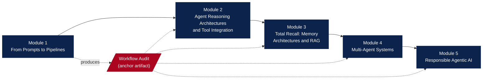

# AI Automation and Agents { .course-hero__title }

Move beyond individual prompts into the world of AI agents and automated workflows: systems that take actions, use tools, manage files, and complete multi-step tasks on your behalf. Five modules, about 40 hours, from foundational agent theory to the open-source frameworks used in industry.
{ .course-hero__tagline }

[:material-rocket-launch: Start Module 1](modules/module-1/overview.md){ .md-button .md-button--primary }
[:material-file-pdf-box: Syllabus (PDF)](assets/files/AI-Automation-and-Agents-Syllabus-UNM.pdf){ .md-button target=_blank }
[:material-source-branch: Set up your portfolio](start-here/github-portfolio-setup.md){ .md-button }
[:material-github: Source on GitHub](https://github.com/tyson-swetnam/AI-Automation-and-Agents){ .md-button target=_blank }

-   :material-map-marker-path:{ .lg .middle } __Module 1: From Prompts to Pipelines__

    ---

    *Thinking Like an Automation Designer* (8 hours). The agent loop; the
    no-code, low-code, and code-first automation spectrum; workflow
    decomposition; hands-on agent interaction with Claude Desktop; key
    vocabulary. Anchor deliverable: the Workflow Audit.

    [:octicons-arrow-right-24: Module 1](modules/module-1/index.md)

-   :material-brain:{ .lg .middle } __Module 2: Agent Reasoning Architectures and Tool Integration__

    ---

    8 hours. Chain-of-Thought, ReAct, Tree of Thoughts, and LATS; tool
    integration with LangChain; prompt engineering for agents; reading
    reasoning traces; architectural trade-offs.

    [:octicons-arrow-right-24: Module 2](modules/module-2/index.md)

-   :material-database-search:{ .lg .middle } __Module 3: Total Recall - Memory Architectures and RAG__

    ---

    8 hours. Parametric vs. non-parametric memory; the six-stage
    retrieval-augmented generation pipeline; conversational memory types;
    retrieval optimization; RAGAS evaluation.

    [:octicons-arrow-right-24: Module 3](modules/module-3/index.md)

-   :material-account-group:{ .lg .middle } __Module 4: Multi-Agent Systems__

    ---

    8 hours. Coordination architectures; multi-agent implementation with
    LangGraph; three-role pipeline design; CrewAI vs. LangGraph; diagnosing
    coordination failures.

    [:octicons-arrow-right-24: Module 4](modules/module-4/index.md)

-   :material-shield-check:{ .lg .middle } __Module 5: Responsible Agentic AI__

    ---

    *Production Deployment, Evaluation, and Responsible AI* (8 hours).
    Technical debt and production infrastructure; multi-dimensional
    evaluation and CI/CD; observability with LangSmith; the OWASP Top 10 for
    LLM applications; EU AI Act, NIST AI RMF, and human-in-the-loop
    governance.

    [:octicons-arrow-right-24: Module 5](modules/module-5/index.md)

-   :material-school:{ .lg .middle } __Course design (for instructors)__

    ---

    Formal learning design, the development plan, instructor materials, and
    the July 2026 course review.

    [:octicons-arrow-right-24: Course design](course-design/index.md)

-   :material-robot:{ .lg .middle } __For AI agents__

    ---

    How agents and harnesses should consume this site: `llms.txt`, per-page
    Markdown mirrors with OKF frontmatter, and trust signals.

    [:octicons-arrow-right-24: Agent entry points](about/ai-agents.md)

## Course map

Each module builds on the one before it. The Workflow Audit you produce in
Module 1 (three real workflows from your own professional context) is the
anchor artifact you return to when building automations in Modules 2 through 5.

## Course description

This course moves beyond individual [AI prompts](https://en.wikipedia.org/wiki/Prompt_engineering){target=_blank} into the world of [AI agents](https://en.wikipedia.org/wiki/AI_agent){target=_blank} and [automated workflows](https://en.wikipedia.org/wiki/Workflow){target=_blank}: systems
that can take actions, use tools, manage files, and complete multi-step tasks on your behalf. Learners will
progress from foundational agent theory through to structured agent frameworks used in industry, gaining
transferable skills applicable to any organization or platform.

The course follows a layered progression. Module 1 builds the conceptual foundation: defining what agents are,
surveying the [no-code](https://en.wikipedia.org/wiki/No-code_development_platform){target=_blank}/low-code/code-first automation spectrum, and introducing [Claude Desktop](https://claude.ai/){target=_blank} for hands-on agent
interaction. Subsequent modules introduce the leading open-source agent frameworks ([LangChain](https://www.langchain.com/){target=_blank},
[LangGraph](https://www.langchain.com/langgraph){target=_blank}, and [CrewAI](https://crewai.com/){target=_blank}) through guided [Jupyter Notebook labs](https://jupyter.org/){target=_blank} on [Google Colab](https://colab.research.google.com/){target=_blank}, covering reasoning
architectures, tool integration, memory, retrieval-augmented generation, and multi-agent coordination.
Throughout, the emphasis remains practical and workforce-relevant.

The course closes with a dedicated module on responsible agentic AI, covering production deployment,
evaluation, observability, security (the [OWASP Top 10 for LLM Applications](https://genai.owasp.org/){target=_blank}), and governance grounded in the
[EU AI Act](https://eur-lex.europa.eu/legal-content/EN/TXT/?uri=CELEX:32024R1689){target=_blank} and the [NIST AI Risk Management Framework (AI RMF 1.0)](https://www.nist.gov/itl/ai-risk-management-framework){target=_blank}.

## Course learning outcomes

Upon successful completion of this course, learners will be able to:

1. Design an AI agent system specification that selects and justifies the reasoning architecture, memory configuration, retrieval pipeline, and multi-agent coordination pattern for a given task and deployment context.
2. Implement end-to-end AI agent pipelines integrating tool use, vector retrieval, conversational memory, multi-agent workflows, and observability instrumentation using current industry frameworks.
3. Diagnose failures in AI agent systems by analyzing reasoning traces, RAGAS evaluations, coordination logs, and observability data, attributing deficiencies to specific architectural causes.
4. Evaluate an AI agent system's production readiness across accuracy, cost, latency, safety, and coordination efficiency, and determine when multi-agent complexity is warranted.
5. Apply responsible AI governance frameworks (EU AI Act, NIST AI RMF) to classify risk, specify mitigations and human oversight checkpoints, and produce accountability documentation.

## Course overview

| # | Module | Key Topics | Hours |
| :--: | :-- | :-- | :--: |
| 1 | [**From Prompts to Pipelines:** Thinking Like an Automation Designer](modules/module-1/overview.md) | Agent loop; no-code/low-code/code-first spectrum; workflow decomposition; Claude Desktop; key vocabulary | 8 hours |
| 2 | [**Agent Reasoning Architectures and Tool Integration**](modules/module-2/overview.md) | Chain-of-Thought, ReAct, Tree of Thoughts, LATS; tool integration with LangChain; prompt engineering; trace evaluation; architectural trade-offs | 8 hours |
| 3 | [**Total Recall:** Memory Architectures and Retrieval-Augmented Generation](modules/module-3/overview.md) | Parametric vs. non-parametric memory; six-stage RAG pipeline; conversational memory types; retrieval optimization; RAGAS evaluation | 8 hours |
| 4 | [**Multi-Agent Systems**](modules/module-4/overview.md) | Coordination architectures; LangGraph multi-agent implementation; three-role pipeline design; CrewAI vs. LangGraph comparison; coordination failure diagnosis | 8 hours |
| 5 | [**Responsible Agentic AI:** Production Deployment, Evaluation, and Responsible AI](modules/module-5/overview.md) | Technical debt and production infrastructure; multi-dimensional evaluation and CI/CD; observability with LangSmith; OWASP Top 10; EU AI Act, NIST AI RMF, human-in-the-loop | 8 hours |

## Browse the course

* [Start here](start-here/index.md) - How the course works, the syllabus, setting up your GitHub portfolio, and running the Colab labs.
* [Modules](modules/index.md) - The five modules: overviews, foundational concepts, reading guides, activities, lab notebooks, and chapter quizzes.
* [Course design](course-design/index.md) - Formal learning design, development plan, instructor materials, and the course review, for instructors and designers.
* [About](about/index.md) - License and attribution, how to contribute, the agent-facing surface, the wiki crosswalk, and the archive.
* [Update log](log.md) - Dated record of every change to the course site.

[{ width="100" }](https://creativecommons.org/licenses/by/4.0/){ target=_blank }
2026 The Regents of the University of New Mexico, [Center for Advanced Research Computing](https://carc.unm.edu/){ target=_blank }. Developed at the University of Arizona, [AI2S](https://responsibleai.arizona.edu/ai2s){ target=_blank } and the [Office of Responsible Artificial Intelligence](https://responsibleai.arizona.edu/){ target=_blank }, and released there under CC0. See [license and attribution](about/license-and-attribution.md).

