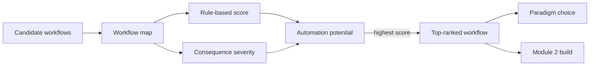

# Module 1 Activities

The Workflow Audit project runs as a pipeline: each mapped workflow is scored on two dimensions, and its automation potential is the rule-based score divided by (consequence severity + 1).

This Activity Guide contains the hands-on activities for Module 1. 

- Self-check prompts (~10 min)
- Lab A: Set up Ollama and run LLM models on your own computer (~45 min)
- Lab B: Set up Openwork as your local agent interface (~45 min)
- Workflow Audit Project (~2.5 hrs)
- Discussion Post + Reply (~30 min)

## Self-Check Prompts (ungraded)

*Estimated time: ~10 min*

Before moving ahead, write brief answers to the three prompts below in a personal notes document or on paper.

#### Prompt 1 - Agent vs. Chatbot

In your own words, what is the difference between a chatbot and an AI agent? Write one precise
sentence that would allow a colleague who has not taken this course to correctly classify a new system
as one or the other.

#### Prompt 2 - Agent Loop Diagram

Close your notes. Sketch the agent loop from memory - label each stage and write one sentence
describing what happens at that stage. If you cannot reproduce the loop without looking, re-read the
LangChain Conceptual Guide section on the agent loop before proceeding.

#### Prompt 3 - Paradigm Placement

Place the following tools in order from least to most technical user requirement: n8n, LangGraph,
Openwork, Claude Code, CrewAI. Write your ranking and a one-sentence rationale for why you
placed each tool in its position.

If Prompt 2 reveals gaps, re-read the LangChain Conceptual Guide on the agent loop. If Prompt 3 reveals uncertainty, re-read the Automation Landscape Overview.

## Guided Lab Exercise

*Estimated time: ~2 hrs*

In these two labs you will set up a free, private AI agent system that runs entirely on your own computer using Ollama and Openwork, an open-source alternative to Claude Cowork.

- **Lab A** installs Ollama and a local LLM, then walks you through three interactions designed to reveal what a capable language model can and cannot do without tool access.
- **Lab B** sets up [Openwork](https://openworklabs.com/){target=_blank}, a free local agent interface, pointed at your Ollama model — giving you experience delegating a structured task to an AI agent.

> **Alternative:** If you have access to Claude Cowork or another LLM API provider and prefer to use that, you can substitute it for Openwork in Lab B.

### Lab A - Run models locally with Ollama

*Estimated time: ~40 minutes*

Lab A installs Ollama — a free local LLM runner that operates entirely on your computer. The goal is to observe what a capable language model can and cannot do without tool access, which motivates why agent architectures add tools on top of LLMs.

#### A1.  Install Ollama and Pull the Llama3.2 Model

*Estimated time: ~20 minutes*

1. Visit [ollama.com](https://ollama.com/){target=_blank} and follow the installation instructions for your operating system (supports macOS, Linux, and Windows.)
2. Open a terminal (macOS: Terminal app; Windows: Command Prompt or PowerShell). Run: `ollama pull llama3.2`
3. This downloads the 3B-parameter Llama 3.2 model (~2.0 GB). Wait for the 'success' confirmation before proceeding.
4. Verify installation by running the model: `ollama run llama3.2`

!!! tip "Hint"

    If the download fails due to disk space, the model requires approximately 2.5 GB of free space. Alternative: use Ollama's smaller phi3:mini model (1.2 GB) via `ollama pull phi3:mini`.

#### A2. Factual Question About AI Agents

*Estimated time: ~5 minutes*

Submit the following prompt:

> 'What is the ReAct reasoning pattern? Explain how the Thought/Action/Observation cycle works and give one concrete example.'

Observe: How accurate was the response? Verify against your readings and note any errors or unexpected behavior.

#### A3. Multi-Step Reasoning Prompt

*Estimated time: ~5 minutes*

Submit the following prompt:

> 'Plan the steps needed to automate my weekly status report process. Assume: I currently spend 45 minutes every Friday gathering updates from three spreadsheets and writing a summary email to my manager.'

Observe: Did the model produce a generic plan or did it ask clarifying questions? What information would a human automation consultant ask for before creating this plan? What information would an agent with calendar and spreadsheet tool access be able to retrieve automatically that this LLM must guess at?

#### A4. Uncertainty Elicitation Prompt

*Estimated time: ~5 minutes*

Submit the following prompt:

> 'What are the current pricing rates for the Claude API (claude-sonnet-4-6) per million tokens?'

Observe: Does the model (a) provide a specific number as if it is current, (b) acknowledge that its training data has a cutoff and the information may be outdated, or (c) refuse to answer? Note what the model said about its own uncertainty.

!!! note "Note"

    Interaction 3 is a test of the model's metacognitive behavior, not its knowledge. The evaluation criterion is whether the model correctly signals uncertainty about time-sensitive information — not whether the number it provides happens to be accurate.

#### Short Reflection

*Estimated time: ~10 minutes*

1. What is one critical limitation you observed — something the LLM demonstrably could not do reliably — and what tool would an agent need to compensate for it?

### Lab B - Openwork Setup and Agent Orientation

*Estimated time: ~45 minutes*

Lab B sets up Openwork — a free, open-source agent interface that runs locally — pointed at the Ollama model you installed in Lab A. This gives you hands-on experience submitting instructions to an AI agent and observing its behavior.

#### B1. Install Openwork

*Estimated time: ~20 minutes*

1. Visit [openworklabs.com](https://openworklabs.com/){target=_blank} and follow the installation instructions for your operating system.
2. Launch Openwork. On first run it will prompt you to select a model backend — choose **Ollama (local)** and select the llama3.2 model you pulled in Lab A.
3. Confirm the interface loads and you can see the main chat/agent panel.

#### B2. Submit a Pre-Written Instruction and Observe Agent Behavior

*Estimated time: ~10 minutes*

In the agent panel, submit the following instruction exactly as written:

> 'List all .txt files in this folder and create a summary document named summary.md that lists each file name followed by the first sentence of its content.'

Watch the agent's response in real time and note:

- Did it correctly identify all .txt files?
- Does the summary.md output match the instruction?
- Did the agent take any action you did not expect?

Open the generated summary.md file and verify its contents.

!!! tip "Hint"

    The most analytically valuable thing to observe here is not whether the agent succeeded — it almost always does on a simple file task — but how it communicated its reasoning. Did it narrate its steps? Did it ask for clarification or proceed unilaterally? Did it handle edge cases (e.g., a .txt file with no content) gracefully or silently?

#### B3. Design and Submit One Instruction of Your Own

*Estimated time: ~10 minutes*

Design and submit one instruction of your own. The instruction should represent a simple file organization or document drafting task. Constraints: (1) the task must be completable using only local folder contents; (2) the task must require at least two distinct operations (e.g., 'find' and then 'create', not just 'list').

Reflect on three things:

1. The exact instruction you submitted.
2. What the agent produced — be specific, not general.
3. One revision you would make to the instruction if you ran it again, and why.

## Hands-On Project - Workflow Audit

**Duration:** ~2.5 hours

The Workflow Audit Project is the primary deliverable of Module 1. The three workflows you document here become the anchor for every subsequent module — you will return to them when building automations in Modules 2–5. The specificity of what you produce here directly determines how useful those later projects will be.

### Step 1 - Identify potential workflows to automate

*Estimated time: ~30 minutes*

Identify two repetitive, multi-step processes from your own professional or academic practice.  Explain each workflow in 1 or two sentences.

Guidance on choosing workflows:

- Choose workflows you currently do at least once per week - the higher the frequency, the higher the automation ROI potential, and the more data you will have for the time estimate.
- Choose workflows that cross at least two tools or systems - a process that stays entirely within one application is unlikely to benefit from agent automation.
- Choose at least one workflow from each of two different domains: one professional workflow (work or research) and one administrative or coordination workflow.

!!! example "Example"

    "I review incoming vendor invoices received by email, extracts key fields (vendor name, invoice amount, due date), cross-references a shared spreadsheet to check for duplicate payments, and forwards approved invoices to the accounting team with a summary note."

**Workflow Mapping Template - Required Fields (per workflow)**

| Field | Specification Requirement |
| --- | --- |
| **Trigger** | What event initiates the workflow? Must be specific and external: an email arriving with a particular subject line or sender, a calendar event at a specific recurrence, a file appearing in a designated folder, or a recurring time. 'Someone sends me a request' is not a trigger. |
| **Sequential Steps** | Minimum four steps. Each step must specify: (a) the specific tool or system touched (email client, CRM, spreadsheet software, file system — not 'the computer'); (b) the input format and output format at that step; and (c) whether any judgment is exercised at that step or whether it is fully mechanical. |
| **Conditional Branches** | At least one 'if X, then Y; else Z' decision point in at least two of your three workflows. The condition must be statable as a rule: 'if the invoice amount exceeds $5,000, route to VP approval; else forward to accounts payable directly.' |
| **Output** | The final deliverable or state change that signals the workflow is complete. Must be specific: 'a PDF report emailed to three recipients' not 'a report.' |
| **Time Estimate** | How many minutes or hours this workflow currently takes per week, and how you derived that estimate (measurement, best estimate, or calculation). This becomes the ROI baseline for the automation assessment. |

### Step 2 - Two Workflow Maps

*Estimated time: ~60 minutes*

Fill out the Workflow Mapping Template for each of the two workflows you identified in Step 1. Apply all five required fields to each workflow. 

The minimum level of specificity is: another person who has never done your job could follow your
workflow map as a procedure and produce the same output without asking you a single clarifying
question. If a step says 'check the spreadsheet,' it is underspecified. 'Open the shared Google Sheet
at [URL], filter column C for entries where Status = Pending, and copy the matching rows to a new tab
labeled [current date]' is correctly specified.

!!! warning "Common mistake — read before submitting"

    The most common Task 1 failure is confusing a category of activity with a workflow. 'I respond to customer emails' is a category. 'Every morning at 9 AM, I open the shared support inbox, read each unread message, classify it as billing, technical, or general, and forward it to the appropriate team alias - a process taking approximately 20 minutes with no ambiguous cases more than once per week' is a workflow. If your workflow map would require fewer than four steps to complete, you have described a task, not a workflow. Choose a larger process.

### Step 3 - Two-Dimensional Automation Assessment Matrix

*Estimated time: ~40 minutes*

For each of your three mapped workflows, complete the two-dimensional automation potential
assessment using the scoring framework below. This framework operationalizes the 'blast radius'
analysis introduced in the Automation Landscape Overview reading.

| Dimension | Score 5 (High) | Score 1 (Low) |
| --- | --- | --- |
| **Rule-Based Specification Score (1–5)** | Every step can be specified in advance as a complete rule — no human judgment is required at any decision point. The conditional branches are fully enumerable. | At least one step requires genuine human expertise, ethical judgment, or contextual knowledge that cannot be pre-specified as a rule. |
| **Consequence Severity Score (1–5)** | An automation error would have irreversible, significant financial, legal, or reputational consequences. Error blast radius is wide and recovery is costly. | An automation error is easily detected, immediately reversible, and has no external impact. Error blast radius is narrow and recovery is trivial. |
| **Automation Potential Score** | Calculated: Rule-Based Score ÷ (Consequence Severity + 1). This formula penalizes high-consequence workflows even when they are technically rule-based. | Lower scores indicate poorer automation candidates, either because the workflow requires judgment or because errors are high-stakes. |

For each workflow, write a minimum 100-word justification explaining your rule-based and
consequence severity scores. The justification must use at minimum four of the following course-
specific terms: rule-based, high-stakes, reversibility, trigger, blast radius, automation potential,
conditional branch, orchestration. Vague justifications - 'This workflow has medium automation
potential because some steps require judgment' - do not meet the standard. Specific justifications -
'Step 3 (cross-referencing the duplicate payment spreadsheet) is fully rule-based because the duplicate
detection criterion is binary: invoice number appears more than once in column A, yes or no. The
consequence severity is 4 because an undetected duplicate payment is a financial error with external
vendor impact that requires manual reversal and notification - reversibility exists but is costly.' - meet the standard.

After completing scores for both workflows: Identify the lower-scoring workflow and write one sentence explaining why it is a poor automation candidate - what specific property of the workflow produces the low score?

### Step 4 - Paradigm Selection Reflection

*Estimated time: ~20 minutes*

Write a 200-word reflection on your top-ranked workflow from Task 2 - the workflow with the highest
automation potential score. Address the following question:

!!! question "Question"

    For this workflow, which automation paradigm - no-code, low-code, or code-first - is most likely appropriate, and why? Reference at least two specific trade-off criteria from the Automation Paradigms Comparison Diagram (Chapter 2) and name one specific tool as your recommended implementation platform.

!!! tip "Hint"

    The most common Task 3 error is selecting a paradigm based on general preference rather than the specific properties of the workflow. 'I would choose no-code because it is easier' is not a justified paradigm selection. 'I would choose no-code (specifically n8n Community Edition) because: (1) the workflow requires no custom logic beyond conditional routing, which n8n's visual node editor handles without Python; and (2) the data involved is internal-only with no third-party API authentication requirements, so data governance risk is low - the primary data governance concern for no-code (routing data through vendor servers) does not apply to a self-hosted n8n deployment' is a justified selection.

**Workflow Audit Project - Rubric**

| Criterion | Weight | 4 — Distinguished | 3 — Proficient | 2 — Developing |
| --- | --- | --- | --- | --- |
| Completeness (all required fields present for all 3 workflows) | 25% | All 15 fields complete with required specificity; all conditional branches identified | All 15 fields present; 1–2 missing conditional branches or incomplete time estimates | 1–2 fields missing or unacceptably vague ('uses email') across all workflows |
| Accuracy and Specificity of Workflow Mapping | 25% | Each step specifies tool/system, input format, output format, and judgment indicator; workflows are from genuine practice and non-hypothetical | Steps specify tools but omit input/output format for 2–3 steps; one workflow may be partially generic | Steps name categories rather than specific tools; workflows appear hypothetical or generic |
| Assessment Matrix Reasoning (Task 2) | 30% | Scores justified with ≥100 words each using ≥4 course terms; scoring formula applied correctly; lowest-ranked candidate identification persuasive | Justifications present but ≤80 words or missing ≥2 course terms; formula correct | Justifications vague or circular; formula misapplied; no lowest-candidate identification |
| Paradigm Selection Reflection (Task 3) | 20% | 200-word reflection cites ≥2 diagram criteria by name; paradigm selection follows from workflow properties; one specific tool named with justification | Reflection present; ≥150 words; 1 criterion cited; tool named without justification | Reflection &lt;100 words; no diagram criteria cited; paradigm selection unsupported |

## Peer Discussion

*Estimated time: ~30 min*

### Step 1 Discussion Post - Workflow Automation Insight

*Estimated time: ~20 minutes*

**Discussion Prompt**

Describe one workflow from your Workflow Audit that surprised you - either because it turned out to
be a better automation candidate than you expected, or a worse one. What specifically made the
difference? **Reference at least one course concept from Module 1** in your post (e.g., rule-based
specification, consequence severity, automation paradigm, agent loop, blast radius).

Reply to at least one classmate's post by asking a clarifying question or offering an alternative
assessment of their workflow's automation potential.

**Post Requirements**

* Initial post: 100–150 words. Name the workflow. State whether it was a better or worse candidate than
expected. Identify the specific property (rule-based score, consequence severity, or a particular step's
judgment requirement) that drove the surprise.

### Step 2 Peer reply

*Estimated time: ~10 minutes*

* Peer reply: 50–80 words. Either ask one specific clarifying question about your classmate's
assessment ('You scored the consequence severity at 3 - what specific reversal mechanism did you
assume that brought the score down from 5?') or offer an alternative assessment citing the course
framework.

!!! note "Note"

    A substantive peer reply names your classmate's specific workflow and references their scores — not just general agreement.

!!! info "Next: Module 2"

    [Module 2](../module-2/overview.md)

    Module 2 begins with your top-ranked workflow from the Workflow Audit. You will build your first no-code automation pipeline using Openwork or n8n applied to that workflow. Ensure your Workflow Audit document is complete before starting — it is the anchor for all subsequent module projects.

Migrated from the [course wiki](https://github.com/UA-AI2S/AI-Automation-and-Agents-v2/wiki/Module-1:-Activities){target=_blank} (wiki page last changed 2026-07-22). Spotted a problem? [Edit this page](https://github.com/tyson-swetnam/AI-Automation-and-Agents/edit/main/docs/modules/module-1/activities.md){target=_blank}.

