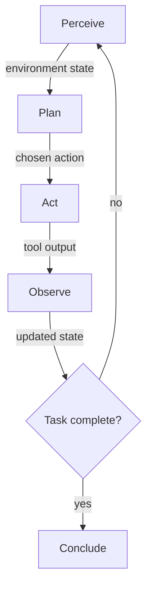

# Module 1: Foundational Concepts

The four-stage agent loop that Chapter 1 defines, and the point at which the agent exits it.

## Foundational Concepts for Module

*Estimated time: ~7 min*

Module 1 of AI Automation and Agents establishes the conceptual and practical foundation
for everything that follows in the course. Its title — From Prompts to Pipelines: Thinking Like
an Automation Designer — signals the module’s central cognitive shift: moving from viewing
AI as a conversational tool you prompt to viewing it as an autonomous agent you design
workflows for.

**Three critical takeaways define the module’s contribution to your professional
development:**

- AI agents are not chatbots. They perceive their environment, plan actions, use tools,
and observe outcomes across a structured loop — delegating nothing to chance and
nothing to the user once set in motion. Understanding this distinction is a non-
negotiable prerequisite for all subsequent course modules.

- The automation landscape is a spectrum, not a binary choice. Three paradigms —
no-code, low-code, and code-first — address different user profiles, risk tolerances,
and organizational requirements. Exercising professional judgment about which
paradigm to select for a given workflow is a high-value skill.

- Your own professional practice is the course’s primary raw material. The Workflow
Audit Project you produce in this module is not a homework exercise — it is the
foundational portfolio artifact that every subsequent module will build upon. The
quality and specificity of your workflow documentation here determines the quality of
your subsequent applied work.

By the end of this module, you will have completed your first hands-on AI agent interactions,
mapped three real workflows from your professional practice, assessed their automation
potential using a structured framework, and produced your first reflective self-assessment —
a metacognitive baseline you will revisit in Module 5 to observe your growth.

The sources assigned in Module 1 establish five interconnected conceptual
frameworks that serve as the analytical vocabulary for the entire course. Each framework
addresses a distinct dimension of the AI automation landscape: what agents are, how the tool
ecosystem is structured, what AI literacy requires of professionals, how to think computationally
about workflows, and what responsible deployment requires from the first day of practice.

### Chapter 1: Redefining Intelligence — What AI Agents Actually Are

#### Chapter 1 Lesson

*Estimated time: ~14 min*

Public discourse around AI often confuses four structurally distinct entities: chatbots,
search engines, rule-based automation scripts, and AI agents. This is not a minor
terminological imprecision — it leads to fundamental errors in system design, risk assessment,
and organizational decision-making. Module 1 begins by resolving this confusion with analytical
precision.

**THE FOUR-STAGE AGENT LOOP**

Wooldridge and Jennings (1995) — the foundational theoretical paper on intelligent agents —
define an agent as a computer system capable of autonomous action in an environment in
order to meet its design objectives. The critical word is 'autonomous': an agent acts without
continuous human direction. The LangChain Conceptual Guide operationalizes this definition in
contemporary practice through a four-stage agent loop:

| Stage | What the Agent Does | Technical Mechanism | Professional Analogy |
| --- | --- | --- | --- |
| **PERCEIVE** | Reads the current environment state | Processes context window: instructions, tool outputs, history | A consultant reads the brief, prior meeting notes, and available data before responding |
| **PLAN** | Decides what action to take next | LLM reasoning step: selects the next tool or determines task completion | The consultant drafts a response strategy, selecting which of their available resources to deploy |
| **ACT** | Executes the chosen action via a tool call | Issues a structured tool call (web search, code execution, file write, API request) | The consultant executes: sends an email, retrieves a document, runs a calculation |
| **OBSERVE** | Reads the tool output and updates state | Parses tool response; decides whether to loop again or conclude | The consultant reads the result, determines whether the task is complete, and acts accordingly |

**FOUR PROPERTIES THAT DEFINE A TRUE AGENT (Wooldridge & Jennings, 1995)**

* **Autonomy:** The agent operates without continuous human direction. It makes decisions based
on its own internal state and goals, not external prompts at each step.

* **Reactivity:** The agent perceives its environment and responds to changes in that environment
in a timely fashion — it is not executing a fixed script.

* **Pro-activeness:** The agent does not merely react to stimuli; it exhibits goal-directed behavior,
taking initiative to achieve design objectives.

* **Social ability:** The agent can interact with other agents (and humans) using defined
communication protocols — essential for multi-agent systems introduced in Module 4.

**The Critical Distinctions — What Is Not an AI Agent**

| System Type | Why It Is Not an AI Agent |
| --- | --- |
| **Chatbot** | Responds to a single prompt; has no persistent state across the conversation turn; cannot take actions in external systems; does not loop. |
| **Rule-based script** | Executes a fixed sequence of steps; has no capacity to reason, adapt, or select actions based on context; has no LLM component. |
| **API call** | A single request-response transaction with no reasoning, planning, or state — a tool that an agent might use, not an agent itself. |
| **Search engine** | Retrieves information based on a query; does not plan, act, or use tools autonomously; has no goal-directed behavior. |

!!! note "WHY THIS MATTERS"

    Every design decision in the course — from tool selection to memory architecture to
    responsible deployment — depends on whether you are working with a true agent or one of
    its lookalikes. Misclassifying a system as an 'agent' when it is a script leads to unrealistic
    expectations, inappropriate risk assessments, and flawed evaluation frameworks. Precision
    here is not pedantry; it is professional practice.

#### Learning Resources

* [LangChain - What are Agents?](https://docs.langchain.com/oss/python/langchain/agents){target=_blank}
* Wooldridge, M., & Jennings, N. R. (1995). [Intelligent agents: Theory and practice](readings/intelligent-agents-wooldridge-jennings.md). The knowledge engineering review, 10(2), 115-152.
* [Video 1: "What are Agents?"](https://www.youtube.com/watch?v=F8NKVhkZZWI){target=_blank} - IBM Technology

[**Reading Guide Chapter 1 - Redefining Intelligence, what AI agents actually are**](reading-guides.md#reading-guide-1)

#### Chapter 1 Quiz

[Take the Chapter 1 Quiz](chapter-quizzes.md#chapter-1-quiz){ .md-button }

### Chapter 2: The Automation Ecosystem — Three Paradigms, One Spectrum

#### Chapter 2 Lesson

*Estimated time: ~10 min*

Automation tools exist on a spectrum defined by two axes: required user technical skill and system
flexibility. Understanding where each tool class sits on this spectrum — and why — is a core
professional competency. Choosing the wrong paradigm for an organizational workflow wastes
engineering resources, introduces data governance risks, or creates a system the team that built it
cannot maintain.

**Three automation paradigms**

- No-code
- Low-code
- Code-first

| Dimension | No-Code | Low-Code | Code-First | Key Criterion |
| --- | --- | --- | --- | --- |
| **Representative tools** | Claude Cowork, n8n, Zapier, Make | LangChain, CrewAI, LangGraph | Claude Code, custom Python agents, AutoGen | What does your team know? |
| **Primary user** | Knowledge workers, operations professionals, non-developers | Data scientists, AI practitioners, technical analysts | Software engineers, ML researchers | Who will build and maintain this? |
| **Setup effort** | Minutes to hours; visual interface | Hours to days; configuration + scripting | Days to weeks; full development cycle | What is the time budget? |
| **Flexibility** | Limited to platform capabilities | High within framework constraints | Unlimited — any architecture possible | How custom is the workflow? |
| **Cost model** | Subscription; per-workflow or per-seat | API costs + developer time | Full developer cost + infrastructure | What is the total cost of ownership? |
| **Data governance** | Data processed on vendor servers | API data transit; partial control | Full data sovereignty possible | What are the compliance requirements? |
| **Best suited for** | Standard repetitive processes with low customization needs | Complex workflows requiring LLM reasoning and tool integration | Novel architectures, proprietary data, maximum control | What does the workflow require? |

**Two Critical Observations Emerge From The Comparison.** 

First, the paradigms are not hierarchically
ranked — no-code is not inferior to code-first; each is appropriate in different contexts. A seasoned
AI engineer who builds a no-code workflow for a repetitive administrative process is exercising
professional judgment, not laziness. 

Second, data governance is the most commonly
underweighted factor in paradigm selection. Organizations that move sensitive data
through no-code vendor servers without explicit data processing agreements may be in regulatory
violation, regardless of how elegant the workflow is.

#### Learning Resources

* Long, D., & Magerko, B. (2020, April). [What is AI literacy? Competencies and design considerations](https://dl.acm.org/doi/pdf/10.1145/3313831.3376727){target=_blank}. In Proceedings of the 2020 CHI conference on human factors in computing systems (pp. 1-16).
* Ng, D. T. K., Leung, J. K. L., Chu, S. K. W., & Qiao, M. S. (2021). [Conceptualizing AI literacy: An exploratory review](https://www.sciencedirect.com/science/article/pii/S2666920X21000357){target=_blank}. Computers and Education: Artificial Intelligence, 2, 100041.

[**Reading Guide Chapter 2 - Automation Landscape Overview**](reading-guides.md#reading-guide-4)

#### Chapter 2 Quiz

[Take the Chapter 2 Quiz](chapter-quizzes.md#chapter-2-quiz){ .md-button }

### Chapter 3: AI Literacy as a New Professional Imperative

#### Chapter 3 Lesson

Ng, Leung, Chu, and Qiao (2021) conducted an exploratory review of the AI literacy literature and
synthesized a four-pillar competency model that directly informs the design of this course.
Long and Magerko (2020) complement this with twenty-one specific AI literacy competencies,
organized into five families. Together, these frameworks articulate what it means to be literate in AI —
not merely to use AI tools, but to understand, evaluate, and create with them.

**The Four-Pillar AI Literacy Model (Ng et al., 2021)**

**Pillar: KNOW AI**

Understand the fundamental concepts, capabilities, and limitations of AI systems. In Module 1, this means understanding the agent loop, the properties of autonomous agents, and the boundaries of what current LLMs can and cannot do without tool access.

*Module 1 focus — Units 1 and 2 (Reading, Video, Concept Quiz)*

**Pillar: USE AI**

Operate AI tools productively in authentic contexts. In Module 1, this means running a local model with Ollama and delegating a structured task to an agent through Openwork — not just reading about it.

*Module 1 focus — Unit 3 (Guided Labs: Ollama, Openwork)*

**Pillar: EVALUATE AI**

Critically assess AI outputs, assess automation potential, compare frameworks, and identify failure modes. In Module 1, this means applying the two-dimensional assessment matrix to your own workflows with written justifications.

*Module 1 focus — Units 4 and 5 (Workflow Audit, Paradigm Comparison)*

**Pillar: CREATE WITH AI**

Design original AI-enabled solutions for real-world problems. Module 1 plants the seed: the Workflow Audit produces the specification that Modules 2–5 will attempt to automate. Create competency is the terminal goal of the entire course.

*Introduced Module 1, fully developed Modules 3–5*

Long and Magerko (2020) add an important nuance: AI literacy is not merely technical proficiency with AI tools. It includes the capacity to recognize AI in deployed systems, understand the ethical and social implications of AI decisions, and communicate AI concepts accurately to non-specialist audiences. This breadth is why the course’s five general skills include both technical implementation and communication and evidence-based reasoning — professional AI literacy is a multi-domain competency, not a single technical credential.

#### Learning Resources

* Long, D., & Magerko, B. (2020, April). [What is AI literacy? Competencies and design considerations](https://dl.acm.org/doi/pdf/10.1145/3313831.3376727){target=_blank}. In Proceedings of the 2020 CHI conference on human factors in computing systems (pp. 1-16).
* Ng, D. T. K., Leung, J. K. L., Chu, S. K. W., & Qiao, M. S. (2021). [Conceptualizing AI literacy: An exploratory review](https://www.sciencedirect.com/science/article/pii/S2666920X21000357){target=_blank}. Computers and Education: Artificial Intelligence, 2, 100041.

[**Reading Guide Chapter 3 - AI Literacy**](reading-guides.md#reading-guide-3) - Ng et al. (2021): AI Literacy Framework

#### Chapter 3 Quiz

[Take the Chapter 3 Quiz](chapter-quizzes.md#chapter-3-quiz){ .md-button }

### Chapter 4: Workflow Thinking as a Professional Competency

#### Chapter 4 Lesson

Jeannette Wing's (2006) foundational essay on computational thinking argues that the ability to decompose problems, recognize patterns, and abstract processes into clear specifications is a fundamental intellectual skill, analogous to reading and arithmetic, rather than one specific to computer scientists. The following **Workflow Decomposition Framework** and **Two-Dimensional Automation Assessment** explains how one can systematically break down any multi-step professional process into its atomic components and assess it's potential for automation.

**The Workflow Decomposition Framework**

Every workflow capable of automation can be completely specified by six components: Trigger, Sequential Steps, Tools and Resources, Conditional Branches, Error Handling, and Output.

| Component | Definition | Why It Matters for Automation |
| --- | --- | --- |
| **TRIGGER** | The specific event that initiates the workflow — a received email, a scheduled time, a form submission, a file upload | Agents must know exactly what starts them. Vague triggers produce agents that activate at the wrong time or not at all. |
| **SEQUENTIAL STEPS** | The ordered set of actions the workflow executes — minimum four steps; each step must be atomic and non-ambiguous | Agents cannot execute ambiguous instructions. Each step must be specifiable precisely enough to be delegated. |
| **TOOLS AND RESOURCES** | The systems, files, APIs, and data sources touched at each step — named specifically (e.g., 'Google Sheets API', not 'spreadsheet') | Tool identification directly maps to agent tool provisioning. Vague resource naming is a design error. |
| **CONDITIONAL BRANCHES** | Decision points where the workflow splits based on evaluated conditions — the if/then logic that real processes always contain | Agents implement conditionals via routing logic. Undocumented branches produce agents that fail silently on edge cases. |
| **ERROR HANDLING** | What happens when a step fails, returns unexpected output, or times out — the fallback logic | Production agents must handle failures gracefully. Workflows without error handling are prototype-grade, not production-grade. |
| **OUTPUT** | The final deliverable of the workflow — specified precisely (file format, destination, recipient, content type) | Agents need a concrete termination condition. Undefined outputs produce agents that run indefinitely or terminate prematurely. |

**The Two-Dimensional Automation Assessment Framework**

The following automation assessment framework evaluates any workflow across two independent dimensions to produce a justified automation-potential score.

**Dimension 1 — Rule-Based Specification (1–5 scale)**

How fully can this workflow be specified as a set of rules that apply consistently, without human judgment, across all expected inputs?

- A score of 5 means every step has a deterministic rule.
- A score of 1 means every step requires human judgment that cannot be codified.
- Higher scores indicate higher automation potential.

**Dimension 2 — Consequence Severity of Errors (1–5 scale, inverse)**

If an automated step produces an incorrect output, how severe are the consequences?

- A score of 1 means errors are immediately visible, easily corrected, and costless (low severity = high automation potential).
- A score of 5 means errors are irreversible, legally significant, or harmful to people (high severity = lower automation potential regardless of rule-based specification).

**INTERPRETING THE OUTPUT**

The framework produces a two-dimensional profile, not a single score. A workflow can be highly rule-based and highly high-stakes. This combination does not rule out automation, but it mandates human-oversight checkpoints, extensive testing, and explicit approval gates before the agent takes any irreversible action.

**Shared vocabulary**

The vocabulary of this assessment — rule-based, high-stakes, reversibility, blast radius — will be used throughout the course.

#### Learning Resources

* Wing, J. M. (2006). [Computational thinking](https://dl.acm.org/doi/pdf/10.1145/1118178.1118215){target=_blank}. Communications of the ACM, 49(3), 33-35

[**Reading Guide Chapter 4 - Workflow thinking**](reading-guides.md#reading-guide-2) - Wooldridge & Jennings (1995): Intelligent Agents

#### Chapter 4 Quiz

[Take the Chapter 4 Quiz](chapter-quizzes.md#chapter-4-quiz){ .md-button }

### Chapter 5: Responsible AI — From Principle to Practice, Starting Now

#### Chapter 5 Lesson

Module 1 introduces responsible deployment not as a separate ethics unit, but as an integral part of the automation assessment framework. The high-stakes dimension of the two-dimensional assessment is itself a risk management instrument. The NIST AI Risk Management Framework (2023) and the AI4People ethical principles (Floridi et al., 2018) provide the formal governance vocabulary the course will use throughout.

**NIST AI RISK MANAGEMENT FRAMEWORK (2023)**

The NIST AI RMF 1.0 identifies four core functions — Govern, Map, Measure, Manage — that organizations should enact across the AI system lifecycle. Module 1 introduces the Map function: identifying the context in which an AI system will operate, the risks it poses, and the stakeholders it affects. The Workflow Audit Project you complete in Module 1 is a foundational Map exercise: you identify three workflows, characterize their risk profiles, and document the consequences of automation errors.

!!! note "Note"

    FOUNDATIONAL PRINCIPLE
    'The AI did it' is never a complete ethical or legal answer. When an AI agent takes an action
    — sends an email, modifies a file, charges a payment, contacts a person — a human being
    or organization is accountable for that action. The agent is a tool; the designer, deployer, and
    operator of that tool bear the accountability. This principle will be reinforced in every module
    and constitutes the foundational ethical commitment of the course.

Floridi et al.'s (2018) AI4People framework articulates five ethical principles for AI systems that
professional practitioners should be able to identify and apply: 

* beneficence (AI should benefit people), 
* non-maleficence (AI should not harm people), 
* autonomy (AI should preserve human agency), 
* justice (AI's benefits and risks should be equitably distributed), and 
* explicability (AI decisions should be intelligible to affected parties). 

These principles are not abstract values —
they translate directly into design decisions about oversight mechanisms, error handling,
permission scoping, and audit logging for production AI systems.

#### Learning Resources

* AI, N. (2023). [Artificial intelligence risk management framework (AI RMF 1.0)](https://nvlpubs.nist.gov/nistpubs/ai/NIST.AI.100-1.pdf?isid=enterprisehub_us&ikw=enterprisehub_us_lead%2Fhow-to-responsibly-use-ai-powered-hr-tools_textlink_https%3A%2F%2Fnvlpubs.nist.gov%2Fnistpubs%2Fai%2FNIST.AI.100-1.pdf){target=_blank}. URL: https://nvlpubs. nist. gov/nistpubs/ai/nist. ai, 100-1.
* Floridi, L., Cowls, J., Beltrametti, M., Chatila, R., Chazerand, P., Dignum, V., ... & Vayena, E. (2018). [AI4People—An ethical framework for a good AI society: Opportunities, risks, principles, and recommendations](https://link.springer.com/content/pdf/10.1007/s11023-018-9482-5.pdf){target=_blank}. Minds and machines, 28(4), 689-707.

[**Reading Guide Chapter 5 - Responsible AI**](reading-guides.md#reading-guide-5)

#### Chapter 5 Quiz

[Take the Chapter 5 Quiz](chapter-quizzes.md#chapter-5-quiz){ .md-button }

Migrated from the [course wiki](https://github.com/UA-AI2S/AI-Automation-and-Agents-v2/wiki/Module-1:-Foundational-Concepts){target=_blank} (wiki page last changed 2026-07-23). Spotted a problem? [Edit this page](https://github.com/tyson-swetnam/AI-Automation-and-Agents/edit/main/docs/modules/module-1/foundational-concepts.md){target=_blank}.

