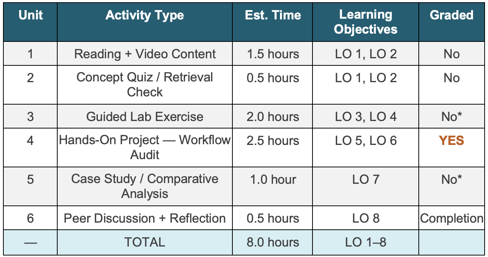

# Module 1 Overview: From Prompts to Pipelines

**Time:** 8 hours

{ width="900" }

## Introduction

*Estimated time: ~3 min*

Every powerful automation begins with a question: what is actually happening in this workflow,
and where is the human effort most replaceable? Module 1 is intentionally tool-light. Before you touch Claude
Cowork, n8n, or any agent framework, you need a mental model that will make every subsequent module
coherent. This module builds that model.

We begin by defining what an AI agent is and distinguishing it from a chatbot, a script,
or a search engine. We trace the agent loop (perceive → plan → act → observe) that underlies every automated
system you will build in this course, from a simple Cowork file-organization task to a multi-agent LangGraph
workflow. We then survey the full automation landscape — from no-code tools like n8n to orchestration
frameworks like LangChain and CrewAI — so that you can see the whole map before we begin exploring
individual territories.

The module's anchor activity is the Workflow Audit: a structured analysis of three repetitive tasks from your own
work or studies. You will return to this audit in every subsequent module, progressively automating, connecting,
and refining the workflows you identify here. Begin it thoughtfully.

## Topics Covered

*Estimated time: ~2 min*

1. What is an AI agent? Precise definitions: perception, planning, action, and observation
2. The agent loop: perceive → plan → act → observe — illustrated with real examples
3. Prompts vs. pipelines: why automation requires a different mindset than a single conversation
4. The anatomy of a workflow: triggers, tasks, conditional logic, tools, and outputs
5. Identifying automation candidates: high-repetition, rule-based, and time-consuming tasks
6. Overview of the automation landscape: no-code (n8n, Cowork), low-code (LangChain), and code-first
(custom Python agents)
7. Introduction to key open-source frameworks: LangChain, LangGraph, CrewAI, Ollama — what each does
and when to use it
8. What agents can and cannot do: setting realistic expectations and avoiding common over-automation
mistakes
9. Introduction to the Claude Desktop app: Chat, Cowork, and Code tabs explained
10. Key vocabulary: agent, pipeline, trigger, tool call, MCP, RAG, sandbox, orchestration, and 15+ additional
terms

## Learning Objectives for Module 1

*Estimated time: ~1 min*

1. Distinguish an AI agent from chatbots, APIs, scripts, and search engines.
2. Classify automation paradigms (no-code, low-code, code-first) by trade-off
dimensions.
3. Operate Claude Desktop on a basic agentic task.
4. Execute three structured LLM interactions with behavioral observation.
5. Decompose three real workflows using the Workflow Mapping Template.
6. Evaluate three workflows using the two-dimensional assessment framework.
7. Compare automation paradigms across six dimensions.
8. Reflect on skill confidence with professional context connections.

## Module 1 Checklist

*Estimated time: ~2 min*

{ width="700" }

## Grade Weight Summary

*Estimated time: ~1 min*
- Workflow Audit Project : PRIMARY MODULE GRADE — see rubric
- Discussion Forum Post + Peer Reply : Completion grade (graded for participation, not
content quality)
- Lab Submissions (Units 3, 5, 6): Formative only — required for portfolio, not graded
numerically
- Concept Quiz : Formative only — two attempts; best score retained

## Diagnostic Self-survey

*Estimated time: ~7 min*

Before you write a single prompt, run a single tool, or map a single workflow, you need
accurate mental representations of three constructs that every subsequent module takes
for granted: the agent loop, the automation paradigm taxonomy, and the difference
between an AI agent and a chatbot, script, or pipeline.

Complete the 12-question [Diagnostic Knowledge Survey](diagnostic-survey.md) in the LMS before opening any
readings. This is ungraded and takes approximately 10 minutes. The survey covers: prior
experience with automation tools, your current working definition of 'AI agent,' comfort
level with Python, and one open- ended prompt - 'Name one repetitive task at work or
school that you wish you could hand off.' Do not look up answers before completing it. The
survey's purpose is to capture your current mental models before instruction begins, which
is the baseline the course uses to measure growth.

Your responses are visible to the instructor before Module 2 begins. Immediately after
submission, you receive anonymized cohort summary feedback comparing your prior
experience profile to the rest of the class. This comparison is genuinely informative:
learners consistently misjudge their relative experience level before seeing peer data. Read
the feedback carefully - it calibrates your expectations for how much technical detail will be
assumed versus explicitly taught.

The open-ended prompt ('Name one repetitive task you wish you could hand off') seeds the
most important deliverable in the course: the Workflow Audit Project . Write something
real. The quality of your Workflow Audit Project submission depends entirely on choosing
genuine workflows from your practice, not generic examples. The survey is your first
opportunity to start identifying those workflows.

Migrated from the [course wiki](https://github.com/UA-AI2S/AI-Automation-and-Agents-v2/wiki/Module-1:-Overview){target=_blank} (wiki page last changed 2026-07-22). Spotted a problem? [Edit this page](https://github.com/tyson-swetnam/AI-Automation-and-Agents/edit/main/docs/modules/module-1/overview.md){target=_blank}.

