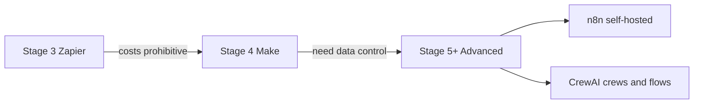

# AI Automation and Multi-Agent Frameworks: A Strategic Comparison

The page's roadmap runs Zapier to Make to n8n or CrewAI — Zapier's costs are the stated reason to leave it, and Stage 5+ is where data control and deep customization are mandatory.

## Executive Summary

The landscape of AI automation is currently defined by a spectrum of tools catering to different organizational maturity levels, ranging from user-friendly no-code platforms to highly technical developer frameworks.

- **[Zapier](https://zapier.com/){target=_blank}** serves as the primary entry point for rapid prototyping and proofs of concept (PoC), offering the largest integration library (8,000+) but facing significant cost challenges at scale.
- **[Make](https://www.make.com/en){target=_blank}** provides a middle ground with a powerful visual scenario builder and a significantly more economical consumption model ($0.0016 per operation), making it ideal for scaling optimized workflows.
- **[n8n](https://n8n.io/){target=_blank}** is the choice for technical teams requiring ultimate control, data privacy through self-hosting, and deep integration with AI frameworks like LangChain.
- **[CrewAI](https://crewai.com/){target=_blank}** and **[LangChain](https://www.langchain.com/){target=_blank}** represent the next frontier: developer-centric frameworks designed for orchestrating autonomous agents. CrewAI distinguishes itself through high-performance Python-based execution (reportedly 5.76x faster than LangGraph in certain tasks), while LangChain offers a standardized interface for multi-model integration and durable execution.

The strategic transition between these tools typically follows an "AI Maturity Model," moving from simple experimentation in Zapier to visual optimization in Make, and finally to bespoke, code-heavy deployments in n8n or CrewAI.

## Comparative Analysis of Automation Platforms

The following table summarizes the core differences between the three dominant automation platforms: Zapier, Make, and n8n.

| Feature | Zapier | Make (formerly Integromat) | n8n |
| :-- | :-- | :-- | :-- |
| Primary Audience | Non-technical / Beginners | Intermediate / Visual Builders | Developers / Technical Teams |
| Ease of Use | 5 Stars (Intuitive, linear) | 4 Stars (Visual, logic-heavy) | 3 Stars (Node-based, technical) |
| Cost Model | High (Task-based pricing) | Medium (Operation-based) | Low (Self-hosted/Execution-based) |
| Integrations | 8,000+ Native Apps | 2,000+ Native Apps | 400-800+ Native Nodes |
| Deployment | Cloud-only | Cloud-only | Cloud or Self-hosted |
| AI Focus | User-friendly AI Agents (Beta) | Complex data flow visualization | LangChain & MCP Integration |
| Maturity Level | Stage 3: Experimentation/PoC | Stage 4: Scaling/Optimization | Stage 5+: Advanced/Custom |

### Zapier: The User-Friendly Gateway

[Zapier](https://zapier.com/){target=_blank} is positioned as the "consumerized" face of AI automation. Its primary value proposition is speed and accessibility.

- **Key Features:**
    - **AI Agent Builder:** Allows users to create custom AI assistants using natural language descriptions.
    - **Anthropic Partnership:** Offers special features like Model Context Protocol (MCP) access, allowing Claude to use Zapier actions as tools.
    - **Reliability:** Includes built-in error handling and automated retries to manage API latency without user intervention.
- **Critical Drawbacks:** The consumption pricing model ($0.05 to $0.10 per task) is cited as a "graduation point" where users are forced to migrate to other platforms as their automation volume increases to avoid excessive costs.

### Make: The Visual Powerhouse

[Make](https://www.make.com/en){target=_blank} is characterized by its drag-and-drop canvas, which allows for non-linear, complex workflows involving branching and sophisticated data manipulation.

- **Key Features:**
    - **Visual Scenario Builder:** Maps out parallel branches and custom error-handling routes (e.g., the "Break" handler for incomplete executions).
    - **Cost Efficiency:** At approximately $0.0016 per operation on the Pro plan, it is significantly cheaper for high-volume workflows than Zapier.
    - **Data Handling:** Provides robust built-in functions for parsing and transforming data without external code.
- **Operational Nuances:** Users may find the configuration "overwhelming and unintuitive" compared to Zapier, and there are occasional reports of performance limits under extreme data loads.

### n8n: The Developer’s Choice

[n8n](https://n8n.io/){target=_blank} is a "fair-code" licensed tool that functions as a central "nervous system" for internal operations, especially those requiring high data privacy.

- **Key Features:**
    - **Self-Hosting:** Allows organizations to keep sensitive AI data on their own infrastructure (critical for GDPR/HIPAA compliance).
    - **Extensibility:** Deep integration with JavaScript/Python and AI/ML frameworks like LangChain.
    - **Node-Based Architecture:** Includes specialized nodes for "MCP Server Triggers," turning workflows into tools for models like Claude.
- **Technical Barrier:** It requires the highest technical aptitude. Infrastructure management (updates, security, backups) falls on the user if self-hosting.

## Specialized Multi-Agent Frameworks

Beyond standard automation, frameworks like **CrewAI** and **LangChain** focus on the orchestration of autonomous, role-playing AI agents.

### CrewAI: High-Performance Autonomy

[CrewAI](https://crewai.com/){target=_blank} is a lean, Python-based framework independent of LangChain. It is designed for production-ready multi-agent systems.

- **Crews vs. Flows:**
    - **Crews:** Teams of agents with role-based collaboration, focusing on autonomous decision-making and dynamic delegation.
    - **Flows:** Event-driven state management that provides fine-grained control over execution paths, designed for enterprise architecture.
- **Performance Advantage:** In specific QA and coding tasks, CrewAI has demonstrated execution speeds up to 5.76x faster than LangGraph, achieving higher evaluation scores with lower completion times.
- **AMP Suite:** Offers an enterprise-grade "Control Plane" for tracing, observability, and 24/7 support.

### LangChain and LangGraph

[LangChain](https://www.langchain.com/){target=_blank} remains a foundational open-source framework, primarily focused on standardizing model interfaces.

- **Standardization:** Allows developers to swap LLM providers (OpenAI, Anthropic, Google) with minimal code changes.
- **LangGraph:** A low-level orchestration framework used when workflows require a mix of deterministic logic and autonomous agentic behavior.
- **Deep Agents:** A "batteries-included" implementation of LangChain agents featuring automatic conversation compression and subagent-spawning.

## Strategic Implementation and Best Practices

### The AI Maturity Roadmap

The analysis suggests a tiered strategic approach to adopting these tools:

1. **Stage 3 (Experimentation):** Use **Zapier** to rapidly validate ideas and build initial PoCs. Focus on simple tasks like text summarization or inquiry classification.
2. **Stage 4 (Scaling):** Move to **Make** when workflows require sophisticated data manipulation or when Zapier’s costs become prohibitive.
3. **Stage 5+ (Advanced):** Deploy **n8n** or **CrewAI** for custom, high-volume production environments where data control and deep technical customization are mandatory.

### Critical Considerations for Success

- **Error Handling for AI:** AI API calls are inherently less predictable than traditional APIs. Robust error handling (retries and fallbacks) is essential. Make and n8n offer more granular control over these failures.
- **Data Governance:** As AI integration deepens, self-hosting options (like n8n) become vital for managing data privacy and security.
- **Human-in-the-Loop (HITL):** All major platforms support human review nodes, which are critical for high-stakes decisions or scenarios where AI confidence is low.
- **Total Cost of Ownership:** Strategic selection must account for more than subscription fees; it includes development time, infrastructure costs (for n8n), and AI model API usage.

## Emerging Trends

The industry is moving toward **Autonomous Agents** that can plan and execute multi-step actions with minimal human intervention. Platforms are evolving into "meta-orchestrators" that manage swarms of specialized AI agents. This shift necessitates a focus on **Data Governance** and the strategic identification of high-value use cases rather than just technical feasibility.

Migrated from the [course wiki](https://github.com/UA-AI2S/AI-Automation-and-Agents-v2/wiki/Module-1-Act-5:-AI-Automation-and-Multi%E2%80%90Agent-Frameworks){target=_blank} (wiki page last changed 2026-07-14). Spotted a problem? [Edit this page](https://github.com/tyson-swetnam/AI-Automation-and-Agents/edit/main/docs/modules/module-1/readings/automation-and-multi-agent-frameworks.md){target=_blank}.

