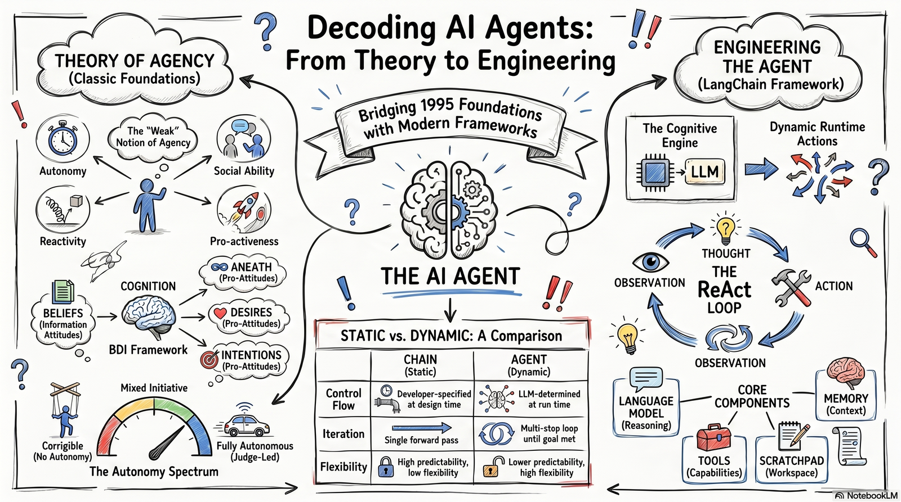

# What Is an AI Agent?

{ width="900" }

### Contents of this package

1. **** Section 1 — LangChain Conceptual Guide: What Are Agents?

2. **** Section 2 — Annotated Excerpt: Wooldridge & Jennings (1995), ["Intelligent Agents: Theory and Practice"](https://www.cs.ox.ac.uk/people/michael.wooldridge/pubs/ker95.pdf){target=_blank}

3. **** Section 3 — Glossary Pre-Fill Sheet (12 Key Terms)

### Learning Objectives

-   Distinguish the engineering definition of an agent (LangChain) from the theoretical definition (Wooldridge & Jennings).

-   Identify and define the four core properties of a weak agent: autonomy, social ability, reactivity, and pro-activeness.

-   Explain rationality and the intentional stance as formal frameworks for characterising agent behaviour.

-   Apply the BDI (Belief–Desire–Intention) vocabulary to describe agent cognition.

-   Articulate the role of tools, the ReAct loop, and LangGraph in modern LLM-based agent architectures.

## Section 1: LangChain Conceptual Guide — What Are Agents?

**Source:** LangChain Documentation, Conceptual Guide — "Agents". *https://python.langchain.com/docs/concepts/agents/*

### 1.1 Overview: From Chains to Agents

In the LangChain framework, the term agent denotes a system in which a large language model (LLM) serves as the cognitive engine that decides, at runtime, which actions to 
execute and in what sequence. This is a departure from the fixed-pipeline paradigm of chains, where the sequence of operations is determined entirely at design time by the developer. 
Agents introduce dynamic, LLM-driven control flow: the model inspects the current context, reasons about which tool or sub-routine is most appropriate, executes that tool, observes 
the result, and iterates until a satisfactory answer or terminal state is reached.

A key conceptual distinction is therefore between a chain (static, developer-specified logic) and an agent (dynamic, model-specified logic). Whereas a chain defines an immediate 
input-to-output mapping, an agent can interleave reasoning steps with targeted tool invocations, feeding each observation back into the model's context before deciding the next move. 
This architecture enables the system to tackle multi-hop queries, ambiguous tasks, and open-ended objectives that cannot be addressed by a single forward pass through a static pipeline.

!!! note "LangChain Definition"

    An agent is a system that uses an LLM to dynamically decide which actions to take. The LLM functions as the reasoning engine;
    external tools extend its capabilities into the world.

### 1.2 Core Components of a LangChain Agent

LangChain identifies four foundational components that constitute a fully functional agent:

| Component | Role and Significance |
| :-- | :-- |
| **Language Model (LLM)** | The LLM is the agent's reasoning engine. It interprets the user's prompt and conversation history, selects appropriate tools from those available, generates intermediate reasoning traces (the "scratchpad"), and formulates final responses. Models with function-calling or tool-use capabilities (e.g., GPT-4o, Claude, Gemini) are typically used in production agents. |
| **Tools** | Tools extend the agent's reach beyond the LLM's parametric knowledge. Each tool is a callable function with a name, a natural-language description, and a typed signature. Examples include web search APIs, code interpreters, database query interfaces, file readers, and custom business-logic functions. The agent selects tools based on their descriptions, making those descriptions a critical design surface. |
| **Reasoning / Scratchpad** | The scratchpad is the agent's workspace for multi-step deliberation. It records the sequence of Thought → Action → Observation triples that constitute the agent's reasoning trace. This intermediate context allows developers to inspect and debug the model's decision-making process and enables the model to revise its strategy based on tool outputs. |
| **Memory** | Memory subsystems allow agents to maintain context across turns (short-term) or across sessions (long-term). Short-term memory typically involves passing the conversation history as part of the prompt context. Long-term memory may rely on external vector stores or structured databases that the agent can query to retrieve relevant prior experience. |

### 1.3 The ReAct Loop: Reasoning and Acting

The dominant execution pattern in LangChain-style agents is the ReAct framework (Yao et al., 2022), which interleaves reasoning (Thought) steps with action (Act) steps and environmental 
feedback (Observation) steps. The loop operates as follows:

> **1. Thought:** The LLM generates a natural-language reasoning trace that analyses the current context, identifies what information is missing, and selects the most appropriate next action.
>
> **2. Action:** The LLM calls a specific tool with the appropriate input parameters, as specified by the reasoning trace.
>
> **3. Observation:** The tool executes and returns a result. This output is appended to the agent's context window.
>
> **4. Iteration or Termination:** The model evaluates whether the observation is sufficient to answer the user's query. If not, it generates a new Thought and repeats the cycle. If yes, it produces a final answer.

The ReAct pattern is significant because it makes the agent's reasoning process explicit and inspectable. Unlike chain-of-thought prompting alone (which remains internal to the model), the action-observation interleaving grounds each reasoning step in empirical feedback from the environment, mitigating hallucination and enabling adaptive multi-step problem-solving.

!!! info "📌 Connection to Classic Agent Theory"

    The Thought–Action–Observation loop maps directly onto the perception–deliberation–action cycle described in classical
    agent architectures (Section 2). The "Observation" phase corresponds to Wooldridge & Jennings' notion of an agent "perceiving its environment"; the "Thought" phase to deliberative reasoning;
    the "Action" phase to pro-active goal-directed behaviour.

### 1.4 Modern Agent Infrastructure: LangGraph

As agent systems scale in complexity, a simple linear ReAct loop becomes insufficient. LangChain addresses this by introducing LangGraph, a graph-based orchestration framework that models agent workflows as directed graphs. Each node in the graph represents an agent, a processing step, or a decision point; edges represent control flow conditioned on the outputs of preceding nodes.

LangGraph supports conditional branching, parallel execution of agent sub-tasks, and stateful persistence across graph traversal steps. It also integrates natively with the Model Context Protocol (MCP), a standardised interface for connecting agents to external tool providers and data sources. Because of this modularity and production-readiness, LangGraph is now the recommended framework for building enterprise-grade AI agents within the LangChain ecosystem.

!!! note "LangGraph vs. Simple Agent"

    A simple ReAct agent is a single LLM in a loop. A LangGraph agent is a network of nodes (each potentially an LLM, a tool, or another sub-agent) with explicit state,
    conditional branching, and controllable human-in-the-loop checkpoints. LangGraph is the production-grade evolution of the original LangChain agent abstraction.

### 1.5 Agents vs. Chains: A Comparative Summary

| **Dimension** | **Chain** | **Agent** |
| :-- | :-- | :-- |
|Control flow | Developer-specified at design time | LLM-determined at run time |
| Tool selection | Fixed (no tool selection needed) | Dynamic, based on model reasoning |
| Iteration | Single forward pass | Multi-step loop until goal met |
| Flexibility | High predictability, low flexibility | Lower predictability, high flexibility |
| Best suited for | Well-defined, structured tasks | Open-ended, multi-step tasks |

**Question: What surprised you about this definition?**

## Section 2: Annotated Excerpt

*Wooldridge, M. & Jennings, N. R. (1995). Intelligent agents: Theory and practice. The Knowledge Engineering Review, 10*(2), 115–152.

!!! note "How to use this excerpt"

    The original text appears in normal type; instructor annotations appear in the shaded boxes labelled with 📌 icons.
    Annotations connect the 1995 theoretical vocabulary to contemporary AI systems and course themes.

### 2.1 Introduction: The Agent Concept in AI

The concept of an agent has become important in both artificial intelligence (AI) and mainstream computer science. Our aim in this paper is to point the reader at what we perceive to be the most important theoretical and practical issues associated with the design and construction of intelligent agents. Agent theory is concerned with the question of what an agent is, and the use of mathematical formalisms for representing and reasoning about the properties of agents. Agent architectures can be thought of as software engineering models of agents; researchers in this area are primarily concerned with the problem of designing software or hardware systems that will satisfy the properties specified by agent theorists. Finally, agent languages are software systems for programming and experimenting with agents; these may embody principles proposed by theorists.

!!! info "📌 Annotation: The Three-Layer Framework"

    Wooldridge & Jennings organise agent research into three mutually reinforcing layers: (1) theory (formal properties and logic),
    (2) architectures (engineering implementations), and (3) languages (programming abstractions). This taxonomy remains foundational today. Modern frameworks such as LangChain
    and LangGraph correspond primarily to the architecture and language layers, while the theoretical layer is addressed by research in BDI logic, game-theoretic decision theory,
    and reinforcement learning.

### 2.2 The Weak Notion of Agency: Four Core Properties

Perhaps the most general way in which the term "agent" is used is to denote a hardware or (more usually) software-based computer system that enjoys the following properties:

| **Property** | **Definition (Wooldridge & Jennings, 1995, p. 116)** |
| :-- | :-- |
| **Autonomy** | Agents operate without the direct intervention of humans or others, and have some kind of control over their actions and internal state (Castelfranchi, 1995). |
| **Social Ability** | Agents interact with other agents (and possibly humans) via some kind of agent-communication language (Genesereth & Ketchpel, 1994). |
| **Reactivity** | Agents perceive their environment (which may be the physical world, a user via a graphical interface, a collection of other agents, the Internet, or all of these combined) and respond in a timely fashion to changes that occur in it. |
| **Pro-activeness** | Agents do not simply act in response to their environment; they are able to exhibit goal-directed behaviour by taking the initiative. |

!!! info "📌 Annotation: Mapping to LLM Agents"

    These four properties map directly onto the design goals of modern LLM-based agents: Autonomy → the agent acts without step-by-step human instruction
    (ReAct loop without human intervention); Social Ability → multi-agent systems communicate via shared message formats (e.g., LangChain messages, OpenAI function-call JSON);
    Reactivity → the agent's tool-call results inform its next action (the Observation step); Pro-activeness → the agent pursues a terminal goal across multiple steps, not
    merely responding to the most recent input.

### 2.3 The Stronger Notion: Mentalistic Agency and Rationality

For some researchers—particularly those working in AI—the term "agent" has a stronger and more specific meaning. These researchers generally mean an agent to be a computer system that, in addition to having the properties identified above, is either conceptualised or implemented using concepts that are more usually applied to humans. It is quite common in AI to characterise an agent using mentalistic notions such as knowledge, belief, intention, and obligation (Shoham, 1993).

In addition to the four weak-agency properties, the following attributes are discussed in the context of the stronger notion of agency:

> **Mobility:** The ability of an agent to move around an electronic network (White, 1994).
>
> **Veracity:** The assumption that an agent will not knowingly communicate false information (Galliers, 1988b).
>
> **Benevolence:** The assumption that agents do not have conflicting goals, and that every agent will therefore always try to do what is asked of it (Rosenschein & Genesereth, 1985, p. 91).
>
> **Rationality:** (Crudely) the assumption that an agent will act in order to achieve its goals, and will not act in such a way as to prevent its goals being achieved—at least insofar as its beliefs permit (Galliers, 1988b, pp. 49–54).

!!! info "📌 Annotation: Rationality in Formal Agent Theory"

    The notion of rationality introduced here is a conceptual precursor to the formal BDI (Belief–Desire–Intention) model.
    In BDI theory (Rao & Georgeff, 1991), a rational agent selects intentions that are consistent with its beliefs about the world and its desires about future states. Rationality does
    not imply omniscience or perfect reasoning; it only requires that the agent not act against its own goals given what it currently believes. This is a key design constraint for
    autonomous AI systems: they must be locally rational without requiring global knowledge.

### 2.4 Agents as Intentional Systems

When explaining human activity, it is often useful to make statements such as the following: "Janine took her umbrella because she believed it was going to rain." The attitudes employed in such folk psychological descriptions are called the intentional notions. The philosopher Daniel Dennett coined the term intentional system to describe entities "whose behaviour can be predicted by the method of attributing belief, desires and rational acumen" (Dennett, 1987, p. 49).

An obvious question is whether it is legitimate or useful to attribute beliefs, desires, and so on, to artificial agents. McCarthy, among others, has argued that there are occasions when the intentional stance is appropriate: "To ascribe beliefs, free will, intentions, consciousness, abilities, or wants to a machine is legitimate when such an ascription expresses the same information about the machine that it expresses about a person. It is useful when the ascription helps us understand the structure of the machine, its past or future behaviour, or how to repair or improve it" (McCarthy, 1978).

> *Put crudely, the more we know about a system, the less we need to rely on animistic, intentional explanations of its behaviour. However, with very complex systems, even if a complete,
> accurate picture of the system's architecture and working is available, a mechanistic, design stance explanation of its behaviour may not be practicable. The intentional notions are
> thus abstraction tools, which provide us with a convenient and familiar way of describing, explaining, and predicting the behaviour of complex systems.*

!!! info "📌 Annotation: The Intentional Stance and LLMs"

    Dennett's intentional stance is particularly relevant to LLM-based agents, whose internal computations are largely opaque.
    We routinely say that an LLM "believes" something, "wants" to produce a coherent answer, or "intends" to call a tool—even though the model is, mechanistically, a statistical
    next-token predictor. Wooldridge & Jennings' justification for the intentional stance provides a rigorous philosophical grounding for this common engineering practice.
    The stance is useful not because LLMs literally have minds, but because the intentional vocabulary allows us to design, debug, and predict agent behaviour at a tractable level of abstraction.

### 2.5 Information Attitudes and Pro-Attitudes

For the purposes of this survey, the two most important categories of intentional attitude are information attitudes and pro-attitudes (Wooldridge & Jennings, 1995, p. 120):

| **Category** | **Constituent Attitudes and Significance** |
| :-- | :-- |
| **Information Attitudes (what the agent knows about the world)** | Belief: The agent's representation of the current state of the world, which may be incomplete or incorrect. Knowledge: A stronger form of belief, typically assumed to be veridical (true). Formally, if i knows φ, then φ is true. |
| **Pro-Attitudes (what motivates the agent to act)** | Desire: A state of affairs the agent wishes to bring about. Intention: A desire the agent has committed to pursuing—one it actively plans and acts to realise. Obligation: A constraint on the agent's behaviour arising from social or contractual norms. Commitment: The agent's disposition to persist with an intention even when circumstances change. |

!!! info "📌 Annotation: BDI Architecture"

    The information / pro-attitude taxonomy is the theoretical foundation for the BDI (Belief–Desire–Intention) architecture, first formally
    specified by Rao & Georgeff (1991). BDI remains influential in both academic agent theory and practical systems (PRS, dMARS, JADE, Jason). In LLM agents, beliefs correspond to
    the model's parametric and retrieved knowledge; desires map onto the user-specified task or system prompt objective; intentions map onto the specific plan or tool-call
    sequence the agent is currently executing.

### 2.6 Theories of Agency: Representing the Rational Agent

All of the formalisms considered so far have focused on just one aspect of agency. A complete agent theory, expressed in a logic with these properties, must define how the attributes of agency are related. For example, it will need to show how an agent's information and pro-attitudes are related; how an agent's cognitive state changes over time; how the environment affects an agent's cognitive state; and how an agent's information and pro-attitudes lead it to perform actions. Giving a good account of these relationships is the most significant problem faced by agent theorists (Wooldridge & Jennings, 1995, p. 125).

Cohen and Levesque (1990) identified seven properties that must be satisfied by a reasonable theory of intention, which remain a touchstone for agent design:

1.  Intentions pose problems for agents, who need to determine ways of achieving them.

2.  Intentions provide a "filter" for adopting other intentions, which must not conflict.

3.  Agents track the success of their intentions, and are inclined to try again if their attempts fail.

4.  Agents believe their intentions are possible.

5.  Agents do not believe they will not bring about their intentions.

6.  Under certain circumstances, agents believe they will bring about their intentions.

7.  Agents need not intend all the expected side effects of their intentions.

!!! info "📌 Annotation: Intentions and LLM Agent Design"

    These seven properties have direct implications for LLM-agent engineering. Property 3 (retry on failure) motivates self-reflection
    and re-planning loops in agents. Property 2 (non-conflicting intentions) motivates constraint-checking in multi-agent task allocation. Property 7 (no obligation for side effects) informs
    how agents should handle uncertainty: an agent that books a flight need not intend the environmental impact of the flight as a goal. These properties are also relevant to AI safety:
    a misaligned agent might violate property 2 by adopting intentions that conflict with human values.

### 2.7 Autonomy: A Deeper Analysis

Autonomy, the first of the four weak-agency properties, is the most fundamental and the most contested. At its core, autonomy refers to an agent's ability to determine its own behaviour without direct external instruction. Wooldridge & Jennings situate autonomy along a spectrum that runs from fully corrigible systems (which do exactly what they are told, at every step) to fully autonomous systems (which act entirely on their own judgment, drawing no guidance from external principals).

For practical AI systems, neither extreme is desirable. A fully corrigible agent provides no added cognitive value beyond a simple function call; a fully autonomous agent raises significant safety and alignment concerns. The productive design space therefore lies in what the authors term controlled autonomy: the agent acts on its own initiative within a domain defined by its principal hierarchy (the set of entities whose instructions it is designed to follow), but defers to human oversight on high-stakes or out-of-distribution decisions.

!!! note "Autonomy Spectrum (Wooldridge & Jennings, 1995 / Extended)"

    Corrigible (no autonomy) ↔ Supervised Autonomy ↔ Goal-Directed Autonomy ↔ Fully Autonomous.
    Contemporary best practice in AI deployment targets supervised or goal-directed autonomy, with human-in-the-loop checkpoints at high-risk decision nodes.

The degree of autonomy exhibited by an agent is closely linked to its level of social integration. An agent that operates within a multi-agent system must balance its own goal-directed autonomy with cooperative norms established with other agents. This tension—between individual rationality and collective coordination—is one of the central problems in multi-agent systems research and is directly relevant to the design of modern AI pipelines that orchestrate multiple specialised sub-agents.

!!! info "📌 Annotation: Autonomy in Contemporary AI Governance"

    The autonomy spectrum discussed by Wooldridge & Jennings anticipates contemporary debates in AI safety and governance.
    Anthropic's Constitutional AI, OpenAI's alignment frameworks, and the EU AI Act all implicitly invoke the autonomy spectrum: high-risk AI systems (those with significant real-world
    consequences) are required to maintain human oversight, limiting their autonomy. Understanding autonomy as a property along a spectrum—rather than a binary attribute—is essential
    for responsible agent deployment.

**Question: Can you draw the agent loop from memory?**

## Section 3: Glossary Pre-Fill Sheet

Instructions: For each term below, complete the definition by filling in the blanks (shown as \_\_\_\_\_\_\_\_\_\_). Use the cited readings for guidance. Completed glossaries will be discussed in the next class session. Pay close attention to the distinctions between terms that appear similar (e.g., Desire vs. Intention; Autonomy vs. Pro-activeness).

---

 **AI Automation and Agents — Glossary Pre-Fill Sheet**

Student Name: \_\_\_\_\_\_\_\_\_\_\_\_\_\_\_\_\_\_\_\_\_\_\_\_\_\_\_ Date: \_\_\_\_\_\_\_\_\_\_\_\_\_\_\_\_\_\_

---

| Term | Details |
| :-- | :-- |
| **1. Agent** | *\[Hint: W&J §1.1, LangChain §1\]* |
| **Context** | Wooldridge & Jennings (1995) define an agent as a computer system capable of autonomous action in an environment to meet its design objectives. |
| **Complete the definition:** | *A hardware or software system situated in an environment that \_\_\_\_\_\_\_\_\_\_ perceives that environment and \_\_\_\_\_\_\_\_\_\_ acts upon it in order to meet its delegated \_\_\_\_\_\_\_\_\_\_.* |
| **2. Autonomy** | *\[Hint: W&J §1.1.1\]* |
| **Context** | One of the four core properties of a weak agent; refers to the agent's ability to act without direct human intervention. |
| **Complete the definition:** | *The property by which an agent operates without the \_\_\_\_\_\_\_\_\_\_ intervention of humans or others, maintaining \_\_\_\_\_\_\_\_\_\_ over its own actions and internal \_\_\_\_\_\_\_\_\_\_.* |
| **3. Reactivity** | *\[Hint: W&J §1.1.1\]* |
| **Context** | Distinguishes agents from passive software modules; an agent must respond to environmental changes, not merely process inputs. |
| **Complete the definition:** | *The property by which an agent \_\_\_\_\_\_\_\_\_\_ its environment and responds in a \_\_\_\_\_\_\_\_\_\_ fashion to changes that occur in it.* |
| **4. Pro-activeness** | *\[Hint: W&J §1.1.1\]* |
| **Context** | Alongside reactivity, pro-activeness distinguishes agents from simple stimulus-response systems. |
| **Complete the definition:** | *The property by which an agent exhibits \_\_\_\_\_\_\_\_\_\_ behaviour by taking the \_\_\_\_\_\_\_\_\_\_, rather than merely responding to its \_\_\_\_\_\_\_\_\_\_.* |
| **5. Intentional Stance** | *\[Hint: W&J §2.1; Dennett (1987)\]* |
| **Context** | Dennett's philosophical concept adopted by Wooldridge & Jennings to justify ascribing mental predicates to artificial agents. |
| **Complete the definition:** | *A strategy for predicting and explaining the behaviour of a system by treating it as if it had \_\_\_\_\_\_\_\_\_\_, \_\_\_\_\_\_\_\_\_\_, and \_\_\_\_\_\_\_\_\_\_, regardless of the system's physical substrate.* |
| **6. Belief (BDI)** | *\[Hint: W&J §2.1–2.2; Rao & Georgeff (1991)\]* |
| **Context** | An information attitude in the BDI framework, representing the agent's internal model of the world. |
| **Complete the definition:** | *An agent's \_\_\_\_\_\_\_\_\_\_ of the state of its environment; may be \_\_\_\_\_\_\_\_\_\_ or \_\_\_\_\_\_\_\_\_\_, and may change over time as the agent perceives new information.* |
| **7. Desire (BDI)** | *\[Hint: W&J §2.1–2.2\]* |
| **Context** | A pro-attitude representing a motivational state; what the agent "wants" to be true. |
| **Complete the definition:** | *A \_\_\_\_\_\_\_\_\_\_ state of affairs the agent wishes to \_\_\_\_\_\_\_\_\_\_; constitutes the agent's motivational component, but does not necessarily lead to \_\_\_\_\_\_\_\_\_\_ unless adopted as an intention.* |
| **8. Intention (BDI)** | *\[Hint: W&J §2.6.2; Cohen & Levesque (1990)\]* |
| **Context** | The pro-attitude that distinguishes committed goal pursuit from mere desire; the basis of planned action. |
| **Complete the definition:** | *A desire to which the agent has \_\_\_\_\_\_\_\_\_\_, leading it to formulate and execute \_\_\_\_\_\_\_\_\_\_; intentions \_\_\_\_\_\_\_\_\_\_ resources and constrain the adoption of conflicting intentions.* |
| **9. Rationality (Agent Theory)** | *\[Hint: W&J §1.1.3\]* |
| **Context** | A property of the stronger notion of agency; an agent is rational if its actions are consistent with its goals given its beliefs. |
| **Complete the definition:** | *The property by which an agent acts in order to achieve its \_\_\_\_\_\_\_\_\_\_, and will not act in such a way as to \_\_\_\_\_\_\_\_\_\_ its goals being achieved—at least insofar as its \_\_\_\_\_\_\_\_\_\_ permit.* |
| **10. ReAct Loop** | *\[Hint: LangChain §1.3; Yao et al. (2022)\]* |
| **Context** | The predominant execution paradigm in LangChain-style agents, introduced by Yao et al. (2022). |
| **Complete the definition:** | *An agent execution pattern that interleaves \_\_\_\_\_\_\_\_\_\_ (reasoning traces) with \_\_\_\_\_\_\_\_\_\_ (tool invocations) and \_\_\_\_\_\_\_\_\_\_ (environmental feedback), iterating until a terminal condition is met.* |
| **11. Tool (LangChain)** | *\[Hint: LangChain §1.2\]* |
| **Context** | A callable function exposed to an LLM agent that extends its capabilities beyond parametric knowledge. |
| **Complete the definition:** | *A callable component with a \_\_\_\_\_\_\_\_\_\_, a natural-language \_\_\_\_\_\_\_\_\_\_, and a typed \_\_\_\_\_\_\_\_\_\_, which extends an LLM agent's reach into external systems such as APIs, databases, or code interpreters.* |
| **12. Multi-agent System** | *\[Hint: W&J §1; Jennings (1993); LangGraph documentation\]* |
| **Context** | A collection of interacting agents designed to solve problems that exceed the capabilities of any single agent. |
| **Complete the definition:** | *A system comprising two or more agents that interact through \_\_\_\_\_\_\_\_\_\_ to pursue individual or \_\_\_\_\_\_\_\_\_\_ goals within a shared \_\_\_\_\_\_\_\_\_\_, giving rise to emergent collective behaviour.* |

---

**Synthesis Questions (Short Answer)**

After completing the glossary terms, answer the following synthesis questions in 3–5 sentences each:

**Q1:** How does the weak notion of agency (Wooldridge & Jennings) align with or differ from LangChain's engineering definition of an agent? Identify at least two points of convergence and one point of divergence.

**Response:**

**Q2:** Why does Wooldridge & Jennings' notion of rationality not require an agent to be omniscient? What are the implications of this for the design of LLM-based agents operating in open-ended environments?

**Response:**

**Q3:** A colleague proposes building an AI system that is "fully autonomous"---one that never requires human input or oversight. Using the vocabulary from this reading package, construct a critique of this proposal.

**Response:**

**Q4:** What cannot an agent do?

**Response:**

Migrated from the [course wiki](https://github.com/UA-AI2S/AI-Automation-and-Agents-v2/wiki/Module-1-Act-3:-What-is-an-agent%3F){target=_blank} (wiki page last changed 2026-07-14). Spotted a problem? [Edit this page](https://github.com/tyson-swetnam/AI-Automation-and-Agents/edit/main/docs/modules/module-1/readings/what-is-an-agent.md){target=_blank}.

