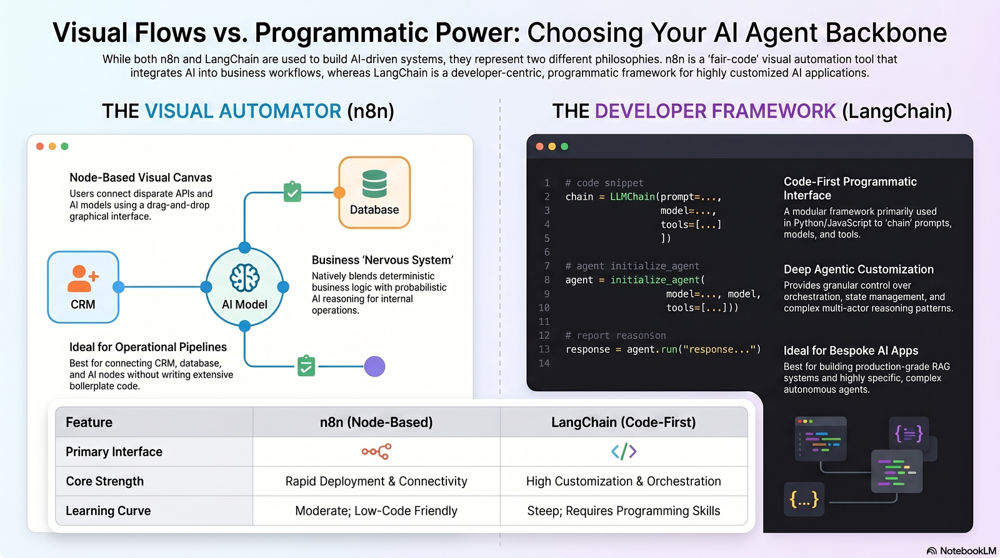

# Module 1: Additional Suggested Resources

## Generative AI foundations

*Key Definitions & Concepts*

* **Generative AI & LLMs:** AI that creates diverse content (text, code, images) from prompts, typically powered by Large Language Models (LLMs) that are pretrained on massive amounts of unstructured data.
* **Transformer Models:** The underlying architecture of modern LLMs that uses parallel processing and "self-attention" mechanisms to understand the contextual relationships between words.
* **Transfer Learning & RAG:** Transfer learning fine-tunes a pretrained model for a new, specific task. Retrieval-Augmented Generation (RAG) further enhances models by fetching real-time, external knowledge to answer queries.
* **Alignment:** The process of ensuring a model's outputs safely meet user expectations, often achieved through Reinforcement Learning from Human Feedback (RLHF).
* **Model Ecosystem:** Developers can choose between highly capable proprietary models (like GPT-4), transparent open-source models, and highly efficient Small Language Models (SLMs) that require less computational power
* **Prompt Engineering:** The technique of carefully crafting inputs to guide the LLM using clear instructions, personas, delimiters, and step-by-step logic

**Connections to AI Agents**. Understanding these generative AI concepts is the bedrock of developing AI agents
* The LLM acts as the core reasoning engine for the agent, allowing it to perform complex tasks that were once exclusive to humans
* Furthermore, prompt engineering is the primary method developers use to program how an agent behaves and makes decisions
* Advanced techniques like RAG are also critical for agents, as they overcome an LLM's static training data by allowing the agent to actively retrieve external, up-to-date information while completing its goals

## Main Types of Agents

* **Simple Reflex Agents:** React only to immediate sensory inputs using basic "if-then" rules. They lack memory, making them easy to build but ineffective in unpredictable environments.
* **Model-Based Reflex Agents:** Maintain an internal model of their environment to predict the outcomes of their actions before making decisions. They adapt better to changes but are computationally expensive.
* **Goal-Based Agents:** Proactively plan and evaluate sequences of possible actions to achieve specific objectives, enabling high levels of autonomy.
* **Utility-Based Agents:** Weigh multiple scenarios using a "utility function" to select actions that optimize complex criteria like cost, quality, or time.
* **Learning Agents:** Continuously improve their performance by analyzing past experiences and feedback, though they require vast amounts of data and are resource-intensive.
* **Hierarchical Agents:** Work in a tiered structure where top-level agents set goals and delegate tasks to lower-level agents. This streamlines execution but can create rigid systems that are hard to repurpose.

A major takeaway from this is that as AI technology advances, these strict boundaries are blurring. Developers are increasingly building hybrid agents that combine the strengths of various approaches.

## Developing AI agents

**Development Environments & UI Tools**
* **Jupyter Notebook & Google Colab:** Web-based environments that allow you to combine live code, visualizations, and text. Colab operates in the cloud and provides free access to powerful hardware like GPUs.
* **VS Code:** A highly customizable code editor that acts as a full integrated development environment (IDE).
* **Streamlit & Gradio:** Rapid development tools that let you easily build interactive, web-based user interfaces for your AI models using just a few lines of Python.

**Foundational Platforms & Languages**
* **Hugging Face:** An open-source community hub where developers can access and share thousands of pre-trained models, datasets, and libraries.
* **Python:** The dominant programming language for AI development, favored because of its extensive ecosystem of machine learning libraries.

**Deploying and Customizing LLMs**
* **Deployment Options:** Developers can access LLMs via cloud APIs (like OpenAI) for high scalability, or run models entirely locally using tools like Ollama to prioritize data privacy and reduce costs.
* **Fine-Tuning:** The process of taking a general, pre-trained model and training it further on a smaller, task-specific dataset to make it highly specialized.
* **Retrieval-Augmented Generation (RAG):** A technique that connects an LLM to an external database, allowing it to retrieve relevant, up-to-date information to answer a query. This significantly reduces "hallucinations" (made-up facts).

## What is an Agent? and how differs from other technologies

An AI agent is a system that uses a large language model (LLM) as its cognitive engine to dynamically perceive its environment, make autonomous decisions, and take actions to meet specific goals. 

Here is how an agent differs from other familiar technologies:
*   **Chatbot:** A chatbot is primarily designed for dialogue and conversational turn-taking. While a chatbot just talks, an agent can autonomously plan and execute multi-step tasks to achieve a goal.
*   **API Call:** An API is simply a gateway used to request and exchange data between software. An agent *uses* APIs as tools to perform actions, but the API itself possesses no reasoning or autonomy.
*   **Rule-Based Automation Script:** Automation scripts (like traditional RPA) follow a rigid, developer-specified sequence of "if-then" rules. Agents can adapt to highly unstructured inputs and decide their own control flow at runtime.
*   **Search Engine:** A search engine retrieves and ranks documents based on matching algorithms, but involves no learning or autonomous task execution. An agent might use a search engine as a tool to gather information needed to complete a broader objective.

The core functioning of an agent relies on a continuous cycle, often modeled after the ReAct (Reasoning and Acting) loop:

**1. Perceive:** The agent receives an input or gathers current state information from its environment, such as a user prompt or system event.

2. **Plan (Thought):** The LLM acts as the reasoning engine to analyze the context, break the problem into steps, and determine which tool is most appropriate to use next.

3. **Act (Action):** The agent executes the chosen tool—like calling an API, running a script, or querying a database—using the parameters it decided on.

4. **Observe (Observation):** The tool returns a result, which is fed back into the agent's context window. The agent evaluates this new information to decide if the goal is met or if the loop must repeat.

## Automation Paradigms

The three major automation paradigms progress from highly accessible visual builders to fully programmable environments:

*   **No-Code (e.g., Claude Cowork, n8n's visual builder):** These platforms use intuitive, drag-and-drop interfaces that are highly accessible to non-technical users, enabling rapid prototyping of simple workflows,. However, they lack flexibility for highly complex or non-linear logic. They often rely on task-based cloud pricing, which can become prohibitively expensive at scale, and pose data governance challenges due to vendor lock-in and a reliance on third-party cloud servers.
*   **Low-Code (e.g., LangChain, CrewAI):** These frameworks blend pre-built components with custom code, requiring a moderate level of technical skill,. They offer significantly more flexibility to orchestrate multi-agent workflows, manage complex state, and connect diverse APIs,. They are more cost-effective for high-volume tasks and provide better data governance by allowing organizations to self-host or integrate local models.
*   **Code-First (e.g., Claude Code, custom Python agents):** Relying entirely on programming, this paradigm has the steepest learning curve and lowest accessibility. In exchange, developers gain ultimate flexibility and fine-grained control over the system's architecture, reasoning logic, and tool integration,. This approach is the most cost-efficient at scale and ensures absolute data governance, as organizations can run everything on private infrastructure using local, open-weight models to guarantee complete data privacy.

**Difference between n8n (no-code) and LangChain (low-code)**

{ width="800" }

## Transitioning from no-code prototype to low-code framework

Transitioning from a no-code prototype (like a Zapier workflow) to a low-code framework usually happens when your project hits limits in complexity, cost-scaling, or data governance. 

Here is a straightforward plan to make the transition:

*   **Document your working prototype:** Before moving anything, clearly define the exact triggers, data transformations, and AI prompts that are currently working in your no-code setup.
*   **Select your low-code path:** If you want to keep a visual interface but need more advanced data routing and lower scaling costs, tools like Make or n8n are excellent choices. If your workflow requires complex reasoning or multiple AI agents collaborating, a Python-based framework like LangChain or CrewAI is the better route.
*   **Rebuild modularly:** Break your workflow down into independent tools and actions. Low-code platforms allow you to use pre-built components for standard tasks while giving you the flexibility to write custom Python or JavaScript for the complex steps.
*   **Implement explicit error handling:** No-code tools often hide error handling. In your new low-code framework, take advantage of the ability to build custom routing for API failures, retries, and human-in-the-loop fallback logic. 

## Low-code examples

**LangChain**

Here is a quick code example showing how to define and connect a tool in LangChain:

```python
from langchain_core.tools import tool
from langchain_openai import ChatOpenAI
from langchain_core.messages import HumanMessage

# 1. Define a tool using the @tool decorator
@tool
def add_numbers(x: int, y: int) -> int:
    """Adds two numbers and returns the sum."""
    return x + y

# 2. Initialize the LLM and bind the tool
llm = ChatOpenAI(model_name="gpt-4o")
llm_with_tools = llm.bind_tools([add_numbers])

# 3. Ask a question and let the LLM invoke the tool
messages = [HumanMessage("What is 11 + 49?")]
ai_msg = llm_with_tools.invoke(messages)
```

In this setup, the `@tool` decorator registers the custom Python function and automatically generates a schema that describes its inputs and outputs to the model. By using `bind_tools`, you give the LLM the awareness and ability to select and execute the tool whenever the user's prompt requires it. 

**CrewAI**

Here is a clean example using **CrewAI**, a popular low-code framework where you build agents primarily by defining their roles and goals in natural language.

```python
from crewai import Agent, Task, Crew

# 1. Define the Agent
researcher = Agent(
    role='Market Researcher',
    goal='Gather insights about current AI trends',
    backstory='You are an analytical researcher who loves data.',
    verbose=True
)

# 2. Define the Task
research_task = Task(
    description='Research current AI automation trends.',
    expected_output='A short summary of AI trends.',
    agent=researcher
)

# 3. Form the Crew and execute
crew = Crew(
    agents=[researcher],
    tasks=[research_task]
)

result = crew.kickoff()
```

In this low-code setup, you don't have to write the complex logic for how the AI "thinks" or decides what to do next. You simply define the agent's personality and objectives, give it a task, and the framework's underlying LLM handles the execution. 

**Connecting CrewAi and LangChain**

Here is a quick code example showing how to define and connect a tool in LangChain:

```python
from langchain_core.tools import tool
from langchain_openai import ChatOpenAI
from langchain_core.messages import HumanMessage

# 1. Define a tool using the @tool decorator
@tool
def add_numbers(x: int, y: int) -> int:
    """Adds two numbers and returns the sum."""
    return x + y

# 2. Initialize the LLM and bind the tool
llm = ChatOpenAI(model_name="gpt-4o")
llm_with_tools = llm.bind_tools([add_numbers])

# 3. Ask a question and let the LLM invoke the tool
messages = [HumanMessage("What is 11 + 49?")]
ai_msg = llm_with_tools.invoke(messages)
```

In this setup, the `@tool` decorator registers the custom Python function and automatically generates a schema that describes its inputs and outputs to the model. By using `bind_tools`, you give the LLM the awareness and ability to select and execute the tool whenever the user's prompt requires it.

<p class="course-provenance" markdown>Migrated from the [course wiki](https://github.com/UA-AI2S/AI-Automation-and-Agents-v2/wiki/Module-1:-Additional-Suggested-Resources){target=_blank} (wiki page last changed 2026-07-14). Spotted a problem? [Edit this page](https://github.com/tyson-swetnam/AI-Automation-and-Agents/edit/main/docs/modules/module-1/resources.md){target=_blank}.</p>
