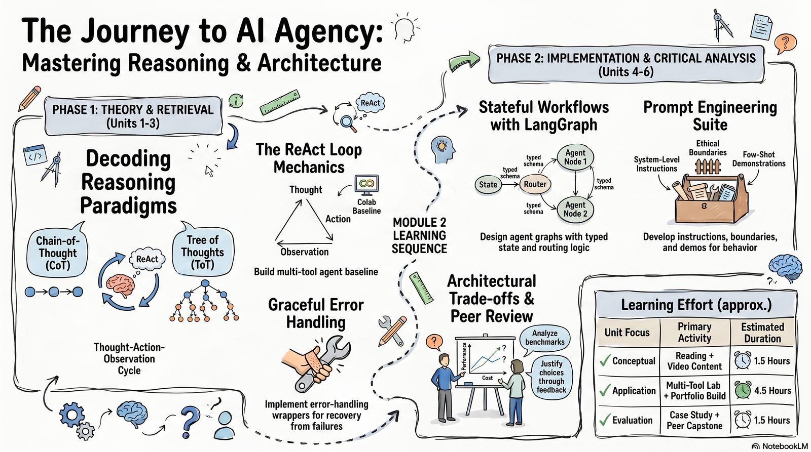

# Module 2 Activities

!!! note "Draft"

    This page is still being written; content may change.

{ width="900" }

## Self-Check Prompts

*Estimated time: ~30 min*

Before moving on, answer the three prompts in a notes document or on a piece of paper. These won't be submitted or graded, they're meant to help you recall what you've  learned. If you're unsure how to answer, revisit the relevant reading before continuing.

1. In your own words, explain the key structural difference between Chain-of-Thought and ReAct. What specific capability does ReAct add, and what is the computational cost of that addition?
2. Sketch a diagram showing the information flow through a tool-calling agent during a single reasoning episode. Your diagram must include: (a) the LLM backbone, (b) the tool registry, (c) the action executor, (d) the memory module, and (e) the direction and content of information passing between each pair of components.
3. Identify two concrete task characteristics that would cause you to select Tree of Thoughts over ReAct. Explain your reasoning.

## Lab Exercise

*Estimated time: ~2 hrs*

!!! warning "Platform setup — read before starting"

    All lab work runs in Google Colab (free tier). You do not need a paid subscription. You will need: (1) a Google account to access Colab; (2) an OpenAI API key (or a locally hosted Ollama model as a free alternative — setup instructions are included in the notebook).

In this lab, you will build a working multi-tool
LangChain ReAct agent from the provided skeleton code.

Do not modify the pre-written code outside
the designated extension zones: the scaffolding is designed to isolate the learning objective of
each step, and modifying it will obscure which design decision produced which behavioral
outcome.

**Open the lab notebook:** [Module-2-Guided-Lab-Notebook.ipynb](lab-notebook.md)

### Notebook Flow Summary

The notebook walks you through a complete ReAct agent build sequence in four phases:

1. Environment setup and first run of a baseline single-tool agent.
2. Multi-tool extension by adding a Python REPL and testing tool selection behavior.
3. Error-handling implementation to improve failure recovery and robustness.
4. Prompt engineering refinements using system instructions and few-shot demonstrations.

All detailed instructions, checks, and logging prompts are embedded directly in the notebook.

!!! info "What to submit"

    **Add to github**: Submit the `.ipynb` file with your completed extension code (all four steps). All cells must be executed with output visible — do not submit a notebook with empty output cells. Filename: `Module2_Lab_[YourName].ipynb`.

## Hands-on Project: Add Your Own Tool

*Estimated time: ~2 hours*

In this final lab extension, you will add a tool of your own choosing to the agent and test how it changes behavior. Choose a tool that could realistically support your own domain or workflow. A strong example is a document retrieval tool that searches a folder of PDFs, policy files, or contract documents. Other possibilities include a spreadsheet reader, calendar tool, or simple database lookup tool.

### What to do

1. Define a new tool with a clear purpose, input format, output format, and one failure condition.
2. Add a short tool description that helps the agent decide when to use it.
3. Connect the tool to the agent and run three prompts:
    - one where the tool should be used
    - one where it should not be used
    - one where the agent must choose between the new tool and an existing tool
4. Compare the agent's behavior before and after adding the tool, and note which description wording made the tool selection more reliable.

This project is designed to help you transfer the lab from the sample workflow to a more realistic use case in your own area of study or work.

!!! info "What to submit"

    **Add to github**: Submit the `.ipynb` file with your completed extension code (all four steps). All cells must be executed with output visible — do not submit a notebook with empty output cells. Filename: `Module2__[YourName].ipynb`.

## Project proposal and peer review

*Estimated time: ~1 hr*

### Part 1: Discussion Post with Project Proposal

Your discussion post will be a Project Proposal Outline for your capstone project.  It should contain the following sections.

**Section 1 — Target Domain Agent Application**

* State the specific application (not just the domain). Not: 'a legal assistant'. Yes: 'an
agent that reviews employment contracts for non-compete clause enforceability under
California law'.

* Identify the intended user and use context: who will interact with this agent, in what
professional setting, and with what prior AI literacy level?

**Section 2 — Reasoning Architecture Selection with Preliminary Justification**

* Specify one of the four Module 2 paradigms (CoT, ReAct, ToT, LATS). Do not say 'I
haven't decided' — commit to a choice with a preliminary justification, even if you
expect to revise it after peer feedback.

* Provide a two-sentence justification that references at least one assigned reading.
Example: 'I selected ReAct because the task requires retrieval of real-time contract
precedents from legal databases, which requires tool invocation at each reasoning
step. As Yao et al. (2022) demonstrate, ReAct outperforms CoT on tasks requiring
external information lookup because...'

**Section 3 — Proposed Tool Set**

* List at minimum two tools with one-sentence descriptions each. Include: the tool name,
what external system it connects to, and the type of input it accepts.

* Identify one tool whose description you anticipate needing to iterate on — based on
your Task 1 experience — and explain why.

**Section 4 — Primary Architectural Trade-Off**

* Identify the single most significant trade-off you are accepting with your design choices.
A trade-off involves two competing properties — not just a limitation. Example: 'By
selecting ReAct over ToT, I prioritize lower token cost and faster inference time,
accepting a lower ceiling on reasoning depth for multi-hypothesis tasks. This is
appropriate given the intended deployment in a high-volume commercial context where
inference cost is a primary constraint.'

!!! tip "Hint"

    The most common Task 3 error is describing what the agent will do rather than why the architecture is appropriate for it. 'The agent will retrieve legal documents and analyze them for compliance issues' describes a capability. 'ReAct is more appropriate than CoT for this agent because compliance analysis requires iterative retrieval — each retrieved document may reveal a new clause requiring a subsequent targeted search — which CoT cannot support because it has no mechanism for tool invocation' describes an architectural justification. The rubric rewards the latter.

### Part 2: Give feedback to two classmates on their proposal

!!! warning "Under construction"

    Guidance on giving thoughtful feedback to two peers on their proposals is still being written.

!!! info "What to submit"

    **Discussion Initial Post**: submitted in LMS Peer Discussion thread. 150–200 words. Due before the reply deadline.

    **Two Peer Replies**: each ≥100 words, substantive engagement as specified above. Due by the module deadline.

Migrated from the [course wiki](https://github.com/UA-AI2S/AI-Automation-and-Agents-v2/wiki/Module-2:-Activities){target=_blank} (wiki page last changed 2026-08-03). Spotted a problem? [Edit this page](https://github.com/tyson-swetnam/AI-Automation-and-Agents/edit/main/docs/modules/module-2/activities.md){target=_blank}.

