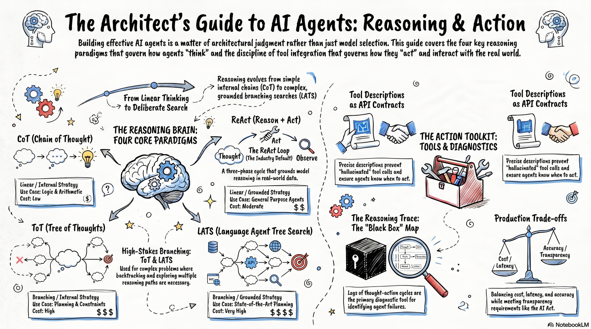
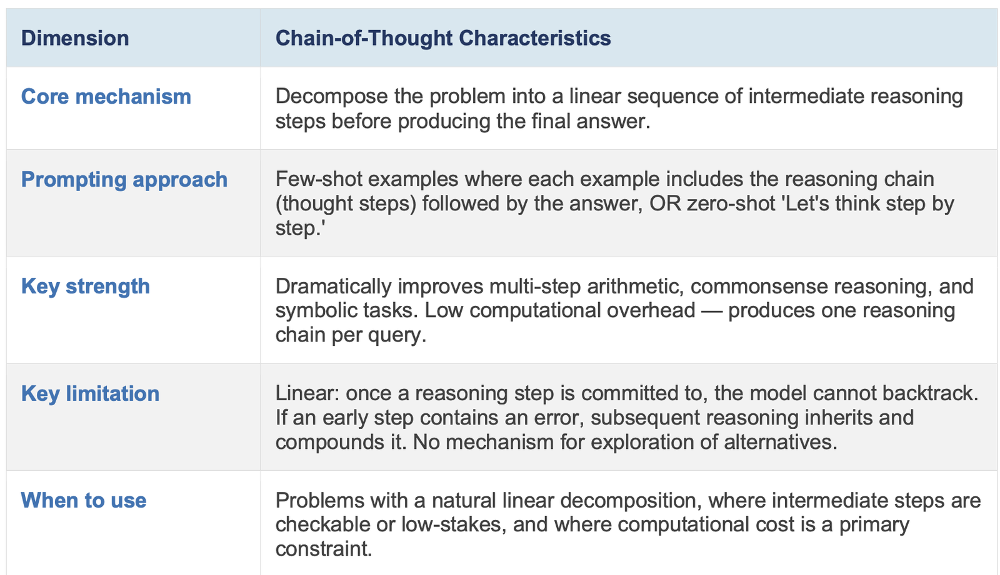
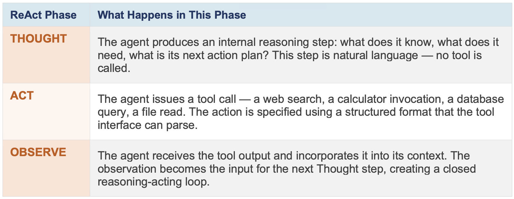
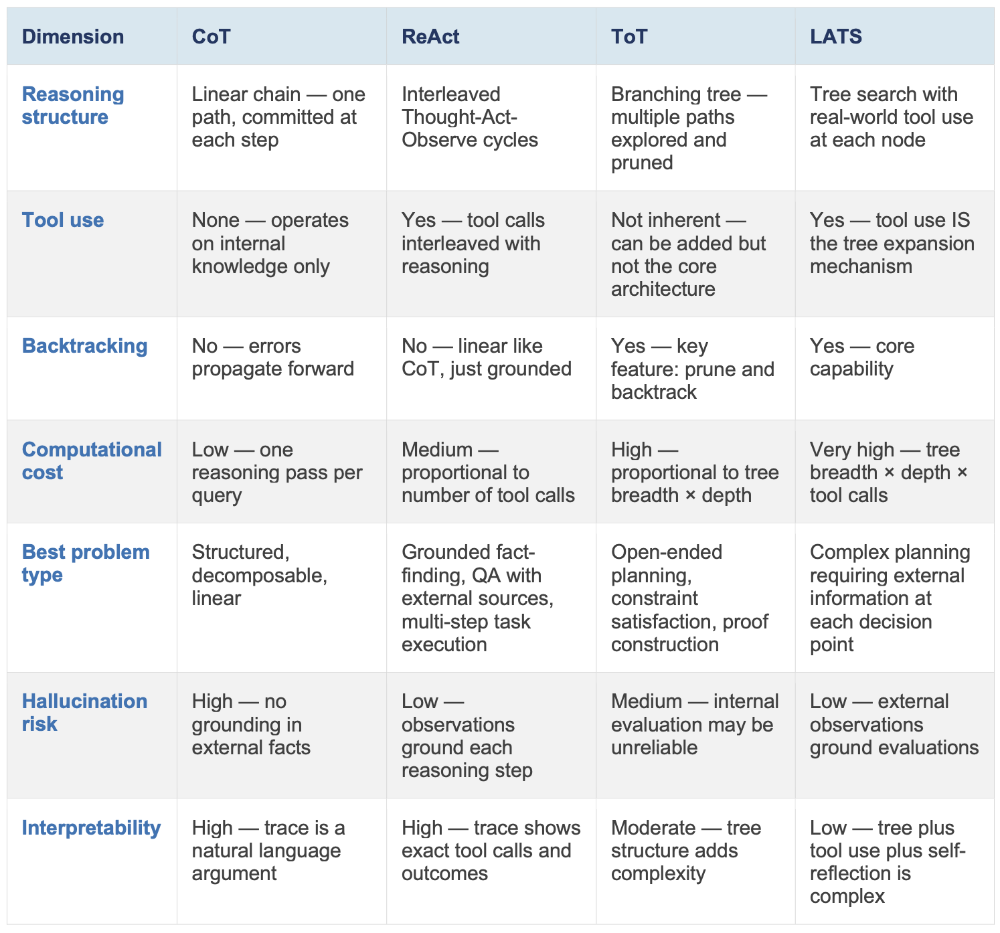
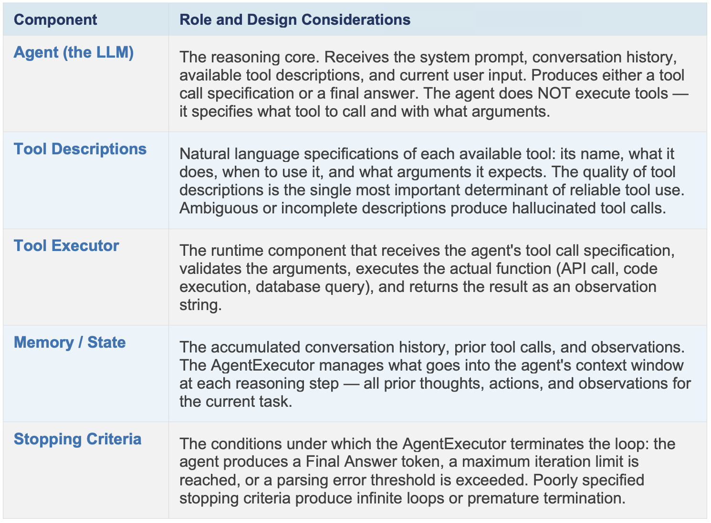
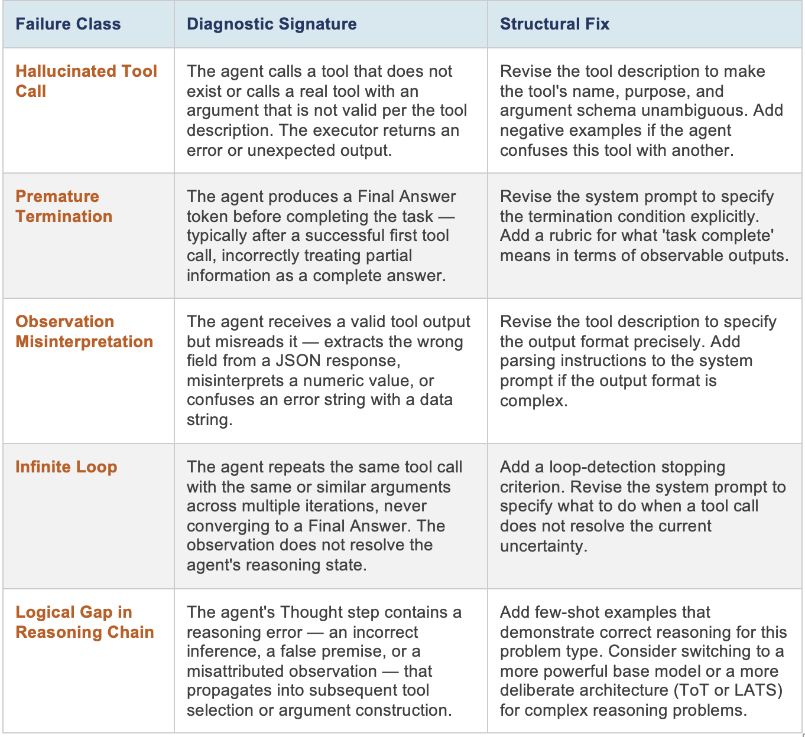
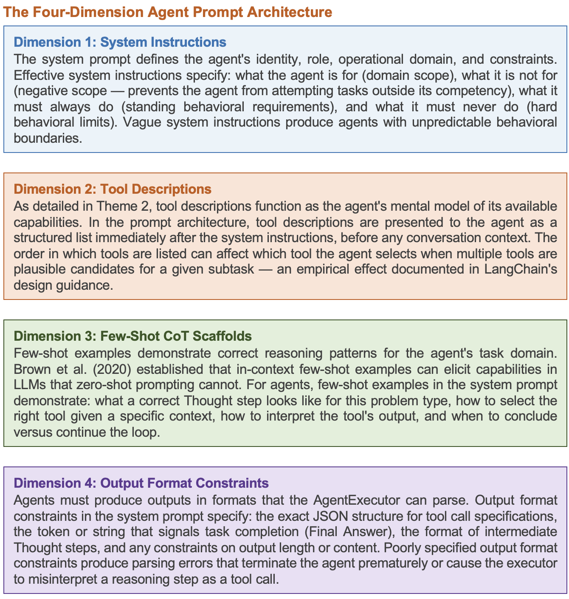
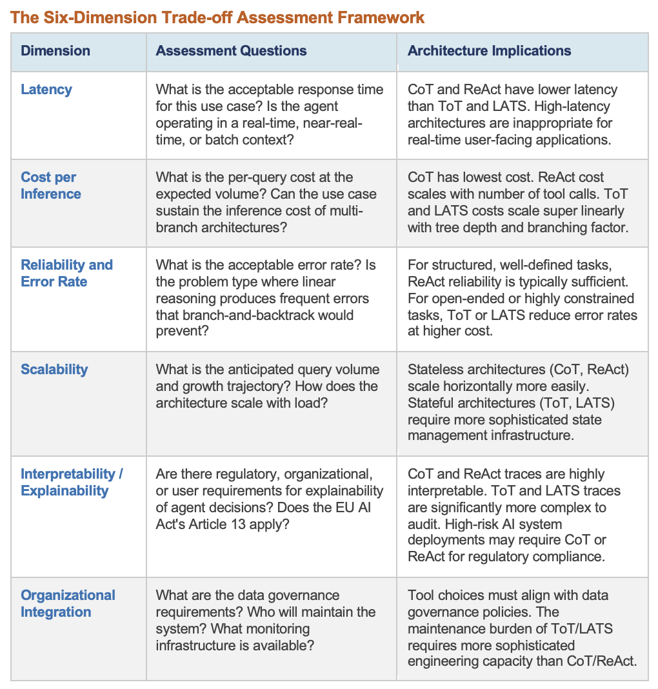

# Module 2: Foundational Concepts

{ width="900" }

Now that we know what agents are, we move on to the next question: how do modern LLM-based agents
actually reason and act? 

The Module 2 readings introduce five interconnected frameworks that
form the technical and analytical vocabulary of contemporary LLM-based agent design.
These frameworks address:

- How agents reason (Chain-of-Thought, ReAct, Tree of Thoughts, LATS)
- How they act through tools (`create_agent` architecture)
- How their reasoning can be interpreted and critiqued (trace analysis)
- How their behavior can be shaped through language (prompt engineering)
- How competing architectural choices are evaluated for production deployment (trade-off assessment)

## Chapter 1: The Four Agent Reasoning Paradigms

### Chapter 1 Lesson

*Estimated time: ~18 min*

The four reasoning paradigms in Module 2 represent a developmental arc in the field: each
addresses specific limitations exposed by its predecessor. Understanding this arc - not merely
the techniques themselves - is the key to knowing when each paradigm is appropriate. The
progression from CoT to LATS is a progression from linear to branching, from reactive to
deliberate, and from low-cost to high-cost reasoning.

**Paradigm 1: Chain-of-Thought Prompting (Wei et al., 2022)**

Wei et al. (2022) demonstrated that prompting large language models to produce intermediate
reasoning steps - a chain of thought - substantially improves performance on complex
reasoning tasks including arithmetic, commonsense reasoning, and symbolic manipulation. The
critical finding is that this capacity is emergent: it is absent in smaller models and appears only
above a scale threshold, suggesting that chain-of-thought reasoning reflects a qualitative
capability transition rather than a continuous improvement curve.

{ width="800" }

**Paradigm 2: ReAct - Synergizing Reasoning and Acting (Yao et al., 2022)**

Yao et al. (2022) introduced ReAct as a solution to the fundamental limitation that chain-of-thought
operates entirely within the model's internal knowledge - it cannot access external information
during reasoning. ReAct interleaves reasoning steps (Thought) with actions (Act) and observation
of action outputs (Observe), creating a three-phase cycle that grounds reasoning in real-world
information retrieved during the task.

{ width="800" }

The ReAct loop is the default reasoning architecture for production agents today. The ability to read and diagnose a ReAct trace - identifying which piece of reasoning was faulty, which tool call was incorrectly specified, or which observation was misinterpreted - is the core diagnostic skill of Module 2. Thought, Act and Observe are the paper's names for the three phases, not labels a current agent prints: the Module 2 lab prints the same three steps as `REASONING:`, `TOOL CALL:` / `ARGUMENTS:` and `OBSERVATION:` lines.

**Paradigm 3: Tree of Thoughts (Yao et al., 2023)**

Yao et al. (2023) identified a fundamental limitation of ReAct for complex, open-ended problems:
the linear thought-action-observe cycle commits to a single path and cannot recover gracefully
from dead ends. Tree of Thoughts (ToT) replaces the linear chain with a deliberate search over
a tree of coherent language sequences (thoughts), where the model generates multiple candidate
reasoning paths, evaluates them using a heuristic or the model itself, and selects the most
promising path to explore - with backtracking.

!!! note "When Tree of Thoughts is Justified"

    ToT incurs substantially higher computational cost than CoT or ReAct - it requires generating
    and evaluating multiple reasoning branches per step, which multiplies inference costs. ToT is
    justified when: (1) the problem has a large state space with many possible solution paths; (2)
    intermediate states can be meaningfully evaluated before the full solution is known; (3)
    backtracking is necessary because early commitment to a wrong path is catastrophically
    costly; and (4) computational budget and latency are not primary constraints. Canonical use
    cases include planning problems, multi-step mathematical proof construction, and creative
    generation tasks with complex constraint satisfaction.

**Paradigm 4: Language Agent Tree Search (Zhou et al., 2023)**

Zhou et al. (2023) proposed LATS (Language Agent Tree Search) as a unifying framework that
integrates the deliberate search of ToT with the grounded tool use of ReAct and a reinforcement
learning-inspired self-reflection mechanism. In LATS, each node in the search tree represents not
just a thought but a complete action-observation pair - the agent acts in the world at each search
node and uses the observation to evaluate node quality. This enables the system to ground its
deliberate search in real-world feedback rather than purely internal model judgment.
The cost of LATS is commensurate with its power: it requires many more LLM calls per task, more
complex state management, and more sophisticated evaluation logic. LATS is the current state
of the art for tasks that require both deliberate planning over a large state space AND real-world
information retrieval during search. Most production systems today use ReAct for cost reasons;
LATS represents the frontier of what is possible when cost and latency constraints permit.

**The Four-Paradigm Comparative Framework**

The following table enables side-by-side evaluation across the five dimensions that determine
architectural selection in professional practice:

{ width="800" }

### Learning Resources
* Wei, J., Wang, X., Schuurmans, D., Bosma, M., Xia, F., Chi, E., ... & Zhou, D. (2022). [Chain-of-thought prompting elicits reasoning in large language models](https://proceedings.neurips.cc/paper_files/paper/2022/file/9d5609613524ecf4f15af0f7b31abca4-Paper-Conference.pdf){target=_blank}. Advances in neural information processing systems, 35, 24824-24837.
* Yao, S., Zhao, J., Yu, D., Du, N., Shafran, I., Narasimhan, K., & Cao, Y. (2022). [ReAct: Synergizing reasoning and acting in language models](https://arxiv.org/pdf/2210.03629){target=_blank}. arXiv preprint arXiv:2210.03629.
* Yao, S., Yu, D., Zhao, J., Shafran, I., Griffiths, T., Cao, Y., & Narasimhan, K. (2023). [Tree of thoughts: Deliberate problem solving with large language models](https://proceedings.neurips.cc/paper_files/paper/2023/file/271db9922b8d1f4dd7aaef84ed5ac703-Paper-Conference.pdf){target=_blank}. Advances in neural information processing systems, 36, 11809-11822.
* Zhou, A., Yan, K., Shlapentokh-Rothman, M., Wang, H., & Wang, Y. X. (2023). [Language agent tree search unifies reasoning acting and planning in language models](https://arxiv.org/pdf/2310.04406){target=_blank}. arXiv preprint arXiv:2310.04406

**Reading 1 — Chain of Thought Prompting [~ 10 min]**

* Wei, J. et al. (2022). [Chain-of-thought prompting elicits reasoning in large language
models](https://proceedings.neurips.cc/paper_files/paper/2022/file/9d5609613524ecf4f15af0f7b31abca4-Paper-Conference.pdf){target=_blank}. NeurIPS 2022. 
  * Read: Abstract + Section 2 (Chain-of-Thought Prompting) and Figure 1. You may skim Section 4 (Experimental Setup) but are not required to read it in full.
  * Extract: What is a reasoning trace in the CoT sense? What does CoT add to
standard few-shot prompting? What task class shows the largest CoT benefit, and
why?

**Reading 2 — ReAct: Reason + Act [~ 12 min]**

* Yao, S. et al. (2022). [ReAct: Synergizing reasoning and acting in language models](https://arxiv.org/pdf/2210.03629){target=_blank}.
ICLR 2023. 
   * Read: Sections 1 and 2 (Introduction + ReAct: Synergizing Reasoning and Acting). 
   * Extract: How does ReAct differ structurally from CoT? What is the Thought/Action/Observation cycle? When does the loop terminate?

### Chapter 1 Quiz

[Take the Chapter 1 quiz](chapter-quizzes.md#chapter-1-quiz){ .md-button }

## Chapter 2: Tool Integration Architecture

### Chapter 2 Lesson

*Estimated time: ~14 min*

Tool use is what separates an AI agent from an LLM. An LLM without tools operates on the
knowledge encoded in its parameters during training - frozen at its training cutoff, unable to
access external systems, and capable only of text generation. An agent with tools can retrieve
live information, execute code, write to databases, send communications, and interact with APIs.
However, tool integration introduces a new class of failure modes that are distinct from LLM
reasoning failures and require different diagnostic approaches.

**The `create_agent` Factory (LangChain)**

LangChain's `create_agent` is the current production API for constructing multi-tool ReAct agents. It replaces the legacy `AgentExecutor` class with a cleaner factory function that integrates directly with LangGraph's stateful execution graph. `create_agent` accepts five primary parameters — constructor arguments, not the agent's structural components — and returns a compiled, runnable agent:

* **`model`** — a chat model instance (e.g., `ChatOpenAI`, `ChatAnthropic`) or a model identifier string. This is the LLM backbone that drives all reasoning steps.
* **`tools`** — a sequence of `BaseTool` objects, callables, or tool-specification dicts. The agent's tool registry is constructed from this sequence; tool descriptions embedded in each `BaseTool` are used for selection at inference time.
* **`system_prompt`** — an optional string or `SystemMessage` that injects persistent behavioral instructions before any user turn. This is the primary mechanism for role definition, output format constraints, and ethical boundaries.
* **`middleware`** — an optional sequence of `AgentMiddleware` objects for observability, tracing, and logging. Middleware intercepts each reasoning step without modifying agent logic, enabling production monitoring without altering behavior.
* **`response_format`** — an optional structured output specification (Pydantic model, type, or schema dict) that constrains the agent's final response to a defined schema. When set, that schema is imposed on the model's own output rather than recovered afterwards from text by an output parser. That is the general pattern in a tool-calling agent: an action comes back as a structured call — each entry in the message's `tool_calls` carries a `name` and an `args` dictionary — so there is nothing left for a parsing component to convert.

The agent returned by `create_agent` is a compiled graph that runs the ReAct loop internally: invoke it with `{"messages": [...]}` and it repeats a reasoning → tool call → observation cycle until the model returns a message that requests no tools. That message ends the run and carries the final answer, which you read from `result["messages"][-1].content`; the step cap is the `recursion_limit` config key. Unlike `AgentExecutor`, state management, loop control, and tool dispatch are handled by the underlying LangGraph execution graph — making the agent inherently compatible with checkpointing, streaming, and multi-agent orchestration. *Thought*, *Action* and *Observation* are the ReAct paper's names for the phases of that cycle, not labels the agent emits — the model's message carries structured `tool_calls`, and it is the Module 2 lab's `show_trace` helper that gives the steps printable names (`REASONING:` — only when the model narrates before calling — then `TOOL CALL:`, `ARGUMENTS:`, `OBSERVATION:` and `[final] ANSWER:`).

The figure below is the original LangChain 0.x `AgentExecutor` design table, kept here because its right-hand column explains what each part of an agent runtime is *for*. Read it as a historical figure: it has five rows, it uses its own names for them, and its body text still refers to the `AgentExecutor` class, to a "Final Answer" token and to a maximum iteration limit — all three of which the current API has left behind.

{ width="800" }

**Reading the figure in this course's vocabulary.** Four of its five rows are the four structural components of the agent runtime, under older names:

* *Agent (the LLM)* is the **LLM Backbone**.
* *Tool Descriptions* are the descriptions carried by the **Tool Registry** — the text the model reads when it chooses a tool.
* *Tool Executor* is the **Action Executor**.
* *Memory / State* is the **Memory Module**.

The fifth row, *Stopping Criteria*, is not a component at all: it is the rule that ends the loop, and it is the part that genuinely changed. A run now ends when the model returns a message with no tool calls, and the step cap is set by the `recursion_limit` config key rather than by a maximum-iteration argument. There is no parsing-error threshold either, because there is no text to parse — the model returns the call itself, as a `name` and an `args` dictionary. Note also what the figure has no row for: an output parser. Older component lists counted one between the model and the executor; this one does not, and neither does the current architecture, for the reason given in the `response_format` note above.

**Tool Description Design - The Specification Discipline**

Tool descriptions are the contract between the agent and the tool ecosystem. An effective tool
description answers five questions precisely:

* **What does this tool do?** State the tool's function in one sentence using active verbs and
concrete output types. Example: 'Searches the web and returns the top-5 result snippets for a
given query string.'

* **When should the agent use it?** Specify the conditions under which this tool is appropriate, and
explicitly note conditions where it is NOT appropriate. This prevents incorrect tool selection.

* **What arguments does it require?** List every argument with its type, format, and any
constraints. Ambiguous argument specifications produce hallucinated values, especially for
structured data types.

* **What does the output look like?** Describe the output format so the agent can parse it
correctly. If the tool returns JSON, describe the schema. If it returns plain text, describe its
structure.

* **What errors can it produce?** List the error states the tool may return and what the agent
should do on each error. Undocumented errors produce agents that silently misinterpret failure
states as data.

!!! note "THE HETEROGENEOUS TOOL ECOSYSTEM"

    Production agents rarely use a single tool type. A realistic tool set might include: a web search
    tool (retrieves live information), a Python REPL (executes code and returns output), a
    database tool (reads/writes structured data), a file tool (reads/writes documents), an email tool
    (sends communications), and a calendar tool (reads/modifies schedule data). Each tool type
    has distinct description requirements, argument schemas, error modes, and risk profiles. The
    skill of designing a cohesive, well-described heterogeneous tool set - where the agent
    reliably selects the right tool for each subtask - is the practical competency developed in
    Module 2's Guided Labs.

### Learning Resources

* LangChain Documentation - [`create_agent` API Reference](https://reference.langchain.com/python/langchain/agents/factory/create_agent){target=_blank}.
* LangChain Documentation - [Tool Creation Reference](https://docs.langchain.com/oss/python/langchain/tools){target=_blank}.
* Brown, T., Mann, B., Ryder, N., Subbiah, M., Kaplan, J. D., Dhariwal, P., ... & Amodei, D. (2020). [Language models are few-shot learners](https://proceedings.neurips.cc/paper_files/paper/2020/file/1457c0d6bfcb4967418bfb8ac142f64a-Paper.pdf){target=_blank}. Advances in neural information processing systems, 33, 1877-1901

**Reading 5 — LangChain `create_agent` [~10 min]**

* LangChain Documentation: [`create_agent` API Reference and Tool Creation
Reference](https://reference.langchain.com/python/langchain/agents/factory/create_agent){target=_blank}.
   * Read the entire `create_agent` API Reference section. Pay particular attention to: the role of the `tools` parameter in constructing the tool registry, how tool descriptions embedded in `BaseTool` objects are used for selection at inference time, and how `response_format` constrains the agent's output.

* **Video 2 — "[Understanding ReACT with LangChain](https://www.youtube.com/watch?v=Eug2clsLtFs){target=_blank}"** - Sam Witteveen (~22 min)
    * Watch focus: the conceptual distinction between CoT and ReAct and the observation integration step.
    * As you watch, map what you see in the video to the structural definitions from Reading 2. If the video uses a different term for the same concept, note both.

### Chapter 2 Quiz

[Take the Chapter 2 quiz](chapter-quizzes.md#chapter-2-quiz){ .md-button }

## Chapter 3: Reasoning Trace Interpretation and Critique

### Chapter 3 Lesson

*Estimated time: ~5 min*

A reasoning trace is the complete log of an agent's internal reasoning steps, tool calls, and tool
observations during the execution of a task. In production systems, the reasoning trace is the
primary diagnostic artifact when an agent fails to produce correct output. The ability to read a
reasoning trace analytically - identifying where reasoning deviated, why a tool call was incorrect,
and what change to the agent design would fix the failure - is a high-value professional
competency.

**The Five Classes of Reasoning Trace Failure**

Systematic trace analysis reveals that agent failures cluster into five distinguishable failure
classes, each with a different root cause and a different fix:

{ width="800" }

### Learning Materials

* Yao, S., Zhao, J., Yu, D., Du, N., Shafran, I., Narasimhan, K., & Cao, Y. (2022). [ReAct: Synergizing reasoning and acting in language models](https://arxiv.org/pdf/2210.03629){target=_blank}. arXiv preprint arXiv:2210.03629.
* LangChain [`create_agent`](https://reference.langchain.com/python/langchain/agents/factory/create_agent){target=_blank} — the streamed step trace from `agent.stream(..., stream_mode="updates")`, which the Module 2 lab wraps in its `show_trace` helper. There is no `verbose=True` switch to turn on.
* Zhou, A., Yan, K., Shlapentokh-Rothman, M., Wang, H., & Wang, Y. X. (2023). [Language agent tree search unifies reasoning acting and planning in language models](https://arxiv.org/pdf/2310.04406){target=_blank}. arXiv preprint arXiv:2310.04406.

### Chapter 3 Quiz

[Take the Chapter 3 quiz](chapter-quizzes.md#chapter-3-quiz){ .md-button }

## Chapter 4: Prompt Engineering for Agent Behavioral Control

### Chapter 4 Lesson

*Estimated time: ~9 min*

For agents, prompt engineering is not the craft of writing better chatbot prompts. It is a design
discipline for specifying agent behavior across four dimensions: what the agent knows about its
role and constraints (system instructions), what tools the agent can use and how (tool
descriptions), what patterns of reasoning the agent should follow (few-shot CoT scaffolds), and
what format the agent's outputs must conform to (output format constraints). Each dimension is
independently configurable and independently contributes to agent reliability.

{ width="800" }

!!! note "BEHAVIORAL CONTROL IS NOT A PATCH - IT IS AN ARCHITECTURE"

    A common error in agent development is to treat behavioral problems as prompting problems:
    when the agent does something unintended, the instinct is to add a sentence to the system
    prompt. This approach accumulates fragile constraints that interact unpredictably. The
    professional approach is to treat behavioral control as an architectural concern: define
    behavioral boundaries clearly at design time, test them systematically before deployment, and
    instrument the agent to detect and log behavioral violations in production. Module 2's hands-
    on project requires you to document three specific behavioral constraints and the prompting
    mechanism used to enforce each.

### Learning Materials

* Brown, T., Mann, B., Ryder, N., Subbiah, M., Kaplan, J. D., Dhariwal, P., ... & Amodei, D. (2020). [Language models are few-shot learners](https://proceedings.neurips.cc/paper_files/paper/2020/file/1457c0d6bfcb4967418bfb8ac142f64a-Paper.pdf){target=_blank}. Advances in neural information processing systems, 33, 1877-1901
* Wei, J., Wang, X., Schuurmans, D., Bosma, M., Xia, F., Chi, E., ... & Zhou, D. (2022). [Chain-of-thought prompting elicits reasoning in large language models](https://proceedings.neurips.cc/paper_files/paper/2022/file/9d5609613524ecf4f15af0f7b31abca4-Paper-Conference.pdf){target=_blank}. Advances in neural information processing systems, 35, 24824-24837.
* LangChain [`create_agent`](https://reference.langchain.com/python/langchain/agents/factory/create_agent){target=_blank} `system_prompt` parameter design.

### Chapter 4 Quiz

[Take the Chapter 4 quiz](chapter-quizzes.md#chapter-4-quiz){ .md-button }

## Chapter 5: Architectural Trade-off Assessment for Production Deployment

### Chapter 5 Lesson

*Estimated time: ~7 min*

Selecting a reasoning architecture is not a purely technical decision. It is a multi-objective
optimization problem with six dimensions that professional practitioners must evaluate explicitly.
The Architectural Specification Brief produced in Module 2 must document your reasoning across
all six dimensions - not just the technical choice, but the evidence-based justification for that
choice given the specific problem context.

{ width="800" }

The European Parliament's AI Act (2024) is directly relevant to architectural choice for high-risk
AI systems. Article 13 of the Act requires that high-risk AI systems provide output that is
'sufficiently transparent' to enable the system's operators to understand and interpret the system's
outputs. For agent systems deployed in high-risk domains - healthcare decision support, legal
document processing, financial analysis - this interpretability requirement has direct implications
for architecture selection. A LATS agent operating in a high-risk domain may face regulatory
scrutiny that a ReAct agent would not, precisely because the branching trace is harder to audit.

### Learning Resources

* European Parliament (2024). [Regulation (EU) 2024/1689 — Artificial Intelligence Act](https://eur-lex.europa.eu/legal-content/EN/TXT/?uri=CELEX:32024R1689){target=_blank}. Read Title III, Chapter 2, Article 13 (Transparency and provision of information to deployers). The primary regulatory source cited in Chapter 5; directly governs interpretability requirements for high-risk AI systems.
* National Institute of Standards and Technology (2023). [AI Risk Management Framework (AI RMF 1.0)](https://nvlpubs.nist.gov/nistpubs/ai/NIST.AI.100-1.pdf){target=_blank}. The U.S. federal framework for identifying, measuring, and managing AI risk across the system lifecycle — maps directly onto the safety/risk dimension of Chapter 5's six-dimension trade-off model.

### Chapter 5 Quiz

[Take the Chapter 5 quiz](chapter-quizzes.md#chapter-5-quiz){ .md-button }

Migrated from the [course wiki](https://github.com/UA-AI2S/AI-Automation-and-Agents-v2/wiki/Module-2:-Foundational-Concepts){target=_blank} (wiki page last changed 2026-08-04). Spotted a problem? [Edit this page](https://github.com/tyson-swetnam/AI-Automation-and-Agents/edit/main/docs/modules/module-2/foundational-concepts.md){target=_blank}.

