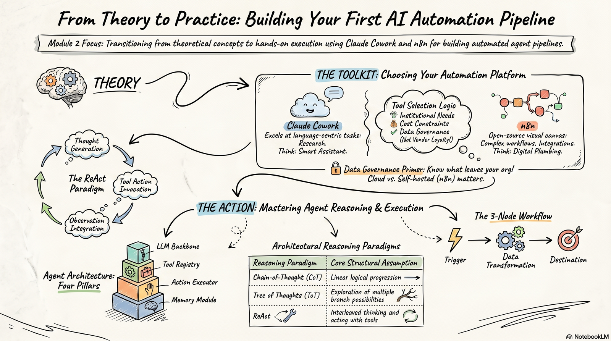

# Module 2 Overview: Agent Reasoning Architectures and Tool Integration

**Time:** 8 hours

{ width="900" }

## Introduction

*Estimated time: ~2 min*

Module 2 builds on Module 1 by showing how an agent actually reasons and acts. You will move from ideas to practical tools, learning how different reasoning approaches work and how agents use tools in real workflows.

The module introduces core concepts such as prompt design, reasoning traces, and architectural trade-offs. You will read about major reasoning paradigms, build a multi-tool agent in LangChain, and learn how to evaluate whether a design is appropriate for a real-world task.

## Topics Covered

*Estimated time: ~1 min*

* **Reasoning paradigms**: Compare Chain-of-Thought, ReAct, Tree of Thoughts, and LATS (Language Agent Tree Search).
* **ReAct loop**: Understand the Thought → Action → Observation cycle.
* **Tool integration**: Learn how agents connect to tools through LangChain.
* **Prompt design**: See how instructions and examples shape agent behavior.
* **Trace evaluation**: Practice reading reasoning traces and spotting failures.

## Learning Objectives

*Estimated time: ~1 min*

- **Compare** major agent reasoning paradigms.
- **Explain** the ReAct loop and tool-calling process.
- **Build** a multi-tool agent in LangChain.
- **Evaluate** reasoning traces using a structured rubric.
- **Choose** an appropriate agent design for a real task.

## Module 2 Checklist

*Estimated time: ~2 min*

| Chapter | Type | Time | Primary LOs | Deliverable |
| :--: | :-- | :-- | :-- | :-- |
| **1** | The Four Agent Reasoning Paradigms | 0.75 hrs | LO 1 | Chapter 1 Quiz |
| **2** | Tool Integration Architecture | 0.75 hrs | LO 2 | Chapter 2 Quiz |
| **3** | Evaluating an Agent Reasoning Trace | 0.5 hrs | LO 4 | Chapter 3 Quiz |
| **4** | Prompt Engineering for Agents | 1.0 hr | LO 3 | Chapter 4 Quiz |
| **5** | Architectural Trade-off Assessment | 1.0 hr | LO 5 | Chapter 5 Quiz |
| **Lab** | Guided Lab Exercise | 2.0 hrs | LO 2, 3 | Colab Notebook + Agent Instruction Log |
| **Project** | Hands-On Project | 2.0 hrs | LO 3, 4 | Add your own tool |
| **Discussion** | Project Proposal and Peer Review | 1.0 hr | LO 5 | Discussion Post + 2 Peer Feedback |

## Grade Weight Summary

!!! info "Grade weight summary"

    Chapter Quizzes (Units 1–5): 100% of module grade — 20% each

    Discussion Post + Peer Reply: required for certificate — completion only, but please give meaningful responses to your fellow learners

Migrated from the [course wiki](https://github.com/UA-AI2S/AI-Automation-and-Agents-v2/wiki/Module-2:-Overview){target=_blank} (wiki page last changed 2026-08-06). Spotted a problem? [Edit this page](https://github.com/tyson-swetnam/AI-Automation-and-Agents/edit/main/docs/modules/module-2/overview.md){target=_blank}.

