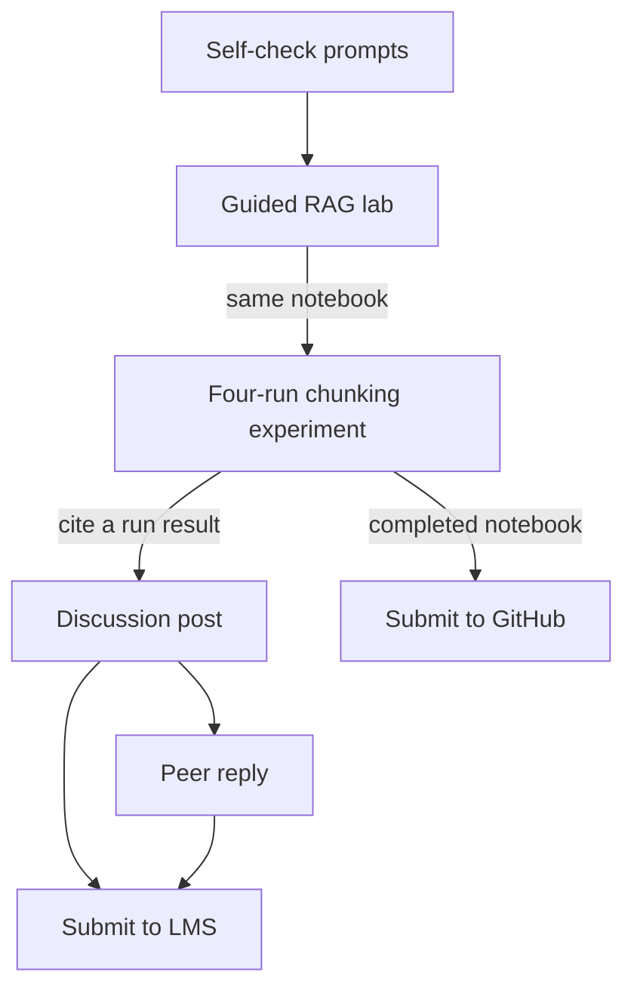

# Module 3 Activities

The four activities run in sequence — self-check prompts (~30 min), the guided RAG lab (~2 hrs), the four-run chunking experiment (~2 hrs), and the peer discussion (~60 min) — with the lab and experiment sharing one notebook and the experiment's results feeding the discussion post.

## Self-Check Prompts

*Estimated time: ~30 minutes*

Before moving on, answer the three prompts in a notes document or on a piece of paper. These won't be submitted or graded, they're meant to help you recall what you've learned. If you're unsure how to answer, revisit the relevant reading before continuing.

#### Prompt 1 - Parametric vs. Non-Parametric Memory

In your own words, explain the difference between parametric and non-parametric memory. Give one concrete example from a professional domain (healthcare, legal, education, etc.) where non-parametric memory would be essential.

#### Prompt 2 - Six-Stage RAG Pipeline

Name each of the six functional stages of a RAG pipeline with a brief description of what happens at each stage.

#### Prompt 3 - RAGAS Diagnostic Interpretation

Your RAG system scores high on context recall but low on faithfulness. Is the problem in retrieval, generation, or both? Identify the specific failure mode this indicates, and describe one remediation you would try first.

## Guided Lab Exercise - RAG Pipeline

*Estimated time: ~2 hrs*

!!! warning "Platform setup — read before starting"

    All lab work runs in Google Colab (free tier). You do not need a paid subscription. You will need: (1) a Google account to access Colab; (2) an OpenAI API key (or a locally hosted embedding model as a free alternative — setup instructions are included in the notebook).

In this lab, you will build a working RAG pipeline using LangChain, from document loading through retrieval-augmented question answering over a multi-document corpus.

**Open the lab notebook:** [Module-3-Lab.ipynb](lab-notebook.md)

### Guided lab notebook flow

The notebook walks you through a complete RAG pipeline build sequence in four phases:

1. Environment setup and document loading using PyPDFLoader.
2. Text splitting with RecursiveCharacterTextSplitter and embedding generation into a Chroma vector store.
3. Retrieval and generation composed with LangChain Expression Language — a `k=4` retriever whose chunks are formatted into a prompt for a chat model, returning the answer and its source chunks together — then tested across five evaluation queries.
4. Multi-document extension by adding a second corpus and observing retrieval precision tradeoffs.

All detailed instructions, checks, and logging prompts are embedded directly in the notebook.

## Hands-On Project

*Estimated time: ~2 hours*

In this project, you will continue in the same notebook from the guided lab to conduct a controlled chunking and retrieval optimization experiment. You will vary one parameter at a time across four experiment runs, score answer quality using a provided rubric, and write a mechanistic analysis of your results.

### Project notebook flow

The notebook walks you through a controlled 4-run parameter variation experiment:

1. Run 1 — Small fixed-size chunking baseline (chunk_size=256, similarity search, k=4).
2. Run 2 — Larger fixed-size chunking (chunk_size=512) to observe context completeness vs. noise tradeoffs.
3. Run 3 — MMR retrieval (lambda_mult=0.5) to test diversity-based retrieval against similarity search.
4. Run 4 (optional) — Metadata-filtered retrieval to evaluate precision gains from source-level filtering.
5. RAGAS metric interpretation — plain-language interpretation of four RAGAS metric scores for a non-technical stakeholder.

Detailed instructions are embedded directly in the notebook.

!!! info "What to submit"

    **Add to github**: Submit the completed `.ipynb` file (guided lab + hands-on project) with all cells executed and output visible. Filename: `Module3_Lab_[YourName].ipynb`.

## Peer Discussion: RAG Corpus Design for Your Domain

*Estimated time: ~60 minutes*

### Part 1: Discussion Post

*Estimated time: ~30 min*

Now that you have hands-on experience building and tuning a RAG pipeline, apply what you learned to your own domain. Post to the Module 3 Discussion Forum addressing the following:

**Section 1 — Domain and Document Sources**

Identify a specific domain where you would deploy a RAG system (your field of study, workplace, or a domain you're familiar with). List 2–3 document sources you would ingest into the knowledge base. For each source, specify: the document type (e.g., PDF reports, HTML documentation, spreadsheets, slide decks), approximate volume (number of documents or pages), and how frequently the content is updated.

**Section 2 — Document Characteristics and Pipeline Challenges**

Identify at least one characteristic of your documents that would require special handling in the RAG pipeline. Examples: dense tables or structured data that would be destroyed by naive text splitting; documents with headers/sections where semantic boundaries don't align with fixed character counts; mixed-format content (code + prose, or images with captions); domain-specific jargon that general-purpose embeddings may not represent well; multilingual content; legal or regulatory language where precise wording matters.

Explain how this characteristic would affect your chunking or retrieval strategy — referencing what you observed in your hands-on experiment.

**Section 3 — Configuration Choices Informed by Your Experiment**

Based on your experiment results, specify: (1) the chunking configuration you would start with and why; (2) the retrieval method (similarity search, MMR, or metadata-filtered) you would choose and what property of your corpus motivates that choice. Your justification must reference a specific observation from your experiment (e.g., "In Run 3, MMR improved scores on multi-faceted queries — my domain involves similar queries because...").

### Part 2: Peer Reply

*Estimated time: ~30 min*

Reply to at least one classmate's post. Your reply must do one of the following:

* **Identify a chunking or retrieval risk:** Based on the document characteristics they described, identify a specific failure mode their proposed configuration might encounter. Explain why that failure mode is likely given their corpus properties.
* **Suggest an alternative approach:** Propose a different chunking strategy, retrieval method, or preprocessing step that could better handle one of their document characteristics. Explain the tradeoff your suggestion introduces.

!!! info "What to submit"

    **Discussion Initial Post**: submitted in LMS Discussion thread. Addresses all three sections. Due before the reply deadline.

    **Peer Reply**: substantive engagement (≥100 words) identifying a risk or suggesting an alternative. Due by the module deadline.

Migrated from the [course wiki](https://github.com/UA-AI2S/AI-Automation-and-Agents-v2/wiki/Module-3:-Activities){target=_blank} (wiki page last changed 2026-08-11). Spotted a problem? [Edit this page](https://github.com/tyson-swetnam/AI-Automation-and-Agents/edit/main/docs/modules/module-3/activities.md){target=_blank}.

