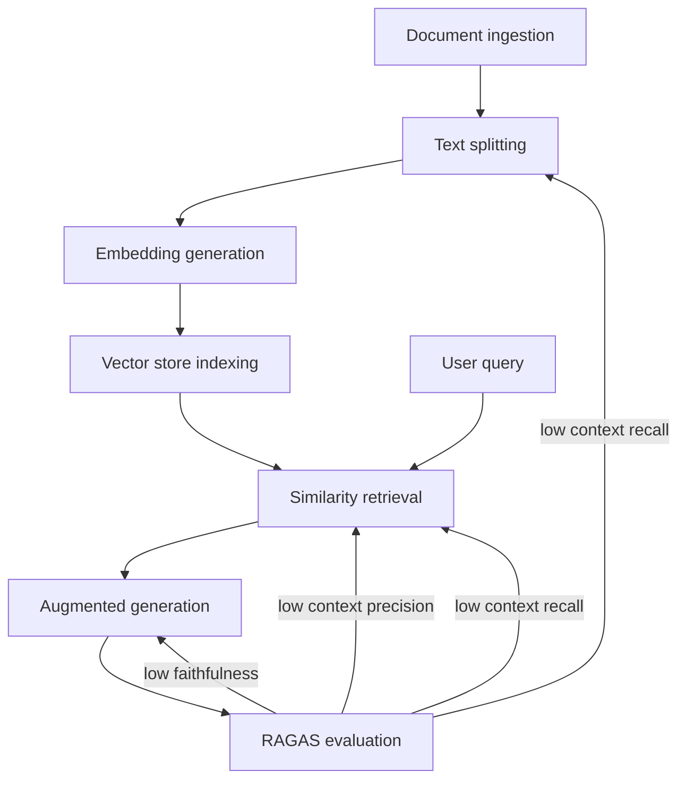

# Module 3: Foundational Concepts

The six-stage RAG pipeline of Chapter 2, with three of Chapter 5's RAGAS metrics pointing back at the pipeline components each low score implicates.

## Chapter 1: Parametric vs. Non-Parametric Memory

### Chapter 1 Lesson

*Estimated time: ~12 min*

LLMs are trained on vast amounts of information, but that knowledge is frozen at training time and can't be updated without expensive retraining. This "frozen" knowledge is known as parametric memory, permanantly encoded in the the model weights during training. 

For tasks that require current or very specialized information, that frozen knowledge isn't enough. Models will hallucinate: generating answers that sound confident but are factually wrong or outdated.

Non-parametric memory solves this by storing knowledge outside the model, in documents, databases, or files that can be updated, verified, and tailored to a specific domain or organization. Unlike parametric memory, it can be regularly updated with new information the model was never trained on.

Retrieval-Augmented Generation (RAG) introduced by Lewis at al. is one of the most widely used forms of non-parametric memory in production AI systems, in which relevant documents are retrieved from an external knowledge store at the moment a question is asked and passed to the model as context — so answers are grounded in current, verifiable evidence.

| | Parametric Memory | Non-Parametric Memory |
| :-- | :-- | :-- |
| **Summary** | • Knowledge is encoded in the model's weights during training and frozen at cutoff • Broad but shallow in specialized domains; updating requires retraining | • Knowledge is stored externally in documents, databases, or APIs • Scoped to your domain and updated without retraining |
| **How reliable it is** | • Cannot be directly audited; sources cannot be traced to a specific document • Failure mode: hallucination — confident generation of plausible but incorrect content | • Fully auditable — retrieved documents can be cited, inspected, and their provenance verified • Failure modes: retrieval failure — correct documents not retrieved; context overflow — too much irrelevant context |
| **When to use it** | Suitable for general reasoning, language tasks, and domains where training data is comprehensive and current | Required for organizational knowledge bases, recent information, proprietary data, and compliance-sensitive domains |

Bommasani et al. (2021), in the Stanford CRFM foundation models report, provide the broader
theoretical context: the capabilities and limitations of foundation models are deeply shaped by the
training data distribution and the model's capacity to generalize from it. RAG is, in their framing,
an architectural strategy for extending a foundation model's effective knowledge boundary beyond
what can be efficiently encoded in parameters — a particularly important capability for the specialized, proprietary, or dynamic knowledge that characterizes professional deployment environments.

!!! note "Note"

    Every organization that deploys AI agents in knowledge-intensive contexts faces the same
    core problem: the agent's parametric knowledge does not include the organization's internal
    documents, policies, proprietary data, or recent developments. RAG is the current production-
    standard solution to this problem.

### Learning Resources
* Lewis, P., Perez, E., Piktus, A., Petroni, F., Karpukhin, V., Goyal, N., ... & Kiela, D. (2020). [Retrieval-augmented generation for knowledge-intensive nlp tasks](https://proceedings.neurips.cc/paper_files/paper/2020/file/6b493230205f780e1bc26945df7481e5-Paper.pdf){target=_blank}. Advances in neural information processing systems, 33, 9459-9474.
* Bommasani, R., Hudson, D. A., Adeli, E., Altman, R., Arora, S., von Arx, S., ... & Liang, P. (2021). [On the opportunities and risks of foundation models](https://arxiv.org/pdf/2108.07258){target=_blank}. arXiv preprint arXiv:2108.07258.

**Video 1: "[What is Retrieval-Augmented Generation (RAG)?](https://www.youtube.com/watch?v=T-D1OfcDW1M){target=_blank}"** - IBM Technology (~6 min)
   * Watch focus: RAG concept and how RAG is used with LLMs.

### Chapter 1 Quiz

[Take the Chapter 1 quiz](chapter-quizzes.md#chapter-1-quiz){ .md-button }

## Chapter 2: The Six-Stage RAG Pipeline — Architecture, Design Decisions, and Downstream Consequences

### Chapter 2 Lesson

*Estimated time: ~8 min*

Gao et al. (2023), in their survey of the RAG literature, identify three
evolutionary RAG paradigms — Naive RAG, Advanced RAG, and Modular RAG — that represent
increasing sophistication in pipeline design. However, all three paradigms share the same six
functional stages. Understanding these stages and the design decisions made at each is the
foundation for diagnosing failures in any RAG system.

**The Six Functional Stages of Every RAG Pipeline**

| # | Stage | What Happens | Critical Design Decision and Downstream Consequence |
| --- | --- | --- | --- |
| 1 | **Document Ingestion** | Raw source documents (PDFs, web pages, databases, code files) are loaded into the pipeline using document loaders. Each loader parses the source format and extracts text content. | Document scope and quality directly determine what the system can know. Documents with poor formatting, ambiguous structure, or low information density degrade all subsequent stages. Garbage in, garbage out — at pipeline scale. |
| 2 | **Text Splitting** | The extracted text is divided into smaller chunks using a text splitter. The chunk size and overlap parameters are configured at this stage. | Chunk size determines information granularity. Chunks too large: retrieval returns chunks with mostly irrelevant content alongside the target information (context noise). Chunks too small: a single complete idea is fragmented across multiple chunks, none of which is individually informative enough for generation. Overlap prevents sentence-boundary information loss. |
| 3 | **Embedding Generation** | Each text chunk is converted into a dense vector representation — an embedding — by a pre-trained embedding model. Semantically similar chunks have embeddings that are geometrically close in the vector space. | The embedding model determines the semantic space in which retrieval operates. Models trained on general corpora (OpenAI Ada-002) may underperform in highly specialized domains (medical, legal, scientific) where domain-specific terminology carries high semantic load. Embedding dimensionality affects storage cost and retrieval speed. |
| 4 | **Vector Store Indexing** | The embeddings are stored in a vector database (FAISS, Chroma, Pinecone) along with the original chunk text and metadata. The vector store builds an index that enables efficient approximate nearest-neighbor search. | The vector store choice involves trade-offs among query latency, scalability, cost, and persistence. FAISS is fast and local but not persistent across sessions. Chroma provides persistence with modest infrastructure. Pinecone provides managed cloud-scale retrieval. Metadata storage enables filtering (retrieve only documents from a specific date range, author, or category). |
| 5 | **Similarity Retrieval** | At query time, the user's query is embedded using the same embedding model, and the vector store is searched for the k chunks with highest semantic similarity to the query embedding. MMR retrieval balances similarity with diversity to reduce redundancy. | The retrieval method (similarity vs. MMR) and the value of k determine context quality. Too few retrieved chunks: the answer may be incomplete. Too many: context window overflow and generation degradation. MMR is preferred when the corpus contains many near-duplicate or paraphrase chunks, as pure similarity retrieval would return a set of nearly identical chunks. |
| 6 | **Augmented Generation** | The retrieved chunks are injected into the LLM's prompt as context, alongside the user's query. The LLM generates an answer grounded in the retrieved context. | The prompt template for context injection is a design artifact with significant impact on generation quality. The template must instruct the LLM to use only the provided context, to cite its source, and to acknowledge when the context does not contain sufficient information to answer the query — the 'I don't know' instruction that prevents hallucination when retrieval fails. |

**The Three RAG Paradigms (Gao et al., 2023)**

**Naive RAG**

The straightforward implementation of the six-stage pipeline with fixed chunking, single-stage retrieval, and direct context injection. Naive RAG is appropriate for small, well-structured corpora where retrieval precision is naturally high, and context windows are not a bottleneck. Its primary failure modes are low retrieval precision (irrelevant chunks retrieved) and hallucination when retrieved context is insufficient.

**Advanced RAG**

Introduces pre-retrieval optimizations (query rewriting, query decomposition, HyDE — Hypothetical Document Embedding) and post-retrieval optimizations (re-ranking, context compression, contextual compression using LLMLingua). Advanced RAG is appropriate when naive retrieval quality is insufficient — typically when the corpus is large, heterogeneous, or the user query is ambiguous or multi-part. It adds engineering complexity in exchange for higher retrieval precision.

**Modular RAG**

Treats each RAG stage as an independently configurable, swappable module. This architecture enables specialized retrievers (sparse BM25, dense vector, hybrid), routing between multiple knowledge sources, and integration of additional components such as re-rankers and knowledge graph augmentation. Modular RAG is the state of the art for production systems that must handle diverse query types and knowledge domains. Its engineering overhead is substantial.

### Learning Resources
* Lewis, P., Perez, E., Piktus, A., Petroni, F., Karpukhin, V., Goyal, N., ... & Kiela, D. (2020). [Retrieval-augmented generation for knowledge-intensive nlp tasks](https://proceedings.neurips.cc/paper_files/paper/2020/file/6b493230205f780e1bc26945df7481e5-Paper.pdf){target=_blank}. Advances in neural information processing systems, 33, 9459-9474.
* Gao, Y., Xiong, Y., Gao, X., Jia, K., Pan, J., Bi, Y., ... & Wang, H. (2023). [Retrieval-augmented generation for large language models: A survey](https://arxiv.org/pdf/2312.10997){target=_blank}. arXiv preprint arXiv:2312.10997, 2(1), 32.
* LangChain Documentation — [Retrieval Guide](https://docs.langchain.com/oss/python/deepagents/retrieval){target=_blank}, [Document Loaders](https://docs.langchain.com/oss/python/integrations/document_loaders){target=_blank}, [Text Splitters](https://docs.langchain.com/oss/python/integrations/splitters){target=_blank}, [Vector Stores](https://docs.langchain.com/oss/python/integrations/vectorstores){target=_blank}, [Retrievers](https://docs.langchain.com/oss/python/integrations/retrievers){target=_blank}

**Video 2: "[RAG Explained For Beginners](https://www.youtube.com/watch?v=_HQ2H_0Ayy0){target=_blank}"** - KodeKloud (~10 min)
   * Watch focus: The full RAG pipeline - document ingestion, text splitting, embedding generation,
vector store indexing, semantic retrieval, and augmented generation.

**Reading 1: [Langchain Retrieval Documentation](https://docs.langchain.com/oss/python/deepagents/retrieval){target=_blank}**

- Take note of the different building blocks LangChain provides for RAG (document loaders, text splitters, embedding models, vector stores, retrievers) and map them to the stages of the RAG pipeline.

### Chapter 2 Quiz

[Take the Chapter 2 quiz](chapter-quizzes.md#chapter-2-quiz){ .md-button }

## Chapter 3: Conversational Memory Management — Four Patterns

### Chapter 3 Lesson

An agent without memory cannot maintain context across conversation turns. Every exchange begins from scratch — no record of what was discussed, decided, or discovered previously. For professional applications like document-review assistants, research helpers, or customer support agents, this statelessness produces frustrating, repetitive interactions.

### The Problem: Why Memory Matters

Consider a customer support agent. A user says "I want to return the blue jacket I ordered last week." Three turns later they ask "What's the refund timeline for that item?" Without memory, the agent has no idea what "that item" refers to — it would need to ask again, breaking the conversational flow.

LangChain solves this with **`RunnableWithMessageHistory`** — a wrapper that automatically stores and retrieves conversation history so the agent remembers what was said.

### How It Works (Three Components)

1. **A prompt template with a history slot** — reserves space in the prompt where prior messages get inserted.
2. **A chain** (`prompt | llm`) — the processing pipeline that takes input, fills the prompt, and sends it to the LLM.
3. **`RunnableWithMessageHistory` wrapper** — connects the chain to a history store, automatically loading prior messages and saving new ones after each turn.

Each conversation gets a unique `session_id`, so one chain can serve many concurrent conversations without mixing up their histories.

### The Four Memory Patterns

There is no single "best" pattern — each trades off token cost against context fidelity differently:

| Pattern | How it works | Token cost | Best use case | Example implementation |
| :-- | :-- | :-- | :-- | :-- |
| **Buffer** | Stores every message verbatim | Grows with each turn | Short conversations (&lt;10 turns) where complete fidelity matters — e.g., medical record review, compliance dialogue | [`InMemoryChatMessageHistory`](https://reference.langchain.com/python/langchain-core/chat_history/InMemoryChatMessageHistory){target=_blank} |
| **Window** | Keeps only the last *k* turns; drops older messages | Stable once window is full | Customer support, coding assistants — where recent context matters most and early turns can be lost | [Lesson 8: Window Memory](https://langchain-tutorials.com/lessons/langchain-essentials/lesson-8){target=_blank} |
| **Summary** | Uses an LLM to compress older messages into a summary; keeps recent messages verbatim | Low and stable | Extended multi-session discussions where key decisions must persist but exact wording doesn't | [Lesson 8: Summary Memory](https://langchain-tutorials.com/lessons/langchain-essentials/lesson-8){target=_blank} |
| **Hybrid** | Rolling summary of older turns + verbatim buffer of recent turns | Low to moderate | Long, dense conversations (debugging, iterative drafting) needing both recency and long-range context — recommended default for production | [Lesson 8: Hybrid Memory](https://langchain-tutorials.com/lessons/langchain-essentials/lesson-8){target=_blank} |

### Persistent Memory Across Sessions

The four patterns above are ephemeral — history is lost when the Python process stops. For production, you configure a persistent backend (database, file store, etc.) to save and load conversation history across sessions. See the [Persistent Memory section](https://langchain-tutorials.com/lessons/langchain-essentials/lesson-8){target=_blank} of the LangChain Essentials tutorial for an implementation example.

### Looking Ahead: LangGraph

For multi-agent systems (Module 4), LangGraph manages conversation state as a typed, structured graph node — making memory explicit, inspectable, and testable. For single-agent applications, `RunnableWithMessageHistory` is sufficient.

!!! note "MEMORY PATTERN SELECTION IS A COST-QUALITY TRADE-OFF"

    A medical record review agent needs complete fidelity (Buffer Memory) and will accept higher token cost. A customer support bot serving thousands of long conversations daily cannot sustain unbounded token growth — Window or Hybrid Memory keeps costs manageable at the expense of some context loss.

### Learning Resources

* LangChain Documentation — [`RunnableWithMessageHistory`](https://reference.langchain.com/python/langchain-core/runnables/history/RunnableWithMessageHistory){target=_blank}
* [Memory Conceptual Guide](https://docs.langchain.com/oss/javascript/concepts/memory){target=_blank}, LangGraph State Schema 
* LangChain Tutorials — Lesson 8: [Memory & Context Management](https://langchain-tutorials.com/lessons/langchain-essentials/lesson-8){target=_blank}
* Gao, Y., Xiong, Y., Gao, X., Jia, K., Pan, J., Bi, Y., ... & Wang, H. (2023). [Retrieval-augmented generation for large language models: A survey](https://arxiv.org/pdf/2312.10997){target=_blank}. arXiv preprint arXiv:2312.10997, 2(1), 32.
* [LangGraph State Schema](https://docs.langchain.com/oss/python/langgraph/thinking-in-langgraph){target=_blank}

### Chapter 3 Quiz

[Take the Chapter 3 quiz](chapter-quizzes.md#chapter-3-quiz){ .md-button }

## Chapter 4: Retrieval Optimization and Context Window Management

### Chapter 4 Lesson

The context window of an LLM backbone is a finite resource. Every token consumed by retrieved
context is a token unavailable for the user's query, prior conversation history, system instructions,
and the model's own generated response. Managing this finite resource — deciding what to
include, at what granularity, and through what retrieval strategy — is the optimization discipline
that separates high-quality RAG systems from low-quality ones. Module 3 addresses this through
two complementary optimization dimensions: chunking strategy selection and retrieval method
selection.

**Chunking Strategy Selection**

Chunking is the most consequential single decision in RAG pipeline design (Gao et al., 2023).
The chunk size and overlap parameters, and the splitting logic used, determine the granularity of
information available to the retriever. Four primary chunking strategies exist:

| Strategy | Mechanism | When to Use | Failure Mode |
| --- | --- | --- | --- |
| **Fixed-Size Chunking** | Split text at a fixed token or character count, with a specified overlap between adjacent chunks | Uniform text (narrative prose, documentation) with no structural hierarchy; simplest to implement | Splits semantic units mid-sentence; chunk boundaries are arbitrary relative to content structure |
| **Recursive Character Text Splitting** | Attempt to split at natural boundaries in order: paragraph breaks → sentence breaks → word breaks → characters; falls back to finer granularity only when a chunk exceeds the size limit | Mixed-format documents with variable paragraph lengths; LangChain's default and most broadly applicable strategy | May still split mid-concept when natural boundaries are unevenly distributed |
| **Semantic Chunking** | Embed each sentence individually; cluster sentences by embedding similarity; split at embedding-similarity discontinuities that signal topic transitions | Documents with clear topic shifts (research papers, multi-topic reports); produces thematically coherent chunks | Computationally expensive — embeds every sentence before splitting; may over-split on very dense or technical documents |
| **Sentence-Window Chunking** | Embed individual sentences for retrieval but expand each retrieved sentence to include surrounding context sentences before injecting into the generation prompt | When the retrieval unit (sentence) needs to be finer than the generation unit (context window); produces highly targeted retrieval with rich generation context | Requires more complex retrieval pipeline; the expansion logic must be correctly configured to avoid context overflow |

**Retrieval Method Selection and Context Compression**

Beyond chunking, two further optimization levers determine context quality:

* **Similarity Search vs. Maximum Marginal Relevance (MMR):** Standard similarity search
retrieves the k chunks most semantically similar to the query — but if the corpus contains near-
duplicate content (e.g., the same policy statement repeated across multiple documents), all k
retrieved chunks may be near-identical, providing redundant context. MMR balances similarity
to the query with dissimilarity to already-retrieved chunks, producing a diverse set of relevant
context. MMR is preferred whenever the corpus has significant redundancy or whenever diverse
perspectives on a query are desirable.

* **Metadata Filtering:** Vector store metadata (document date, author, category, section header)
can be used as pre-retrieval filters: 'retrieve only from documents tagged as Policy documents
published after 2023.' Metadata filtering dramatically reduces the search space and improves
precision for queries with implicit temporal or categorical constraints that are not captured in the
query embedding.

* **Re-ranking:** Post-retrieval re-ranking applies a cross-encoder model (more accurate but more
expensive than the bi-encoder used for initial retrieval) to re-score and re-order the initially
retrieved chunks before context injection. Re-ranking is an Advanced RAG technique that
significantly improves retrieval precision at the cost of additional inference time.

* **Context Compression (LLMLingua):** Context compression tools such as LLMLingua use a
small LLM to compress each retrieved chunk by removing sentences that are not relevant to the
specific query, before injecting into the generation context. This reduces context tokens while
preserving information density — a particularly valuable optimization for chunks retrieved from
long documents where only a portion of the chunk content is relevant to the specific query.

!!! note "Practitioner tip"

    When optimizing RAG, vary one parameter at a time (chunk size, retrieval method). Hold all others constant, and measure the impact on RAGAS metrics (covered in Chapter 5).
    If you vary multiple
    parameters simultaneously, you cannot attribute performance changes to specific design decisions.

### Learning Resources

* Gao, Y., Xiong, Y., Gao, X., Jia, K., Pan, J., Bi, Y., ... & Wang, H. (2023). [Retrieval-augmented generation for large language models: A survey](https://arxiv.org/pdf/2312.10997){target=_blank}. arXiv preprint arXiv:2312.10997, 2(1), 32. Sections 5 (Advanced RAG patterns)
* LangChain Expression Language [LCEL Documentation](https://www.langchain.com/blog/langchain-expression-language){target=_blank}
* Es, S., James, J., Anke, L. E., & Schockaert, S. (2024, March). [RAGAS: Automated evaluation of retrieval augmented generation](https://aclanthology.org/2024.eacl-demo.16.pdf){target=_blank}. In Proceedings of the 18th conference of the european chapter of the association for computational linguistics: system demonstrations (pp. 150-158) (for optimization feedback loops)

### Chapter 4 Quiz

[Take the Chapter 4 quiz](chapter-quizzes.md#chapter-4-quiz){ .md-button }

## Chapter 5: RAGAS Evaluation — From Subjective Impression to Structured, Reproducible Diagnosis

### Chapter 5 Lesson

Es et al. (2023) introduced RAGAS (RAG Assessment) to address a persistent problem in RAG
development: evaluation was subjective, inconsistent, and expensive. Practitioners relied on
human judgment to assess answer quality, but human judgment is slow, expensive, and difficult
to reproduce across evaluators or time periods. RAGAS provides four automated metrics
computed from the retrieved context, the generated answer, and optionally a ground-truth
reference answer — enabling rapid, reproducible, and actionable evaluation that can be
integrated into a CI/CD pipeline for continuous quality monitoring.

**The Four RAGAS Metrics — Definitions, Computation, and Diagnostic Use**

| Metric | Definition | What a Low Score Means | Which Pipeline Component is Implicated |
| --- | --- | --- | --- |
| **Faithfulness** | The proportion of claims in the generated answer that are directly supported by the retrieved context. Computed by decomposing the answer into atomic claims and verifying each against the context. | The generator is hallucinating — producing claims not supported by the retrieved context. The answer cannot be trusted even if retrieval was successful. | Generator (Stage 6) — revise the generation prompt to strengthen the 'use only the provided context' instruction; or the retrieved context is too sparse to support the answer. |
| **Answer Relevance** | The degree to which the generated answer addresses the user's question, independent of whether the answer is factually correct. Computed by generating questions from the answer and measuring their similarity to the original question. | The generator is producing on-topic but non-responsive output — answering a related but different question or providing a broader or narrower response than requested. | Generator (Stage 6) — revise the generation prompt to clarify the required response scope; or the query was ambiguous and should be pre-processed. |
| **Context Precision** | The proportion of retrieved context chunks that are relevant to answering the question. Measures retrieval precision — how much of what was retrieved was needed. | The retriever is returning too many irrelevant chunks. Relevant information is buried in noise, increasing context window consumption and degrading generation quality. | Retriever (Stage 5) — reduce k, switch to MMR, add metadata filtering, or improve the embedding model's domain sensitivity. |
| **Context Recall** | The proportion of the ground-truth answer that is supported by the retrieved context. Measures retrieval completeness — how much of what was needed was retrieved. | The retriever is missing relevant documents. The generator cannot answer correctly because the relevant information was not retrieved. | Retriever (Stage 5) and/or text splitter (Stage 2) — increase k, adjust chunking to prevent relevant content from being fragmented across chunk boundaries, or review corpus coverage. |

**The Three Principal RAG Failure Modes**

RAGAS metrics map systematically to three classes of RAG system failure, each with a distinct
diagnostic signature and a distinct remediation strategy:

| Failure Mode | RAGAS Signature | Remediation Strategy |
| --- | --- | --- |
| **Hallucination** | Low Faithfulness; Answer Relevance may be moderate to high (the hallucinated answer addresses the question — it is just not supported by context) | Strengthen the 'grounded generation' instruction in the prompt template. Add explicit 'If the context does not contain sufficient information, state that you cannot answer.' Increase context coverage (higher k or improved retrieval precision). |
| **Retrieval Failure** | Low Context Recall; Faithfulness may be high for what was retrieved but the answer is incomplete or incorrect because key information was not retrieved | Increase k. Review and revise chunking strategy to ensure relevant content is not fragmented. Check corpus coverage — the relevant documents may simply not be in the knowledge base. Consider query rewriting or decomposition to better match the query embedding to the relevant chunks. |
| **Context Irrelevance / Overflow** | Low Context Precision; Faithfulness may be low or variable (the generator is working with noisy context); latency may be high due to large context payloads | Reduce k. Apply metadata filtering to restrict the retrieval search space. Switch from similarity search to MMR. Apply context compression (LLMLingua) to distill retrieved chunks before injection. |

### Learning Resources

* Es, S., James, J., Anke, L. E., & Schockaert, S. (2024, March). [RAGAS: Automated evaluation of retrieval augmented generation](https://aclanthology.org/2024.eacl-demo.16.pdf){target=_blank}. In Proceedings of the 18th conference of the european chapter of the association for computational linguistics: system demonstrations (pp. 150-158) 
* Gao, Y., Xiong, Y., Gao, X., Jia, K., Pan, J., Bi, Y., ... & Wang, H. (2023). [Retrieval-augmented generation for large language models: A survey](https://arxiv.org/pdf/2312.10997){target=_blank}. arXiv preprint arXiv:2312.10997, 2(1), 32.

**Reading 5 - Es et al. (2023): RAGAS Framework [~10 min]**

* [Es, S. et al. (2023). RAGAS: Automated evaluation of retrieval augmented generation.
arXiv:2309.15217.](https://aclanthology.org/2024.eacl-demo.16.pdf){target=_blank} 
   * Read: Section 3: Evaluation Strategies. 
   * Extract: What does each of the four RAGAS metrics measure (faithfulness, answer relevance, context precision, context recall)?
   * Which metric captures the failure mode of an LLM generating a plausible answer that contradicts the retrieved source documents?

### Chapter 5 Quiz

[Take the Chapter 5 quiz](chapter-quizzes.md#chapter-5-quiz){ .md-button }

Migrated from the [course wiki](https://github.com/UA-AI2S/AI-Automation-and-Agents-v2/wiki/Module-3:-Foundational-Concepts){target=_blank} (wiki page last changed 2026-08-11). Spotted a problem? [Edit this page](https://github.com/tyson-swetnam/AI-Automation-and-Agents/edit/main/docs/modules/module-3/foundational-concepts.md){target=_blank}.

