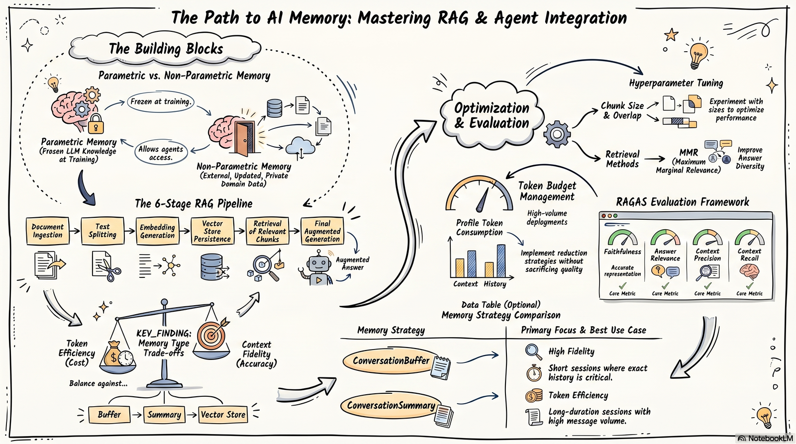
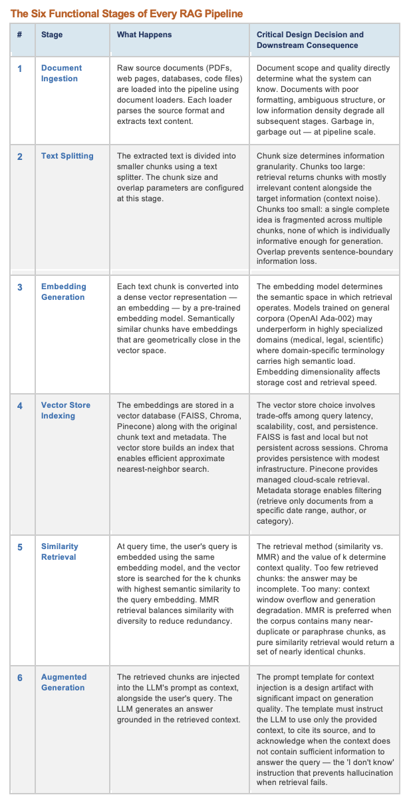
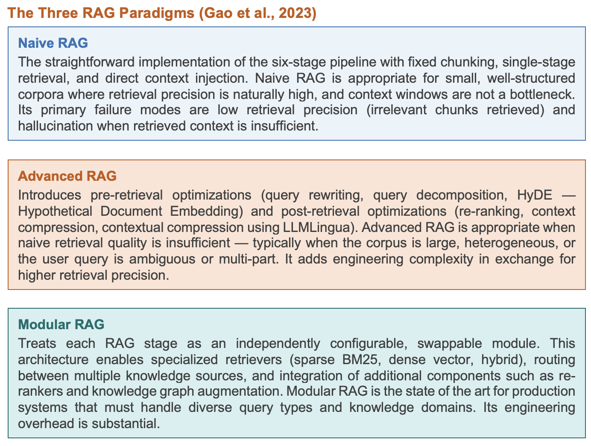
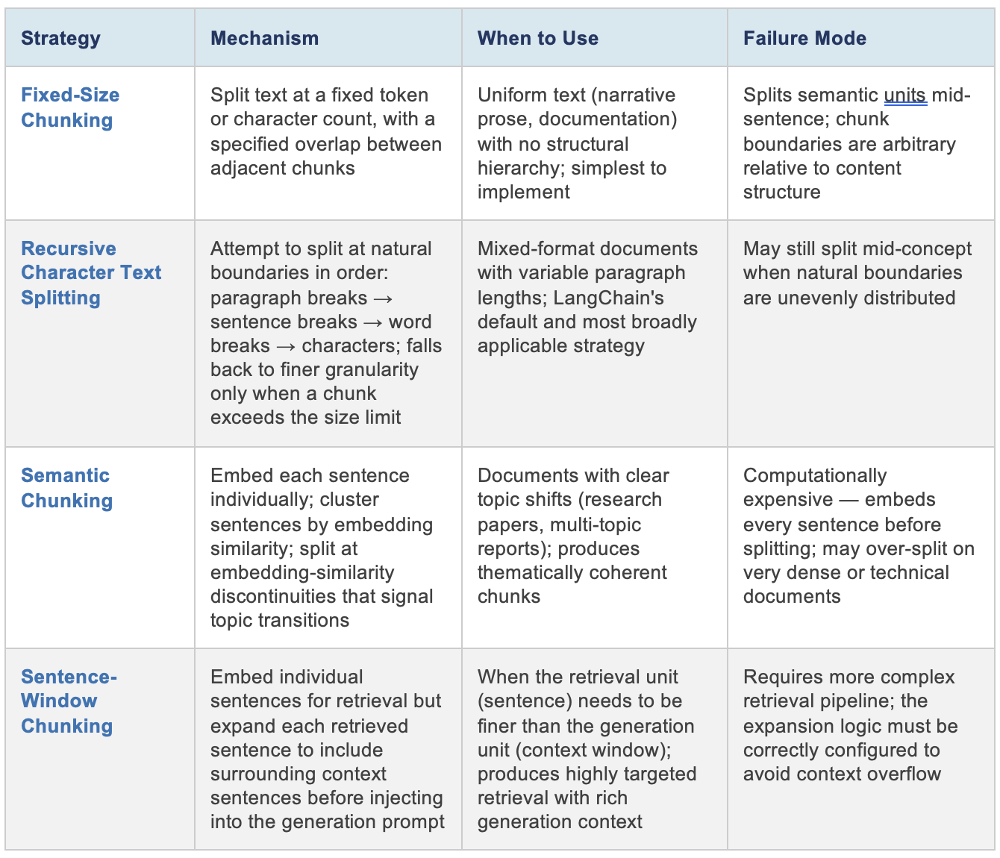
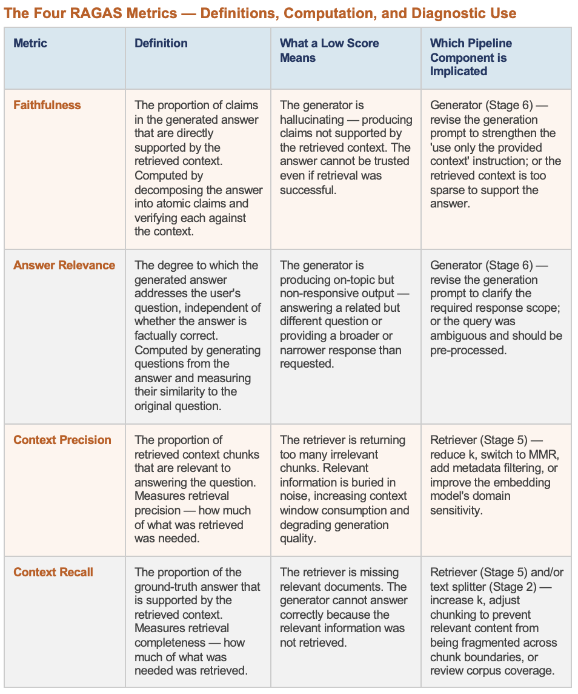
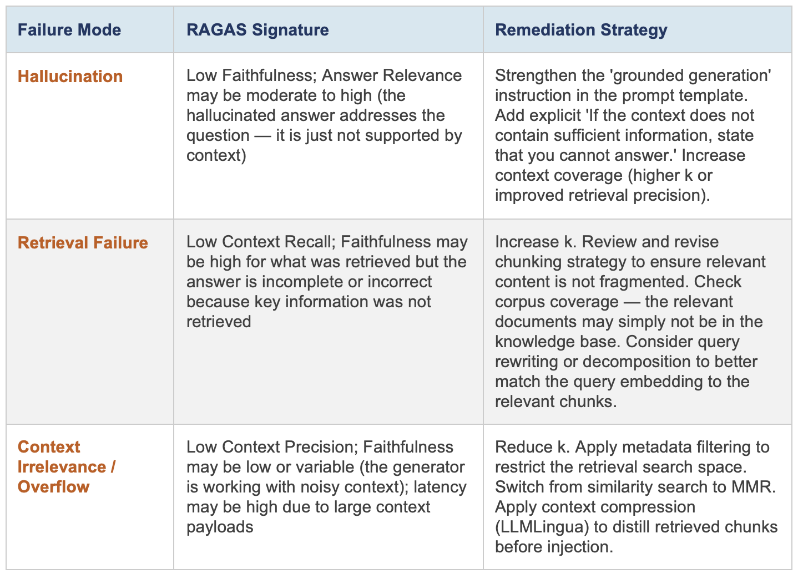

# Module 3: Foundational Concepts

{ width="900" }

## Chapter 1: Parametric vs. Non-Parametric Memory

### Chapter 1 Lesson

*Estimated time: ~12 min*

LLMs are trained on vast amounts of information, but that knowledge is frozen at training time and can't be updated without expensive retraining. This "frozen" knowledge is known as parametric memory, permanantly encoded in the the model weights during training. 

For tasks that require current or very specialized information, that frozen knowledge isn't enough. Models will hallucinate: generating answers that sound confident but are factually wrong or outdated.

Non-parametric memory solves this by storing knowledge outside the model, in documents, databases, or files that can be updated, verified, and tailored to a specific domain or organization. Unlike parametric memory, it can be regularly updated with new information the model was never trained on.

Retrieval-Augmented Generation (RAG) introduced by Lewis at al. is one of the most widely used forms of non-parametric memory in production AI systems, in which relevant documents are retrieved from an external knowledge store at the moment a question is asked and passed to the model as context — so answers are grounded in current, verifiable evidence.

| | Parametric Memory | Non-Parametric Memory |
| :-- | :-- | :-- |
| **Summary** | • Knowledge is encoded in the model's weights during training and frozen at cutoff • Broad but shallow in specialized domains; updating requires retraining | • Knowledge is stored externally in documents, databases, or APIs • Scoped to your domain and updated without retraining |
| **How reliable it is** | • Cannot be directly audited; sources cannot be traced to a specific document • Failure mode: hallucination — confident generation of plausible but incorrect content | • Fully auditable — retrieved documents can be cited, inspected, and their provenance verified • Failure modes: retrieval failure — correct documents not retrieved; context overflow — too much irrelevant context |
| **When to use it** | Suitable for general reasoning, language tasks, and domains where training data is comprehensive and current | Required for organizational knowledge bases, recent information, proprietary data, and compliance-sensitive domains |

Bommasani et al. (2021), in the Stanford CRFM foundation models report, provide the broader
theoretical context: the capabilities and limitations of foundation models are deeply shaped by the
training data distribution and the model's capacity to generalize from it. RAG is, in their framing,
an architectural strategy for extending a foundation model's effective knowledge boundary beyond
what can be efficiently encoded in parameters — a particularly important capability for the specialized, proprietary, or dynamic knowledge that characterizes professional deployment environments.

!!! note "Note"

    Every organization that deploys AI agents in knowledge-intensive contexts faces the same
    core problem: the agent's parametric knowledge does not include the organization's internal
    documents, policies, proprietary data, or recent developments. RAG is the current production-
    standard solution to this problem.

### Learning Resources
* Lewis, P., Perez, E., Piktus, A., Petroni, F., Karpukhin, V., Goyal, N., ... & Kiela, D. (2020). [Retrieval-augmented generation for knowledge-intensive nlp tasks](https://proceedings.neurips.cc/paper_files/paper/2020/file/6b493230205f780e1bc26945df7481e5-Paper.pdf){target=_blank}. Advances in neural information processing systems, 33, 9459-9474.
* Bommasani, R., Hudson, D. A., Adeli, E., Altman, R., Arora, S., von Arx, S., ... & Liang, P. (2021). [On the opportunities and risks of foundation models](https://arxiv.org/pdf/2108.07258){target=_blank}. arXiv preprint arXiv:2108.07258.

**Video 1: "[What is Retrieval-Augmented Generation (RAG)?](https://www.youtube.com/watch?v=T-D1OfcDW1M){target=_blank}"** - IBM Technology (~6 min)
   * Watch focus: RAG concept and how RAG is used with LLMs.

### Chapter 1 Quiz

[Take the Chapter 1 quiz](chapter-quizzes.md#chapter-1-quiz){ .md-button }

## Chapter 2: The Six-Stage RAG Pipeline — Architecture, Design Decisions, and Downstream Consequences

### Chapter 2 Lesson

*Estimated time: ~8 min*

Gao et al. (2023), in their survey of the RAG literature, identify three
evolutionary RAG paradigms — Naive RAG, Advanced RAG, and Modular RAG — that represent
increasing sophistication in pipeline design. However, all three paradigms share the same six
functional stages. Understanding these stages and the design decisions made at each is the
foundation for diagnosing failures in any RAG system.

{ width="800" }

{ width="800" }

### Learning Resources
* Lewis, P., Perez, E., Piktus, A., Petroni, F., Karpukhin, V., Goyal, N., ... & Kiela, D. (2020). [Retrieval-augmented generation for knowledge-intensive nlp tasks](https://proceedings.neurips.cc/paper_files/paper/2020/file/6b493230205f780e1bc26945df7481e5-Paper.pdf){target=_blank}. Advances in neural information processing systems, 33, 9459-9474.
* Gao, Y., Xiong, Y., Gao, X., Jia, K., Pan, J., Bi, Y., ... & Wang, H. (2023). [Retrieval-augmented generation for large language models: A survey](https://arxiv.org/pdf/2312.10997){target=_blank}. arXiv preprint arXiv:2312.10997, 2(1), 32.
* LangChain Documentation — [Retrieval Guide](https://docs.langchain.com/oss/python/deepagents/retrieval){target=_blank}, [Document Loaders](https://docs.langchain.com/oss/python/integrations/document_loaders){target=_blank}, [Text Splitters](https://docs.langchain.com/oss/python/integrations/splitters){target=_blank}, [Vector Stores](https://docs.langchain.com/oss/python/integrations/vectorstores){target=_blank}, [RetrievalQA](https://docs.langchain.com/oss/python/integrations/retrievers){target=_blank}

**Video 2: "[RAG Explained For Beginners](https://www.youtube.com/watch?v=_HQ2H_0Ayy0){target=_blank}"** - KodeKloud (~10 min)
   * Watch focus: The full RAG pipeline - document ingestion, text splitting, embedding generation,
vector store indexing, semantic retrieval, and augmented generation.

**Reading 1: [Langchain Retrieval Documentation](https://docs.langchain.com/oss/python/deepagents/retrieval){target=_blank}**

- Take note of the different building blocks LangChain provides for RAG (document loaders, text splitters, embedding models, vector stores, retrievers) and map them to the stages of the RAG pipeline.

### Chapter 2 Quiz

[Take the Chapter 2 quiz](chapter-quizzes.md#chapter-2-quiz){ .md-button }

## Chapter 3: Conversational Memory Management — Four Patterns

### Chapter 3 Lesson

An agent without memory cannot maintain context across conversation turns. Every exchange begins from scratch — no record of what was discussed, decided, or discovered previously. For professional applications like document-review assistants, research helpers, or customer support agents, this statelessness produces frustrating, repetitive interactions.

### The Problem: Why Memory Matters

Consider a customer support agent. A user says "I want to return the blue jacket I ordered last week." Three turns later they ask "What's the refund timeline for that item?" Without memory, the agent has no idea what "that item" refers to — it would need to ask again, breaking the conversational flow.

LangChain solves this with **`RunnableWithMessageHistory`** — a wrapper that automatically stores and retrieves conversation history so the agent remembers what was said.

### How It Works (Three Components)

1. **A prompt template with a history slot** — reserves space in the prompt where prior messages get inserted.
2. **A chain** (`prompt | llm`) — the processing pipeline that takes input, fills the prompt, and sends it to the LLM.
3. **`RunnableWithMessageHistory` wrapper** — connects the chain to a history store, automatically loading prior messages and saving new ones after each turn.

Each conversation gets a unique `session_id`, so one chain can serve many concurrent conversations without mixing up their histories.

### The Four Memory Patterns

There is no single "best" pattern — each trades off token cost against context fidelity differently:

| Pattern | How it works | Token cost | Best use case | Example implementation |
| :-- | :-- | :-- | :-- | :-- |
| **Buffer** | Stores every message verbatim | Grows with each turn | Short conversations (&lt;10 turns) where complete fidelity matters — e.g., medical record review, compliance dialogue | [`InMemoryChatMessageHistory`](https://reference.langchain.com/python/langchain-core/chat_history/InMemoryChatMessageHistory){target=_blank} |
| **Window** | Keeps only the last *k* turns; drops older messages | Stable once window is full | Customer support, coding assistants — where recent context matters most and early turns can be lost | [Lesson 8: Window Memory](https://langchain-tutorials.com/lessons/langchain-essentials/lesson-8){target=_blank} |
| **Summary** | Uses an LLM to compress older messages into a summary; keeps recent messages verbatim | Low and stable | Extended multi-session discussions where key decisions must persist but exact wording doesn't | [Lesson 8: Summary Memory](https://langchain-tutorials.com/lessons/langchain-essentials/lesson-8){target=_blank} |
| **Hybrid** | Rolling summary of older turns + verbatim buffer of recent turns | Low to moderate | Long, dense conversations (debugging, iterative drafting) needing both recency and long-range context — recommended default for production | [Lesson 8: Hybrid Memory](https://langchain-tutorials.com/lessons/langchain-essentials/lesson-8){target=_blank} |

### Persistent Memory Across Sessions

The four patterns above are ephemeral — history is lost when the Python process stops. For production, you configure a persistent backend (database, file store, etc.) to save and load conversation history across sessions. See the [Persistent Memory section](https://langchain-tutorials.com/lessons/langchain-essentials/lesson-8){target=_blank} of the LangChain Essentials tutorial for an implementation example.

### Looking Ahead: LangGraph

For multi-agent systems (Module 4), LangGraph manages conversation state as a typed, structured graph node — making memory explicit, inspectable, and testable. For single-agent applications, `RunnableWithMessageHistory` is sufficient.

!!! note "MEMORY PATTERN SELECTION IS A COST-QUALITY TRADE-OFF"

    A medical record review agent needs complete fidelity (Buffer Memory) and will accept higher token cost. A customer support bot serving thousands of long conversations daily cannot sustain unbounded token growth — Window or Hybrid Memory keeps costs manageable at the expense of some context loss.

### Learning Resources

* LangChain Documentation — [`RunnableWithMessageHistory`](https://reference.langchain.com/python/langchain-core/runnables/history/RunnableWithMessageHistory){target=_blank}
* [Memory Conceptual Guide](https://docs.langchain.com/oss/javascript/concepts/memory){target=_blank}, LangGraph State Schema 
* LangChain Tutorials — Lesson 8: [Memory & Context Management](https://langchain-tutorials.com/lessons/langchain-essentials/lesson-8){target=_blank}
* Gao, Y., Xiong, Y., Gao, X., Jia, K., Pan, J., Bi, Y., ... & Wang, H. (2023). [Retrieval-augmented generation for large language models: A survey](https://arxiv.org/pdf/2312.10997){target=_blank}. arXiv preprint arXiv:2312.10997, 2(1), 32.
* [LangGraph State Schema](https://docs.langchain.com/oss/python/langgraph/thinking-in-langgraph){target=_blank}

### Chapter 3 Quiz

[Take the Chapter 3 quiz](chapter-quizzes.md#chapter-3-quiz){ .md-button }

## Chapter 4: Retrieval Optimization and Context Window Management

### Chapter 4 Lesson

The context window of an LLM backbone is a finite resource. Every token consumed by retrieved
context is a token unavailable for the user's query, prior conversation history, system instructions,
and the model's own generated response. Managing this finite resource — deciding what to
include, at what granularity, and through what retrieval strategy — is the optimization discipline
that separates high-quality RAG systems from low-quality ones. Module 3 addresses this through
two complementary optimization dimensions: chunking strategy selection and retrieval method
selection.

**Chunking Strategy Selection**

Chunking is the most consequential single decision in RAG pipeline design (Gao et al., 2023).
The chunk size and overlap parameters, and the splitting logic used, determine the granularity of
information available to the retriever. Four primary chunking strategies exist:

{ width="800" }

**Retrieval Method Selection and Context Compression**

Beyond chunking, two further optimization levers determine context quality:

* **Similarity Search vs. Maximum Marginal Relevance (MMR):** Standard similarity search
retrieves the k chunks most semantically similar to the query — but if the corpus contains near-
duplicate content (e.g., the same policy statement repeated across multiple documents), all k
retrieved chunks may be near-identical, providing redundant context. MMR balances similarity
to the query with dissimilarity to already-retrieved chunks, producing a diverse set of relevant
context. MMR is preferred whenever the corpus has significant redundancy or whenever diverse
perspectives on a query are desirable.

* **Metadata Filtering:** Vector store metadata (document date, author, category, section header)
can be used as pre-retrieval filters: 'retrieve only from documents tagged as Policy documents
published after 2023.' Metadata filtering dramatically reduces the search space and improves
precision for queries with implicit temporal or categorical constraints that are not captured in the
query embedding.

* **Re-ranking:** Post-retrieval re-ranking applies a cross-encoder model (more accurate but more
expensive than the bi-encoder used for initial retrieval) to re-score and re-order the initially
retrieved chunks before context injection. Re-ranking is an Advanced RAG technique that
significantly improves retrieval precision at the cost of additional inference time.

* **Context Compression (LLMLingua):** Context compression tools such as LLMLingua use a
small LLM to compress each retrieved chunk by removing sentences that are not relevant to the
specific query, before injecting into the generation context. This reduces context tokens while
preserving information density — a particularly valuable optimization for chunks retrieved from
long documents where only a portion of the chunk content is relevant to the specific query.

!!! note "Practitioner tip"

    When optimizing RAG, vary one parameter at a time (chunk size, retrieval method). Hold all others constant, and measure the impact on RAGAS metrics (covered in Chapter 5).
    If you vary multiple
    parameters simultaneously, you cannot attribute performance changes to specific design decisions.

### Learning Resources

* Gao, Y., Xiong, Y., Gao, X., Jia, K., Pan, J., Bi, Y., ... & Wang, H. (2023). [Retrieval-augmented generation for large language models: A survey](https://arxiv.org/pdf/2312.10997){target=_blank}. arXiv preprint arXiv:2312.10997, 2(1), 32. Sections 5 (Advanced RAG patterns)
* LangChain Expression Language [LCEL Documentation](https://www.langchain.com/blog/langchain-expression-language){target=_blank}
* Es, S., James, J., Anke, L. E., & Schockaert, S. (2024, March). [RAGAS: Automated evaluation of retrieval augmented generation](https://aclanthology.org/2024.eacl-demo.16.pdf){target=_blank}. In Proceedings of the 18th conference of the european chapter of the association for computational linguistics: system demonstrations (pp. 150-158) (for optimization feedback loops)

### Chapter 4 Quiz

[Take the Chapter 4 quiz](chapter-quizzes.md#chapter-4-quiz){ .md-button }

## Chapter 5: RAGAS Evaluation — From Subjective Impression to Structured, Reproducible Diagnosis

### Chapter 5 Lesson

Es et al. (2023) introduced RAGAS (RAG Assessment) to address a persistent problem in RAG
development: evaluation was subjective, inconsistent, and expensive. Practitioners relied on
human judgment to assess answer quality, but human judgment is slow, expensive, and difficult
to reproduce across evaluators or time periods. RAGAS provides four automated metrics
computed from the retrieved context, the generated answer, and optionally a ground-truth
reference answer — enabling rapid, reproducible, and actionable evaluation that can be
integrated into a CI/CD pipeline for continuous quality monitoring.

{ width="800" }

**The Three Principal RAG Failure Modes**

RAGAS metrics map systematically to three classes of RAG system failure, each with a distinct
diagnostic signature and a distinct remediation strategy:

{ width="800" }

### Learning Resources

* Es, S., James, J., Anke, L. E., & Schockaert, S. (2024, March). [RAGAS: Automated evaluation of retrieval augmented generation](https://aclanthology.org/2024.eacl-demo.16.pdf){target=_blank}. In Proceedings of the 18th conference of the european chapter of the association for computational linguistics: system demonstrations (pp. 150-158) 
* Gao, Y., Xiong, Y., Gao, X., Jia, K., Pan, J., Bi, Y., ... & Wang, H. (2023). [Retrieval-augmented generation for large language models: A survey](https://arxiv.org/pdf/2312.10997){target=_blank}. arXiv preprint arXiv:2312.10997, 2(1), 32.

**Reading 5 - Es et al. (2023): RAGAS Framework [~10 min]**

* [Es, S. et al. (2023). RAGAS: Automated evaluation of retrieval augmented generation.
arXiv:2309.15217.](https://aclanthology.org/2024.eacl-demo.16.pdf){target=_blank} 
   * Read: Section 3: Evaluation Strategies. 
   * Extract: What does each of the four RAGAS metrics measure (faithfulness, answer relevance, context precision, context recall)?
   * Which metric captures the failure mode of an LLM generating a plausible answer that contradicts the retrieved source documents?

### Chapter 5 Quiz

[Take the Chapter 5 quiz](chapter-quizzes.md#chapter-5-quiz){ .md-button }

Migrated from the [course wiki](https://github.com/UA-AI2S/AI-Automation-and-Agents-v2/wiki/Module-3:-Foundational-Concepts){target=_blank} (wiki page last changed 2026-08-11). Spotted a problem? [Edit this page](https://github.com/tyson-swetnam/AI-Automation-and-Agents/edit/main/docs/modules/module-3/foundational-concepts.md){target=_blank}.

