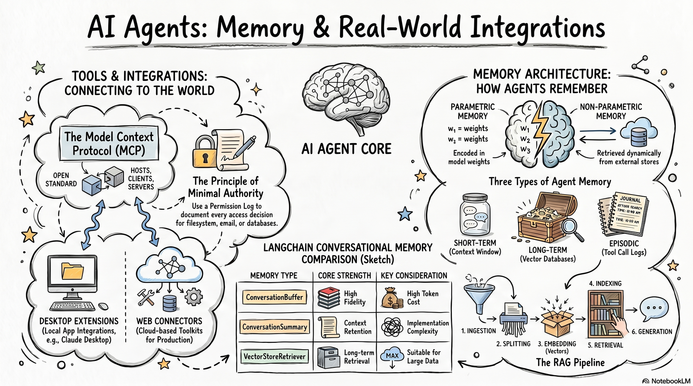

# Module 3 Overview: Memory Architectures and RAG

**Time:** 8 hours

{ width="900" }

## Introduction

*Estimated time: ~2 min*

Module 3 addresses the greatest limitations of the reasoning agents you built in the last module: 1) they do not remember and 2) they do not know you or your work. Every conversation begins from scratch, answered exclusively from knowledge frozen at training cutoff.

For example, all Anthropic models released in June 2026 (Fable 5, Opus 4.8, Sonnet 5) have a knowledge cutoff date of January 2026 [Anthropic Transparency Hub](https://www.anthropic.com/transparency){target=_blank}. This means that an LLM model's knowledge is outdated by several months or even years. Some of this can be mitigated by giving your agent access to tools such as web search, as shown in Module 2. But what about when your models needs institutional or personal knowledge that isn't publicly available online?

This module covers the design, implementation, and evaluation of memory architectures and Retrieval-Augmented Generation (RAG) pipelines that transform agents from isolated question-answerers into productive collaborators.

## Topics Covered

*Estimated time: ~2 min*
* **Parametric vs. non-parametric memory** — the foundational distinction between what a model knows from training and what it retrieves at runtime
* **Six-stage RAG pipeline** — document ingestion, text splitting, embedding, vector indexing, retrieval, and augmented generation as a structured engineering discipline
* **LangChain conversational memory types** — four memory architectures with distinct cost-fidelity trade-offs
* **Retrieval optimization** — chunking strategies, retrieval methods, metadata filtering, and context compression
* **RAGAS evaluation** — four quantitative metrics for diagnosing and prioritizing RAG failure modes

## Learning Objectives

*Estimated time: ~2 min*

- Differentiate parametric and non-parametric memory in LLM systems.
- Explain the stages of a Retrieval-Augmented Generation (RAG) pipeline.
- Compare LangChain conversational memory types across key implementation
criteria.
- Implement an end-to-end RAG pipeline using LangChain.
- Configure a conversational agent with persistent memory.
- Evaluate RAG system failures and recommend remediation strategies.

## Module 3 Checklist

*Estimated time: ~2 min*

| Chapter | Type | Deliverable |
| :--: | :-- | :-- |
| **1** | Parametric vs. Non-Parametric Memory | Chapter 1 Quiz |
| **2** | The Six-Stage RAG Pipeline | Chapter 2 Quiz |
| **3** | Conversational Memory Management | Chapter 3 Quiz |
| **4** | Retrieval Optimization and Context Window Management | Chapter 4 Quiz |
| **5** | RAGAS Evaluation | Chapter 5 Quiz |
| **Lab** | Guided Lab Exercise | Colab Notebook |
| **Project** | Hands-On Project | Optimization Experiment Log + Token Budget Report + Brief Outline |
| **Discussion** | Peer Discussion | Discussion Post + Response |

## Grade Weight Summary

*Estimated time: ~2 min*

!!! info "Grade weight summary"

    Chapter Quizzes (Units 1–5): 100% of module grade — 20% each

    Guided Lab Submission: Colab Notebook: Add to github repository

    Discussion Post + Peer Reply: required for certificate — completion only, but please give meaningful responses to your fellow learners

Migrated from the [course wiki](https://github.com/UA-AI2S/AI-Automation-and-Agents-v2/wiki/Module-3:-Overview){target=_blank} (wiki page last changed 2026-08-06). Spotted a problem? [Edit this page](https://github.com/tyson-swetnam/AI-Automation-and-Agents/edit/main/docs/modules/module-3/overview.md){target=_blank}.

