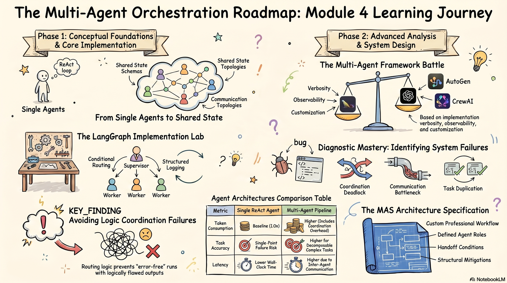

# Module 4 Activities

{ width="900" }

## Self-Check Prompts

*Estimated time: ~30 minutes*

Before moving on, answer the three prompts in a notes document or on a piece of paper. These won't be submitted or graded, they're meant to help you recall what you've learned. If you're unsure how to answer, revisit the relevant reading before continuing.

#### Prompt 1 - When Not to Use Multi-Agent Architecture

Describe one concrete scenario where a single ReAct agent would be a better choice than a multi-agent pipeline. What characteristic of that task makes it unsuitable for multi-agent decomposition?

#### Prompt 2 - Coordination Architectures

Compare the two most common coordination architectures: hierarchical supervisor-worker and role-based sequential pipeline. For each, identify a workflow from your own domain that would naturally fit and explain why in two to three sentences.

#### Prompt 3 - Coordination Failure Diagnosis

A three-agent pipeline (Researcher → Analyst → Critic) runs indefinitely: the Critic keeps rejecting the Analyst's output and sending it back for revision, but the Analyst's revisions never satisfy the Critic's criteria. Diagnose what is most likely causing this failure, and suggest one structural remediation (a change to routing, state design, or termination conditions) that would prevent it.

## Lab Exercise

*Estimated time: ~2 hrs*

!!! warning "Platform setup — read before starting"

    All lab work runs in Google Colab (free tier). You do not need a paid subscription. You will need: (1) a Google account to access Colab; (2) a Hugging Face token for inference providers (free tier available), or an OpenAI/Groq API key, or a locally hosted Ollama model as a free alternative — setup instructions are included in the notebook.

In this lab, you will specify, implement, and run a three-role multi-agent pipeline (Researcher → Analyst → Critic) in LangGraph, with a deterministic quality gate and critic-triggered revision cycles capped at two iterations.

**Open the lab notebook:** [Module4_Learner_Starter.ipynb](lab-notebook.md)

### Guided lab notebook flow

The notebook walks you through a complete multi-agent pipeline build sequence in two phases:

1. Role specification — define all three agent roles (name, input/output format, handoff condition, failure mode) before writing any code.
2. LangGraph implementation — define the pipeline state schema, implement researcher/analyst/critic nodes with structured logging, wire conditional routing with a hard revision limit, and run the pipeline on a complex topic of your choice.

All detailed instructions, checks, and logging prompts are embedded directly in the notebook.

!!! info "What to submit"

    **Add to github**: Submit the `.ipynb` file with your completed LangGraph implementation (sections 1–2), all cells executed with output visible, and all three debrief questions answered (minimum two sentences each). Filename: `Module4_Lab_[YourName].ipynb`.

## Hands-On Project: Framework Comparison

*Estimated time: ~2 hours*

In this project, you will continue in the same notebook from the guided lab to implement an equivalent three-role pipeline in CrewAI and write an evidence-based comparison between the two frameworks.

### Project notebook flow

The notebook walks you through a controlled framework comparison:

1. CrewAI implementation — build the same Researcher → Analyst → Critic pipeline using CrewAI's Agent, Task, and Crew abstractions, with the same topic, model, and quality criteria as the LangGraph version.
2. Framework Comparison Report — a minimum 200-word structured analysis covering four dimensions: implementation verbosity (measured LOC), observability, customization flexibility, and developer experience.

Detailed instructions are embedded directly in the notebook.

!!! info "What to submit"

    **Add to github**: Submit the completed `.ipynb` file (guided lab + hands-on project, sections 1–4) with all cells executed and output visible. Both frameworks must use the same topic and model. Filename: `Module4_Lab_[YourName].ipynb`.

## Peer Discussion

### Part A: Discussion Post

*Estimated time: ~30 minutes*

For this discussion post, identify a complex workflow from your domain that you think would translate well to a multi-agent system. Choose one that you understand deeply enough to analyze its structure. Your post should include the following:

**Workflow description:** Briefly describe the workflow and why it is a good candidate for a multi-agent system.

**Coordination architecture:** Name the coordination pattern you would use and justify it in two sentences, grounded in the workflow's decomposability (can it be divided into independent or sequential sub-tasks?) and interdependency structure (do sub-tasks feed into each other, or contribute independently to the final output?).

**Agent roles:** List each agent role with a one-sentence responsibility, what it receives as input, and what it passes as output.

**Failure modes:** Identify at least two coordination failure modes specific to your workflow — not generic failures, but ones that arise from its structural properties. For each, describe a structural mitigation (a change to routing logic, state schema design, or termination conditions — not a prompt change).

Optional: Feel free to mention anything surprising or unexpected about the multi-agent systems you built in the lab/hands-on.

### Part B: Peer Response

Reply to at least one classmate's post with substantive feedback to their proposal. Consider: does their mitigation strategy actually prevent the failure they described, or does a structural gap remain? Would a different agent division or coordination pattern serve their workflow better, and why?

!!! example "Summative submission"

    * Forum post: MAS Architecture Outline. Post directly in LMS Discussion Forum - no file attachment needed for the post itself.

    * Forum reply: substantive critique of one classmate's outline - failure mode gap or alternative architecture argument.

Migrated from the [course wiki](https://github.com/UA-AI2S/AI-Automation-and-Agents-v2/wiki/Module-4:-Activities){target=_blank} (wiki page last changed 2026-08-12). Spotted a problem? [Edit this page](https://github.com/tyson-swetnam/AI-Automation-and-Agents/edit/main/docs/modules/module-4/activities.md){target=_blank}.

