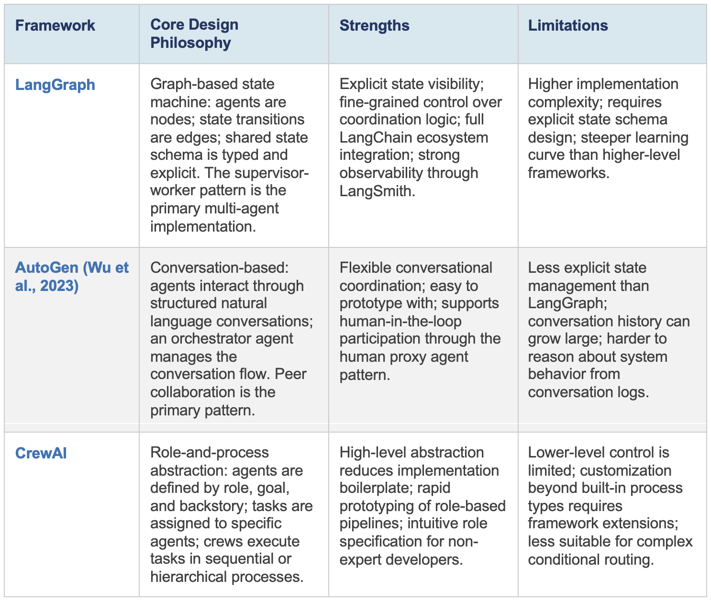

# Module 4: Foundational Concepts

## Chapter 1: Intro to Multi-Agent Systems

### Chapter 1 Lesson

*Estimated time: ~15 minutes*

**What Is a Multi-Agent System?**

 - **Definition:** A **multi-agent system (MAS)** is a computational architecture in which multiple autonomous AI agents, each with distinct roles, capabilities, and access to information, collaborate to accomplish tasks that no single agent could handle efficiently alone.
 - **Benefit:** By dividing complex work across agents with focused responsibilities, a multi-agent system can produce higher-quality, more reliable outcomes than any single generalist agent operating alone.

The theoretical foundation for multi-agent AI systems predates the LLM era by decades.
- Wooldridge and Jennings (1995) identified sociability — the ability of agents to interact with one another — as one of the four aspects of agency.
- Hutchins (1995): complex work
in human organizations is routinely distributed across individuals and artifacts, with no single
participant holding all relevant information.
- Stone and Veloso (2000) present a taxonomy of coordination mechanisms and communication protocols in multi-agent robotic systems.
- Guo et al. (2024) extend this work into the LLM era, documenting where these systems
succeed, where they fail, and when a esingle well-dsigned agent is the better choice.

**When to use a multi-agent system**

LLM-based multi-agent systems are networks where individual language models "perceive inputs, reason about tasks, and take actions," with coordination mechanisms enabling them to work together on "complex, decomposable problems (Guo et al).

That coordination adds cost and complexity, so it should only be considered when the task has specific requirements that a single agent cannot handle well.

| Condition | Why Multi-Agent Architecture Is Justified |
| :-- | :-- |
| **Context window limitation** | The task involves more information than a single agent's context window can hold, requiring multiple agents to process distinct segments. |
| **Task specialization** | The task breaks into sub-tasks that benefit from different expertise, prompting strategies, or tool sets — a generalist agent handling all roles produces lower-quality output. |
| **Parallel execution requirement** | The task contains independent sub-tasks that can run simultaneously across multiple agents, reducing total completion time. |
| **Cross-agent quality control** | The task benefits from one agent generating output and a separate agent critiquing it — a critic reading the output catches errors the generator cannot see in its own work. |
| **Scale beyond single-agent capability** | The task volume or complexity exceeds what a single agent can handle reliably, requiring work to be distributed across multiple agents. |

### Learning Resources

* Wooldridge, M., & Jennings, N. R. (1995). [Intelligent agents: Theory and practice](../module-1/readings/intelligent-agents-wooldridge-jennings.md). The knowledge engineering review, 10(2), 115-152.
* Stone, P., & Veloso, M. (2000). [Multiagent systems: A survey from a machine learning perspective](https://link.springer.com/article/10.1023/A:1008942012299){target=_blank}. Autonomous Robots, 8(3), 345-383.
* Hutchins, E. (1995). [Cognition in the Wild](https://www.ida.liu.se/~nilda08/CST-papers/Hutchins.pdf){target=_blank}. MIT press.
* Guo, T., Chen, X., Wang, Y., Chang, R., Pei, S., Chawla, N. V., ... & Zhang, X. (2024). [Large language model based multi-agents: A survey of progress and challenges](https://arxiv.org/pdf/2402.01680){target=_blank}. arXiv preprint arXiv:2402.01680.

**Reading 1: Guo et al. [Large language model based multi-agents: A survey of progress and challenges](https://arxiv.org/pdf/2402.01680){target=_blank}**. arXiv preprint arXiv:2402.01680. (~15 minutes)

- Read Section 3 and skim section 4 to see some applications of LLM-based multi-agent systems in the read world. Extract:
- How do autonomous agents communicate with each other to coordinate their work?
- How do multi-agent systems mirror or relate to the way humans collaborate to solve real-world problems?

### Chapter 1 Quiz

[Take the Chapter 1 quiz](chapter-quizzes.md#chapter-1-quiz){ .md-button }

## Chapter 2: How do agents coordinate with one another?

### Chapter 2 Lesson

How agents coordinate — who talks to whom, who holds authority, who sees what — determines whether a multi-agent system works or fails. The four patterns below represent some common coordination patterns.

**Pattern 1: Hierarchical Supervisor-Worker**

- **Coordination:** The supervisor agent knows the full task context, breaks it down and delegates sub-tasks to specialized workers. After receiving the worker outputs, the supervisor synthesizes a final response.
- **Communication:** The supervisor sends sub-tasks down to workers; workers return their results back up to the supervisor.
- **Good for:** Tasks that can be broken into predictable, well-defined sub-tasks, where results need to be aggregated and centralized quality control is required.
- **Failure point:** Supervisor becomes a bottleneck; if the supervisor's decomposition strategy is wrong, all downstream work is misaligned.
- **Practical example:** LangGraph's primary multi-agent pattern; a research supervisor delegating literature search, data analysis, and writing to separate specialist agents.

---

**Pattern 2: Peer Collaboration Network**

- **Coordination:** Distributed — no single agent holds global task context; agents communicate horizontally, sharing partial results and observations, and global behavior emerges from their collective interaction.
- **Communication:** Any agent can initiate contact with any other agent within the defined topology; messages flow in all directions.
- **Good for:** Tasks where interdependencies are complex, non-linear, or not fully known at design time.
- **Failure point:** Emergent behavior is difficult to predict and debug; coordination overhead scales with agent count; contradictory outputs can arise without explicit conflict resolution.
- **Practical example:** AutoGen's conversation-based multi-agent architecture; multiple specialist agents collaborating on an open-ended research problem.

---

**Pattern 3: Role-Based Sequential Pipeline**

- **Coordination:** Sequential — each agent receives the previous agent's output as input and passes its own output forward; each stage depends on the prior stage completing successfully.
- **Communication:** Each stage passes its output to the next stage only; communication flows in one direction through the pipeline.
- **Good for:** Tasks with a natural sequential structure and distinct transformation stages where each stage's output is well-defined.
- **Failure point:** A failure at any stage propagates forward and may corrupt all subsequent stages; the pipeline is only as fast as its slowest stage.
- **Practical example:** MetaGPT (Hong et al., 2024) — product manager agent → architect agent → engineer agent → tester agent pipeline for software engineering tasks.

---

**Pattern 4: Market-Mechanism Allocation**

- **Coordination:** Market-mediated — tasks are posted to a shared queue; specialized worker agents bid on or claim tasks based on their capabilities and current load; a broker assigns tasks to the appropriate agent.
- **Communication:** Workers advertise their capabilities to the broker; the broker assigns tasks back to the appropriate worker.
- **Good for:** Dynamic task distributions where task types are heterogeneous and worker availability fluctuates; large-scale production deployments.
- **Failure point:** Highest coordination overhead of the four patterns; broker becomes a single point of failure; worker overload if allocation is unbalanced.
- **Practical example:** Inspired by the contract net protocol from classical MAS; less common in current LLM-based systems but increasingly relevant for high-volume production pipelines.

### Learning Resources

* Wu, Q., Bansal, G., Zhang, J., Wu, Y., Li, B., Zhu, E., ... & Wang, C. (2024, August). [Autogen: Enabling next-gen LLM applications via multi-agent conversations](https://openreview.net/pdf?id=BAakY1hNKS){target=_blank}. In First conference on language modeling.
* Hong, S., Zhuge, M., Chen, J., Zheng, X., Cheng, Y., Wang, J., ... & Schmidhuber, J. (2024, May). [MetaGPT: Meta programming for a multi-agent collaborative framework](https://proceedings.iclr.cc/paper_files/paper/2024/file/6507b115562bb0a305f1958ccc87355a-Paper-Conference.pdf){target=_blank}. In International Conference on Learning Representations (Vol. 2024, pp. 23247-23275).

**Reading 3: Hong, S., Zhuge, M., Chen, J., Zheng, X., Cheng, Y., Wang, J., ... & Schmidhuber, J. (2024, May). [MetaGPT: Meta programming for a multi-agent collaborative framework](https://proceedings.iclr.cc/paper_files/paper/2024/file/6507b115562bb0a305f1958ccc87355a-Paper-Conference.pdf){target=_blank}**. In International Conference on Learning Representations (Vol. 2024, pp. 23247-23275). 

- Read Section 1: Introduction and Section 3: MetaGPT: A Meta-Programming Framework. (~20 minutes)
- This paper introduces a role-based agent system modeling a software engineering team, and uses SOPs to streamline agent behaviors and structured outputs (flowcharts, diagrams) as communication tools between agents.  
- See Figure 3 to understand how each role operates given their specialized SOP.

### Chapter 2 Quiz

[Take the Chapter 2 quiz](chapter-quizzes.md#chapter-2-quiz){ .md-button }

## Chapter 3: The Three Orchestration Frameworks — LangGraph, AutoGen, and CrewAI

### Chapter 3 Lesson

Three orchestration frameworks dominate current LLM-based multi-agent development. Each
embodies specific design philosophies about state management, agent communication, and
system observability. The choice of framework is not merely a stylistic preference — it has real
implications for the maintainability, debuggability, and scalability of the resulting system.

{ width="700" }

### Learning Resources

* LangChain [Multi-Agent Guide](https://docs.langchain.com/oss/python/langchain/multi-agent){target=_blank}
* Wu, Q., Bansal, G., Zhang, J., Wu, Y., Li, B., Zhu, E., ... & Wang, C. (2024, August). [Autogen: Enabling next-gen LLM applications via multi-agent conversations](https://openreview.net/pdf?id=BAakY1hNKS){target=_blank}. In First conference on language modeling.
* [CrewAI Documentation](https://docs.crewai.com/){target=_blank}

**Reading 4: LangChain [Multi-Agent Guide](https://docs.langchain.com/oss/python/langchain/multi-agent){target=_blank}**

**Video 1: "[Fully local multi-agent systems with LangGraph](https://www.youtube.com/watch?v=4oC1ZKa9-Hs){target=_blank}"** - LangChain (~13 min)

### Chapter 3 Quiz

[Take the Chapter 3 quiz](chapter-quizzes.md#chapter-3-quiz){ .md-button }

## Chapter 4: Coordination Failure Taxonomy — The MAST Framework

### Chapter 4 Lesson

Coordination failures are the characteristic failure mode of multi-agent systems — they do not
occur in single-agent systems and require fundamentally different diagnostic approaches.
Cemri et al. (2026) conducted the first large-scale empirical study of multi-agent LLM system
failures, analyzing 150 interaction traces across six popular frameworks. Their Multi-Agent
System Failure Taxonomy (MAST) identifies 14 failure modes clustered into three categories,
mapped to the inter-agent conversation stages where they occur (pre-execution, execution,
post-execution).

The three failure categories and their relative prevalence:

- **System Design Issues (44.2%)** — failures caused by how the system is architected: role definitions, task specifications, memory management, and termination logic.
- **Inter-Agent Misalignment (32.3%)** — failures in how agents communicate and coordinate during task execution: information sharing, clarification, and action consistency.
- **Task Verification (23.5%)** — failures in how agents validate and confirm task completion: premature stopping, incomplete checks, or incorrect acceptance of flawed outputs.

The tables below detail each failure mode within these categories, along with mitigation strategies.

#### System Design Issues

| Failure Mode | Prevalence | Description | Mitigation Strategy |
| :-- | :-- | :-- | :-- |
| **Step Repetition** | 15.7% | An agent repeats the same action or reasoning step multiple times without making progress, often due to missing state tracking or loop-detection logic. | Track executed actions in a state log and add a loop-detection gate that halts the agent after N identical steps. |
| **Unaware of Termination Conditions** | 12.4% | An agent continues executing after the task is already complete, or fails to recognize when to stop — lacking explicit termination criteria in the system design. | Define explicit completion criteria in the task prompt and add a post-step check that evaluates whether the criteria have been met. |
| **Disobey Task Specification** | 11.8% | An agent deviates from its assigned task instructions, producing output that does not match what was specified — often caused by ambiguous or underspecified task prompts. | Use structured output schemas that enforce the required format; add a verification agent that rejects outputs not conforming to the spec. |
| **Loss of Conversation History** | 2.8% | An agent loses access to prior context due to context window limits or faulty memory management, causing it to repeat questions or contradict earlier decisions. | Store key decisions in external memory (not just the context window) and inject a summary of prior state at each turn. |
| **Disobey Role Specification** | 1.5% | An agent acts outside its defined role boundaries — e.g., a researcher agent starts making editorial decisions — due to insufficiently constrained role definitions. | Constrain each agent's available tools and output types to its role; add a gate that rejects actions outside the agent's defined scope. |

#### Inter-Agent Misalignment

| Failure Mode | Prevalence | Description | Mitigation Strategy |
| :-- | :-- | :-- | :-- |
| **Reasoning-Action Mismatch** | 13.2% | An agent's stated reasoning does not match its subsequent action — it describes one plan but executes another, indicating a disconnect between the reasoning trace and the action layer. | Add a verification step that compares the agent's stated plan to its executed action and flags discrepancies before passing output downstream. |
| **Task Derailment** | 7.4% | Agents collectively drift away from the original objective during execution, often through a chain of tangential responses that each seem locally reasonable. | Insert periodic objective-check gates that compare current output against the original task goal; halt and re-route if drift is detected. |
| **Fail to Ask for Clarification** | 6.8% | An agent proceeds with an ambiguous or incomplete instruction rather than requesting clarification, producing output based on incorrect assumptions. | Require agents to output a confidence score on task interpretation; route low-confidence cases to a disambiguation step before execution. |
| **Conversation Reset** | 2.2% | An agent restarts the conversation or ignores prior exchanges, losing all accumulated context and forcing redundant work. | Persist conversation state in external memory (not just the context window) and validate continuity at each turn before allowing a response. |
| **Ignored Other Agent's Input** | 1.9% | An agent disregards information or instructions provided by another agent, acting solely on its own reasoning without integrating collaborative input. | Require agents to explicitly reference or acknowledge prior agent outputs in their response; reject outputs that contain no such reference. |
| **Information Withholding** | 0.8% | An agent possesses information relevant to another agent's task but fails to share it, causing downstream agents to operate with incomplete context. | Design agents with explicit output schemas that mandate passing all task-relevant context forward; use shared state objects rather than message-only communication. |

#### Task Verification

| Failure Mode | Prevalence | Description | Mitigation Strategy |
| :-- | :-- | :-- | :-- |
| **Incorrect Verification** | 9.1% | A verifier agent accepts flawed output as correct, or rejects correct output as flawed — the verification logic itself produces wrong judgments. | Use multiple independent verifiers and accept only on consensus; generate unit tests as executable verification rather than relying on LLM judgment alone. |
| **No or Incomplete Verification** | 8.2% | The system produces a final output without any verification step, or the verification checks only a subset of the required criteria. | Add a mandatory verification node in the workflow graph that must pass before output is returned; verify against all criteria in a structured checklist. |
| **Premature Termination** | 6.2% | The system declares the task complete before all required steps have been executed, often due to an agent incorrectly signaling completion. | Add a high-level objective verifier that checks whether the original goal is fully satisfied before accepting a completion signal from any sub-agent. |

### Learning Resources

**Reading 5: Cemri, M., Pan, M. Z., Yang, S., Agrawal, L. A., Chopra, B., Tiwari, R., ... & Stoica, I. (2026). [Why do multi-agent llm systems fail?](https://proceedings.neurips.cc/paper_files/paper/2025/file/b1041e52d3be19f0a9bc491657488e4a-Paper-Datasets_and_Benchmarks_Track.pdf){target=_blank}**. Advances in Neural Information Processing Systems, 38.
*Scope: Read Section 1 and Section 4 about the Multi-Agent System Failure Taxonomy (MAST).*

### Chapter 4 Quiz

[Take the Chapter 4 quiz](chapter-quizzes.md#chapter-4-quiz){ .md-button }

## Chapter 5: Evidence-Based Benchmarking — When Does Multi-Agent Add Value?

### Chapter 5 Lesson

In their comparison of single-agent vs. multi-agent systems on benchmark tasks like coding, math, and general reasoning, Gao et al. (2025) find that:

- MAS can solve complex tasks that single-agent systems cannot.
- However, as LLMs improve, the performance gap between MAS and single-agent narrows, while MAS efficiency challenges remain.
- On simple tasks, MAS can underperform a single agent due to unnecessary coordination overhead.

As discussed in Chapter 1, multi-agent is not always the right choice. The decision requires evidence. To determine whether MAS is justified for a given task, evaluate across four dimensions:

**Task Accuracy**
- **Measure:** Run both systems (single-agent and multi-agent) on the same set of benchmark tasks. Grade each output using a scoring rubric, then compare average scores.
- **Interpret:** A statistically meaningful accuracy gain justifies MAS complexity. If the difference is small enough that it could be due to random variation in scoring, it does not justify the added cost.

**Total Token Consumption**
- **Measure:** The total number of tokens used to complete a task — including every message agents send to each other, not just the final output.
- **Interpret:** More tokens means higher API cost. A multi-agent system that is slightly more accurate but uses 4× more tokens may not be worth the expense.

**Wall-Clock Latency**
- **Measure:** How long (in seconds) from when the user submits a task to when they receive the final output. Report mean, P90 (90% of requests finish within this time), and P99 (99% finish within this time).
- **Interpret:** Average latency can hide problems. A multi-agent system may be fast most of the time but occasionally very slow when coordination goes wrong. P90 and P99 reveal these worst-case delays — which matter most when real users are waiting for a response.

**Coordination Overhead**
- **Measure:** How much of the total token usage goes to agents talking to each other (delegating, checking in, combining results) versus actually doing the work.
- **Interpret:** If the system spends more effort coordinating than producing useful output, it is over-engineered. A coordination overhead ratio above 40% is a signal to simplify the architecture.

### Learning Resources

- Gao, M., Li, Y., Liu, B., Yu, Y., Wang, P., Lin, C-Y., & Lai, F. (2025). [Single-agent or Multi-agent Systems? Why Not Both?](https://arxiv.org/abs/2505.18286){target=_blank} arXiv:2505.18286.

### Chapter 5 Quiz

[Take the Chapter 5 quiz](chapter-quizzes.md#chapter-5-quiz){ .md-button }

Migrated from the [course wiki](https://github.com/UA-AI2S/AI-Automation-and-Agents-v2/wiki/Module-4:-Foundational-Concepts){target=_blank} (wiki page last changed 2026-08-12). Spotted a problem? [Edit this page](https://github.com/tyson-swetnam/AI-Automation-and-Agents/edit/main/docs/modules/module-4/foundational-concepts.md){target=_blank}.

