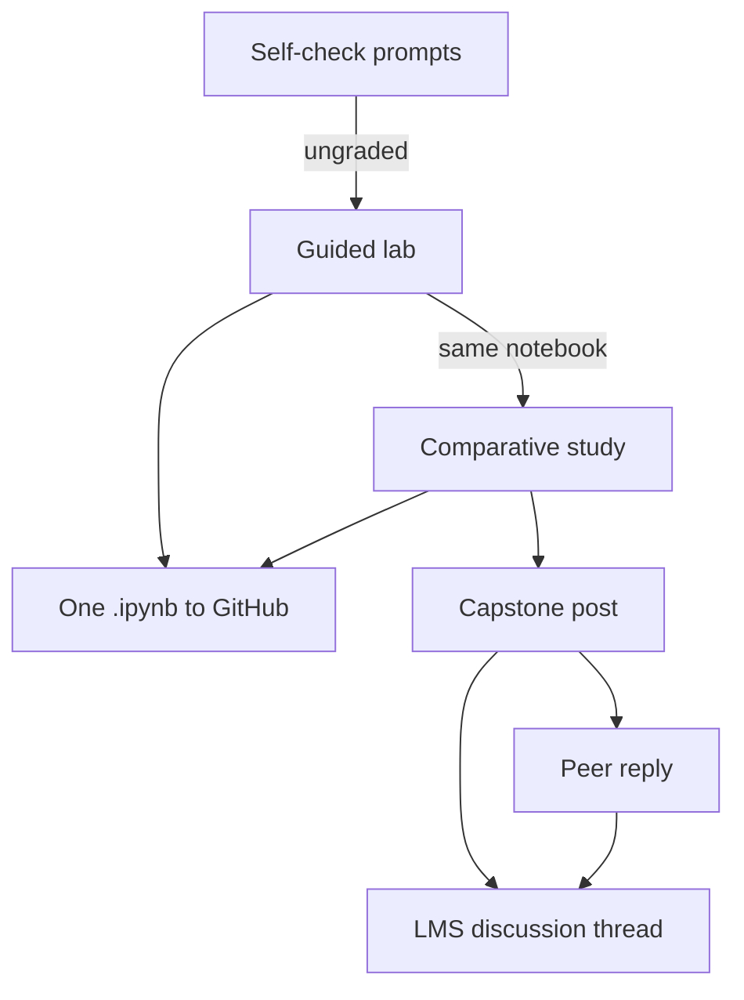

# Module 5 Activities

The Module 5 activities in order, and the two channels their work is submitted through — note that the guided lab and the comparative study share one notebook, submitted to GitHub under the same filename.

## Self-Check Prompts

*Estimated time: ~20 minutes*

Before moving on, answer the three prompts in a notes document or on a piece of paper. These won't be submitted or graded, they're meant to help you recall what you've learned. If you're unsure how to answer, revisit the relevant reading before continuing.

#### Prompt 1 - Where a Human Has to Approve

Pick an agent you have built or proposed in this course and find its riskiest action — the one that would be hardest to undo. Would you let it run unattended? If not, what does the reviewer need to see in order to approve it responsibly? ("The agent's final answer" is usually not enough.)

#### Prompt 2 - What the Trace Tells You That the Output Doesn't

Your agent returns a correct answer, but it takes 40 seconds and costs four times what you expected. The final output alone cannot tell you why. Name three specific things you would look for in the trace, and what each one would point to as the cause.

#### Prompt 3 - Why One Metric Isn't Enough

Describe a change to an agent that would improve one evaluation dimension while making another worse. Use two of the six dimensions (task accuracy, safety, resource efficiency, robustness, fairness, observability) and be concrete about the change. Then say which dimension you would protect with an automated test, and which one you would not trust a test to judge.

## Guided Lab Exercise — LangSmith Observability

*Estimated time: ~60 minutes*

!!! warning "Platform setup — read before starting"

    All lab work runs in Google Colab (free tier). You do not need a paid subscription. You will need: (1) a Google account to access Colab; (2) a free LangSmith account at [smith.langchain.com](https://smith.langchain.com){target=_blank} for observability tracing; (3) an Nvidia, Groq, or OpenAI API key for the LLM provider, or a locally hosted Ollama model as a free alternative — setup instructions are included in the notebook.

In this lab, you will instrument a two-tool agent with LangSmith tracing, run it on 10 test prompts spanning five categories (factual, calculation, multi-step, format and safety), and explore what the resulting traces reveal about how your agent actually behaves. The agent's search tool returns simulated results so that every run is reproducible; the notebook shows how to switch to a live DuckDuckGo search if you want one.

**Open the lab notebook:** [Module5_Learner_Starter.ipynb](lab-notebook.md)

### Guided lab notebook flow

The notebook walks you through a complete observability instrumentation sequence:

1. Build a ReAct agent with two tools, search and a calculator, using LangChain's `create_agent`, which runs on LangGraph.
2. Configure LangSmith tracing and verify traces appear in your dashboard.
3. Execute the agent on the 10 test prompts with structured metadata tags for filtering.
4. Compute observability metrics (latency distribution, token consumption, error rate) from trace data.
5. Interpret what the metrics and traces reveal about how your agent behaves.

All detailed instructions, code scaffolding, and reflection questions are embedded directly in the notebook.

!!! info "What to submit"

    **Add to github**: Submit the `.ipynb` file with Lab A complete — all cells executed with output visible, and all 10 traces confirmed in LangSmith. Filename: `Module5_Lab_[YourName].ipynb`.

## Hands-On Project: Comparative Observability Study

*Estimated time: ~2 hours*

In this project, you will continue in the same notebook from the guided lab to design and execute a controlled experiment comparing 2–3 agent configurations on the same prompts, then write an evidence-based recommendation report.

### Project notebook flow

The notebook walks you through a comparative observability study:

1. Define a hypothesis and experimental conditions — pick one variable to test (e.g., system prompt detail level, model choice, or tool availability) while keeping everything else constant.
2. Run each configuration on the same 10 test prompts from the guided lab, collecting traces and metrics for each condition.
3. Compute comparative metrics (average latency, p90 latency, average output length, success rate) across conditions.
4. Write a Recommendation Report with a trade-off analysis specifying which configuration to deploy under which conditions.

Detailed instructions are embedded directly in the notebook.

!!! info "What to submit"

    **Add to github**: Submit the completed `.ipynb` file (guided lab + hands-on project) with all cells executed and output visible. Your Comparative Observability Report must include: hypothesis, results table, analysis (minimum 200 words), and a deployment recommendation with trade-off matrix. Filename: `Module5_Lab_[YourName].ipynb`.

## Peer Discussion: Capstone — Responsible Deployment Plan

You have been carrying one agent system through the discussion posts since Module 2. In this final post, revise that design with what you now know and add a plan for deploying it responsibly.

### Part A: Discussion Post

Post to the Module 5 Discussion Forum addressing all four sections.

**Section 1 — Revised Design**

Restate your agent system in a few sentences: what it does, who uses it, what it produces. Then name two things you would change about your earlier design, and what you learned that changed your mind — your Module 3 or 4 results, the framework trade-offs from Chapter 2, or what the lab traces showed you. If nothing changed, defend your design against one alternative you rejected.

**Section 2 — Open Questions about Deployment**

Deployment is its own discipline, and this module only opened the door to it. So rather than a deployment plan, give us the questions you would still need answered — two or three of them, with where you would go to find each answer.

Aim for questions whose answers would change your design, not ones a tutorial would settle. Two examples: "Would my organization allow prompt content to leave its network, or do I need self-hosted observability?" and "How often does my source data change, and who is responsible for re-indexing it when it does?"

**Section 3 — Risk and Governance**

* Which EU AI Act tier does your system fall in? Justify it in two sentences, citing the criterion — and remember the tier depends on what your agent's output affects, not how it's built.
* Name your three biggest risks, using the NIST RMF functions (Govern, Map, Measure, Manage) as a checklist. For each: who is affected, how bad it would be, and one specific mitigation. "Add monitoring" is too vague to count.

**Section 4 — Oversight and Gates**

* **Where a human approves.** List the actions your agent takes that are hard to undo. Which need sign-off, and which would you automate? For the gated ones, what does the reviewer need to see to approve responsibly?
* **How you'd build it.** Name the mechanism — LangGraph's `interrupt()`, CrewAI's `@human_feedback`, or a custom gate — and whether your framework makes this easy.
* **What gets tested automatically.** Which evaluation dimensions would you gate on before a change ships, and what result blocks a deploy? Note anything a test can't judge for you.

### Part B: Peer Response

Reply to at least one classmate's post with something they could use. Things worth thinking about as you read:

* **Their risk tier.** Would you have classified it the same way? If your deployment context differs from theirs, say how that changes your read.
* **Their oversight decisions.** Where they chose to automate or gate an action, does that match your instinct? If you'd draw the line elsewhere, explain what you'd be worried about.
* **Their gates and tests.** Do the tests they described connect to the risks they named? If a risk seems hard to test for, that's worth naming — you may not have a solution, and that's fine.
* **Their open questions.** If you know something about one of them, or have faced it yourself, share what you learned.

A useful reply gives them something specific to think about. "Great post, I agree" doesn't.

!!! info "What to submit"

    **Discussion Initial Post**: submitted in the LMS Discussion thread. Addresses all four sections. No file attachment needed.

    **Peer Reply**: substantive engagement (≥100 words) with at least one classmate's system design, governance analysis, or oversight plan.

Migrated from the [course wiki](https://github.com/UA-AI2S/AI-Automation-and-Agents-v2/wiki/Module-5:-Activities){target=_blank} (wiki page last changed 2026-08-19). Spotted a problem? [Edit this page](https://github.com/tyson-swetnam/AI-Automation-and-Agents/edit/main/docs/modules/module-5/activities.md){target=_blank}.

