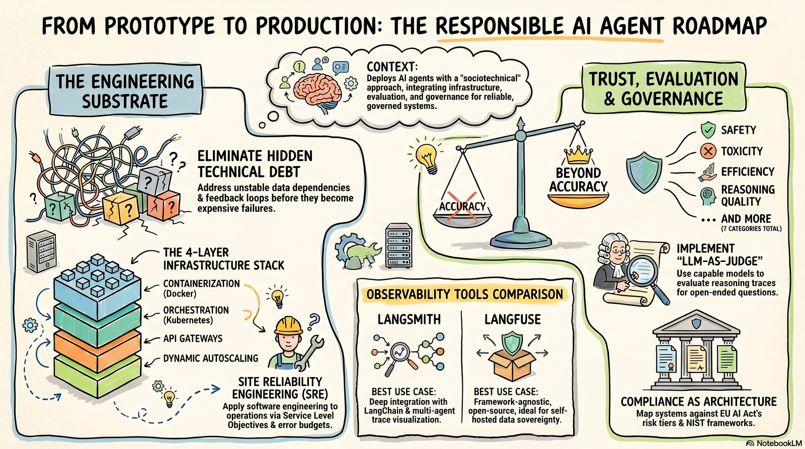

# Module 5: Foundational Concepts

{ width="900" }

## Chapter 1: From Prototype to Production

### Chapter 1 Lesson

#### Hidden Technical Debt in Agent Systems

Sculley et al. (2015) identified a problem often learned the hard way: machine learning systems accumulate hidden technical debt that only becomes visible under production conditions. They categorized five types of debt, and while their framework predates LLM agents, each category still applies to agent systems:

**Entanglement.** Changing one component unexpectedly affects behavior elsewhere.
- **In agent systems:** You tweak one agent's system prompt, and a downstream agent that parses its output starts failing because the output format shifted subtly.
- **How to prevent it:** Define explicit output schemas between agents so changes are caught by validation before they cascade.

**Unstable data dependencies.** Upstream data changes silently corrupt behavior.
- **In agent systems:** Your RAG pipeline's retrieval quality degrades because the vector store was re-indexed with different chunking parameters.
- **How to prevent it:** Run automated retrieval quality checks after any data source update.

**Feedback loops.** A deployed system's outputs influence its future inputs.
- **In agent systems:** One agent writes a result to shared state, and a later agent reads it as ground truth without verifying it. If that first result was wrong, the error propagates forward and compounds.
- **How to prevent it:** Tag agent-generated content so it can be distinguished from original sources, and validate before reuse.

**Configuration debt.** Undocumented parameters make systems brittle.
- **In agent systems:** Prompts, temperature settings, tool configurations, and model version selections are scattered across multiple files with no versioning, no tests, and no single source of truth.
- **How to prevent it:** Store all configuration in a single versioned location and require changes to go through the same review process as code.

**Undeclared consumers.** Downstream systems depend on outputs without being tracked.
- **In agent systems:** You change your agent's output format and discover that other processes were parsing that output. If the dependency isn't documented, there's no way to know the change will break anything until it does.
- **How to prevent it:** Version your agent's output schema and document what depends on it.

#### What a Production Stack Looks Like

Serving real users introduces problems that don't exist in a notebook: handling concurrent requests, recovering from crashes, managing credentials securely, and scaling up or down based on demand. The following layers address these:

| Layer | What it does | Why it matters for agents |
|---|---|---|
| **Containerization** (Docker) | Packages your agent and its dependencies into a portable image that runs identically everywhere | Ensures consistent behavior across development, staging, and production environments |
| **Orchestration** (Kubernetes) | Manages multiple container instances: starts them, scales them up/down, restarts crashed ones | Agent workloads have unpredictable demand; orchestration absorbs traffic spikes and restarts failed instances automatically |
| **API Gateway** | Sits in front of your agent service, handling auth, rate limiting, routing, and SSL | Centralizes security and traffic management outside of agent application code |
| **Secrets Management** (Vault, AWS Secrets Manager) | Stores API keys, model credentials, and database passwords securely | Agent systems typically require multiple API keys; centralized secrets management prevents credential exposure |
| **Autoscaling** | Dynamically adjusts the number of running instances based on demand | Reduces cost during low traffic while maintaining capacity during peaks |

Understanding what these layers do helps you (1) design your agent in ways that are container-friendly (stateless, configurable via environment variables), (2) choose the right managed services for your deployment, and (3) identify when a production failure is an infrastructure problem vs. an agent logic problem.

**Assigned Reading**

- [The Agent Development Lifecycle (Article)](https://www.langchain.com/blog/the-agent-development-lifecycle){target=_blank}. LangChain.

### Learning Resources

- [Sculley et al. (2015) — Hidden Technical Debt in ML Systems](https://proceedings.neurips.cc/paper_files/paper/2015/file/86df7dcfd896fcaf2674f757a2463eba-Paper.pdf){target=_blank}
- [Docker Getting Started Guide](https://docs.docker.com/get-started/){target=_blank}
- [The Agent Development Lifecycle (Harrison Chase)](https://www.youtube.com/watch?v=ZUjijNrg5sQ){target=_blank}: LangChain's founder walks through what production agent deployment  involves (~45 min).

### Chapter 1 Quiz

[Take the Chapter 1 quiz](chapter-quizzes.md#chapter-1-quiz){ .md-button }

## Chapter 2: Evaluating AI Agents

### Chapter 2 Lesson

An agent that passes your test cases may still fail in production. It might be slow, expensive, unreliable on unexpected inputs, or biased in ways that accuracy alone cannot capture.

#### No Single Metric Is Enough

Liang et al. (2022) demonstrated this with HELM (Holistic Evaluation of Language Models). Models that rank highly on accuracy often rank poorly on robustness or efficiency. No single model dominates across all dimensions, and the same applies to agent systems. Optimizing for one metric often degrades another.

These are the key dimensions agent systems can be evaluated on:

| Dimension | What it measures | Example failure |
|---|---|---|
| **Task accuracy** | Does the agent produce correct outputs? | Agent answers questions wrong 8% of the time |
| **Safety & alignment** | Does the agent refuse harmful requests and stay within bounds? | Agent follows injected instructions from user input |
| **Resource efficiency** | Token cost, latency, API calls per task | Agent uses $0.40/query when $0.05 is achievable |
| **Robustness** | Performance under unexpected or adversarial inputs | Agent crashes on multilingual input it wasn't tested on |
| **Fairness & bias** | Consistent performance across demographic groups | Agent approves loans at different rates by zipcode |
| **Observability** | Can you diagnose failures when they happen? | Agent fails silently with no trace, no error, just wrong output |

#### LLM-as-Judge

Many agent output dimensions (reasoning quality, factual grounding, response coherence) have no single correct answer you can match against. LLM-as-judge methodology uses a capable language model to evaluate the agent's outputs against explicit criteria.

It requires careful judge prompt design, clear rubrics for each dimension, and validation by comparing judge scores against a sample of human-labeled outputs. It scales evaluation of subjective dimensions, but is limited by the judge model's own biases and blind spots. Human review is still necessary for dimensions like tone and reasoning quality that even judge models struggle to assess reliably.

#### CI/CD for Agents

Every prompt change, tool update, or model version swap should trigger your evaluation suite automatically. If the new version fails on any dimension, the deployment is blocked.

This is the same CI/CD discipline that software engineering applies to code changes, extended to agent-specific dimensions. On every commit, the pipeline runs the evaluation suite, checks results against defined thresholds, and either deploys or blocks the release. Prompt changes are code changes and should be treated that way.

### Learning Resources

- [Liang et al. (2022) — Holistic Evaluation of Language Models (HELM)](https://arxiv.org/abs/2211.09110){target=_blank}: The benchmark framework for multi-dimensional evaluation. Read Sections 1–3 for evaluation philosophy and metrics taxonomy.
- [Chang et al. (2024) — A Survey on Evaluation of Large Language Models](https://dl.acm.org/doi/pdf/10.1145/3641289){target=_blank}: Comprehensive survey contextualizing HELM within the broader evaluation literature. Section 4 covers benchmark limitations.

### Chapter 2 Quiz

[Take the Chapter 2 quiz](chapter-quizzes.md#chapter-2-quiz){ .md-button }

## Chapter 3: Observability

### Chapter 3 Lesson

Observability is what lets you see what your agent actually did, step by step, so you can diagnose failures and verify behavior before approving actions.

#### Classical Signals and Agent-Specific Signals

Traditional software observability rests on three pillars:

- **Logs** record discrete timestamped events
- **Metrics** track numeric measurements over time (latency, error rate, throughput)
- **Traces** follow a single request's journey through all system components

Agent systems need all three, plus signals that traditional software does not produce:

- Prompt content and length sent to the LLM
- The model's reasoning trace and tool calls
- Inter-agent messages in multi-agent systems
- Token consumption per invocation
- Retrieval context and relevance scores (for RAG agents)

Without these agent-specific signals, a trace can tell you a request was slow but cannot tell you *why*. Was the prompt 12,000 tokens? Did the retrieval step return irrelevant documents? Did the model make six tool calls when one would have been sufficient?

#### LangSmith vs. LangFuse

LangSmith and LangFuse are observability platforms built specifically for LLM applications. Both capture the full agent execution trace (prompt content, model response, tool calls, sub-agent invocations, retrieved context, final output) and expose it through dashboards for debugging and trend analysis.

**LangSmith** integrates natively with LangChain/LangGraph. If you are using those frameworks (as in Modules 2–4), tracing works with minimal configuration. It is a hosted service.

**LangFuse** is open-source and framework-agnostic. It supports self-hosting, which matters when data sovereignty requirements prohibit sending prompt content to third-party services.

#### OpenTelemetry (OTel)

OpenTelemetry is a vendor-neutral instrumentation standard. Instead of writing instrumentation code specific to LangSmith or LangFuse, you instrument once with the OTel SDK and route trace data to any compatible backend (LangSmith, LangFuse, Datadog, Grafana, Prometheus). If you later switch platforms, you change the routing configuration, not your application code.

#### What to Monitor

These are the signals that indicate something is going wrong in a production agent system. For any system serving real users, set up automated alerts on these rather than relying on manual dashboard checks.

1. **Error rate spike.** Sudden increase in failed requests or tool call errors.
2. **Token cost anomaly.** Unexpected spend increase, often indicating runaway loops or prompts that have grown too large (e.g., unbounded conversation history or too many retrieved chunks).
3. **Retrieval quality degradation.** For RAG agents, if relevance scores on retrieved documents start dropping, it usually means the underlying data changed (re-indexed, deleted, or corrupted) and the retrieval pipeline is now returning less useful context.
4. **Safety or guardrail violations.** The agent produces outputs that violate its defined constraints, such as following injected instructions, leaking system prompt content, or acting outside its allowed scope. This is covered more in Chapter 4.
5. **Tool call failure rate.** A specific tool starts failing (API down, credentials expired, rate limited) but the agent still returns output by working around it. The response looks normal but is missing data the agent was supposed to retrieve.
6. **Latency above target.** Agent response time consistently exceeds what users or downstream systems expect. Often a symptom of the other issues above (runaway loops, excessive tool calls) rather than a root cause itself.

**Assigned Reading**

- [LangSmith Observability Quickstart](https://docs.langchain.com/langsmith/observability-quickstart){target=_blank}: Short guide on setting up tracing in LangSmith.

### Learning Resources

- [LangSmith Documentation](https://docs.smith.langchain.com/){target=_blank}: Setup guides for tracing LangGraph and LangChain agents.
- [LangFuse GitHub](https://github.com/langfuse/langfuse){target=_blank}: Open-source LLM observability. Includes self-hosting guide.
- [OpenTelemetry Getting Started](https://opentelemetry.io/docs/getting-started/){target=_blank}: Vendor-neutral instrumentation for any language and any backend.

### Chapter 3 Quiz

[Take the Chapter 3 quiz](chapter-quizzes.md#chapter-3-quiz){ .md-button }

## Chapter 4: Security Risks for LLM Applications — The OWASP Top 10

### Chapter 4 Lesson

LLM-powered systems accept user input, call external tools, retrieve documents from vector stores, and pass outputs to downstream systems. Each of these capabilities is also an attack surface. The OWASP Top 10 for LLM Applications (2026) catalogs the most critical security risks specific to these systems.

This chapter covers these risks with concrete mitigations you can apply to agent architectures.

#### The OWASP Top 10 for LLM Applications (2026)

| # | Risk | Description |
|---|---|---|
| **LLM01** | Prompt Injection | Input to an LLM (user messages, retrieved content, tool output, or stored memory) alters the model's behavior in ways the developer did not intend |
| **LLM02** | Sensitive Information Disclosure | An LLM-integrated system exposes confidential, regulated, or proprietary data through a channel the data subject or system owner did not authorize |
| **LLM03** | Excessive Agency | Damaging actions are performed in response to unexpected or manipulated LLM outputs because the system has excessive functionality, permissions, or autonomy |
| **LLM04** | Supply Chain | Components the system depends on (training data, models, adapters, deployment platforms) are compromised, leading to biased outputs, security breaches, or system failures |
| **LLM05** | Data and Model Poisoning | An adversary manipulates training data or model artifacts to embed harmful behavior, bias, or exploitable weaknesses into the AI system |
| **LLM06** | Unbounded Consumption | The application allows excessive inferences, letting attackers disrupt service availability, inflict unsustainable costs, or clone the model through repeated queries |
| **LLM07** | Misinformation | The LLM produces incorrect or misleading information that appears credible enough to influence a human decision, an automated workflow, or an agent action |
| **LLM08** | Hidden Context Exposure | An attacker extracts or reconstructs hidden system instructions or operational context that was not meant to be visible to end users |
| **LLM09** | Vector and Embedding Weaknesses | Attackers exploit how content is converted to numerical representations and retrieved by similarity search, manipulating what the model sees without injecting instructions directly |
| **LLM10** | Improper Output Handling | LLM-generated outputs are passed downstream to other components without sufficient validation or sanitization, enabling injection into those systems |

#### The OWASP Top 10 for Agentic Applications (2026)

The LLM Top 10 covers risks for any LLM-powered application. The Agentic Top 10 extends this to autonomous agents — systems that plan, use tools, maintain memory, and coordinate with other agents. Where the LLM list focuses on model-level vulnerabilities, the Agentic list focuses on how autonomy, delegation, and multi-step execution amplify those risks.

| # | Risk | Description |
|---|---|---|
| **ASI01** | Agent Goal Hijack | An attacker redirects what the agent is trying to do, changing its goals, task priorities, or decisions via prompt injection, fake tool outputs, or poisoned data |
| **ASI02** | Tool Misuse & Exploitation | The agent uses its own tools in harmful ways (exfiltrating data, hijacking workflows, exhausting resources) because of injected instructions or ambiguous delegation |
| **ASI03** | Identity & Privilege Abuse | An attacker escalates access by exploiting how agents inherit roles, delegate to each other, or carry credentials across systems |
| **ASI04** | Agentic Supply Chain Vulnerabilities | Third-party components the agent relies on (MCP servers, plugins, agent cards) may be malicious, compromised, or tampered with before they reach the agent |
| **ASI05** | Unexpected Code Execution (RCE) | Code-generation features or tool access are exploited to run arbitrary code on the host system, turning a language task into full system compromise |
| **ASI06** | Memory & Context Poisoning | An attacker plants false or malicious data in the agent's memory or retrieval context, corrupting future reasoning, planning, and tool use |
| **ASI07** | Insecure Inter-Agent Communication | Messages between agents lack authentication or integrity checks, allowing an attacker to intercept, spoof, or alter what agents tell each other |
| **ASI08** | Cascading Failures | One fault (a hallucination, bad input, or corrupted tool result) spreads through a multi-agent system, compounding into widespread harm |
| **ASI09** | Human-Agent Trust Exploitation | An attacker leverages the trust a user places in the agent to manipulate decisions, extract sensitive information, or socially engineer the user |
| **ASI10** | Rogue Agents | An agent deviates from its intended function, acting deceptively, harmfully, or parasitically, either because it was compromised or because it was never trustworthy |

**Assigned Video**

- [OWASP's Top 10 Ways to Attack LLMs: AI Vulnerabilities Exposed](https://www.youtube.com/watch?v=gUNXZMcd2jU){target=_blank} (IBM Technologies). The ordering differs slightly between the 2025 and 2026 lists, but the threats are the same.

### Learning Resources

- [OWASP Top 10 for LLM Applications (2026)](https://genai.owasp.org/resource/owasp-genai-llm-top-10-2026/){target=_blank}: The full reference for model-level risks.
- [OWASP Top 10 for Agentic Applications (2026)](https://genai.owasp.org/resource/owasp-top-10-for-agentic-applications-for-2026/){target=_blank}: Risks specific to autonomous agents.
- [OWASP Agentic AI Threats and Mitigations (2025)](https://genai.owasp.org/resource/agentic-ai-threats-and-mitigations/){target=_blank}: The detailed 17-threat taxonomy that underpins the Agentic Top 10.

### Chapter 4 Quiz

[Take the Chapter 4 quiz](chapter-quizzes.md#chapter-4-quiz){ .md-button }

## Chapter 5: Responsible AI — Governance, Compliance, and Accountability

### Chapter 5 Lesson

"The AI did it" is never a complete answer. When an agent denies a loan, screens out a qualified applicant, or misclassifies a medical image, accountability lands on people and organizations. This chapter covers the frameworks that structure that accountability.

#### NIST AI Risk Management Framework

The National Institute of Standards and Technology (NIST) is the U.S. federal agency that develops measurement standards, guidelines, and best practices across science and technology. Their AI Risk Management Framework (AI RMF 1.0, 2023) provides a structured methodology for managing AI risks, organized as four functions in a continuous cycle.

To make this concrete, consider a claims-processing agent that reviews insurance documents and drafts approval or denial letters:

**Govern:** Establish policies, roles, and accountability. *For the claims agent: designate who owns the agent's risk decisions, require human sign-off on all denials, and define what "out of scope" means for this agent.*

**Map:** Identify the system's intended uses, deployment context, affected populations, and specific risks. *For the claims agent: it affects policyholders financially, could produce biased outcomes by zip code, and has access to sensitive health records.*

**Measure:** Develop metrics and testing protocols that produce evidence about the system's actual risk profile. *For the claims agent: track denial rates by demographic group, measure hallucination rate on document extraction, run adversarial prompt injection tests.*

**Manage:** Implement mitigations based on evidence from Measure. Review effectiveness on an ongoing basis. *For the claims agent: add a confidence threshold below which cases route to a human, retrain quarterly on corrected decisions, maintain an incident log.*

The NIST RMF is guidance, not law. It gives you a methodology for thinking about risk. The EU AI Act, covered next, makes some of that thinking legally required.

#### EU AI Act: Four-Tier Risk Classification

The EU AI Act (2024) is the world's first comprehensive AI regulation. It applies to any AI system deployed in or affecting individuals in the EU, regardless of where the developer is based. Understanding the EU AI Act prepares you for the regulatory direction globally, not just in Europe.

It classifies AI systems into four tiers:

| Tier | Description | Agent example |
|---|---|---|
| **Unacceptable** | Prohibited outright | Social scoring agent that rates citizens based on behavior |
| **High risk** | Strict compliance: conformity assessments, documentation, human oversight, public registration | Agent that screens job applicants or assesses creditworthiness |
| **Limited risk** | Transparency obligations | Customer service chatbot (must disclose it's AI) |
| **Minimal risk** | No specific obligations | Internal code review agent, content summarizer |

Article 14 explicitly requires human oversight mechanisms for high-risk systems. Non-compliance carries fines up to 3% of global annual revenue.

#### Classifying Your Agent

The classification depends on deployment context, not technical architecture. The same LangGraph agent with RAG could be minimal risk or high risk depending on what decisions it informs. Ask four questions:

1. What decisions or recommendations does the agent produce?
2. Do those decisions affect individuals in protected domains (employment, credit, education, health, law enforcement)?
3. What degree of human oversight exists between the agent's output and the impact on individuals?
4. What's the potential harm if the agent produces a materially wrong output?

If the answers to #2 and #4 are "yes" and "significant," you're likely in high-risk territory with mandatory compliance obligations.

#### Human-in-the-Loop

Both the EU AI Act (Article 14) and the NIST RMF (Govern function) require defining where human authority is needed. For high-risk systems, this translates into a concrete technical requirement: the agent must pause at irreversible decision points so a human can approve or reject before the action takes effect.

Human-in-the-loop (HITL) means the agent stops mid-execution, presents the pending action and its reasoning to a reviewer, and resumes only after approval. The key design questions are:

1. **Which actions require a gate?** Any action that is hard to undo (sending a denial letter, filing a legal document, approving a financial transaction).
2. **What does the reviewer need to see?** Not just the final output, but the reasoning trace, the source documents, and the confidence level.
3. **What happens on rejection?** Does the agent retry with different parameters, escalate to a specialist, or terminate the workflow?

For a regulated use case, evaluate HITL support before choosing a framework. Some frameworks (LangGraph, OpenAI Agents SDK, CrewAI Flows) treat approval gates as a first-class primitive. Others (Strands, Google ADK) give you hooks and callbacks but leave the gate for you to build.

#### Governance Artifacts

Four documentation artifacts translate risk assessment into auditable, accountable records:

- **Model cards** (Mitchell et al., 2019): Document the model's intended uses, limitations, evaluation results, demographic performance disparities, and out-of-scope uses.
- **System cards**: Extend model cards to the full system: deployment context, human oversight mechanism, incident response procedure, data provenance chain.
- **Risk registers**: Catalog identified risks, their likelihood, impact, and mitigations. A living document updated as the system evolves.
- **Incident response plans**: What happens when things go wrong. Who gets notified, what gets shut down, how affected users are informed.

These are the artifacts that demonstrate accountability when regulators, auditors, or affected individuals ask "who was responsible and what did you do about it?"

**Assigned Video**

- [AI Governance and the EU AI Act: What Developers Need to Know](https://www.youtube.com/watch?v=GELAXU9XReI){target=_blank} (~15 minutes). Practitioner-oriented overview of the EU AI Act's four-tier risk classification and practical compliance obligations for developers building AI agent systems.

### Learning Resources

- [EU AI Act Full Text (Regulation 2024/1689)](https://eur-lex.europa.eu/legal-content/EN/TXT/?uri=CELEX:32024R1689){target=_blank}
- [NIST AI RMF 1.0](https://nvlpubs.nist.gov/nistpubs/ai/NIST.AI.100-1.pdf){target=_blank}: The full framework document. Read the Core Framework sections on Govern, Map, Measure, and Manage.
- [Mitchell et al. (2019) — Model Cards for Model Reporting](https://dl.acm.org/doi/10.1145/3287560.3287596){target=_blank}: The standard for AI model documentation and transparency.

### Chapter 5 Quiz

[Take the Chapter 5 quiz](chapter-quizzes.md#chapter-5-quiz){ .md-button }

Migrated from the [course wiki](https://github.com/UA-AI2S/AI-Automation-and-Agents-v2/wiki/Module-5:-Foundational-Concepts){target=_blank} (wiki page last changed 2026-08-28). Spotted a problem? [Edit this page](https://github.com/tyson-swetnam/AI-Automation-and-Agents/edit/main/docs/modules/module-5/foundational-concepts.md){target=_blank}.

