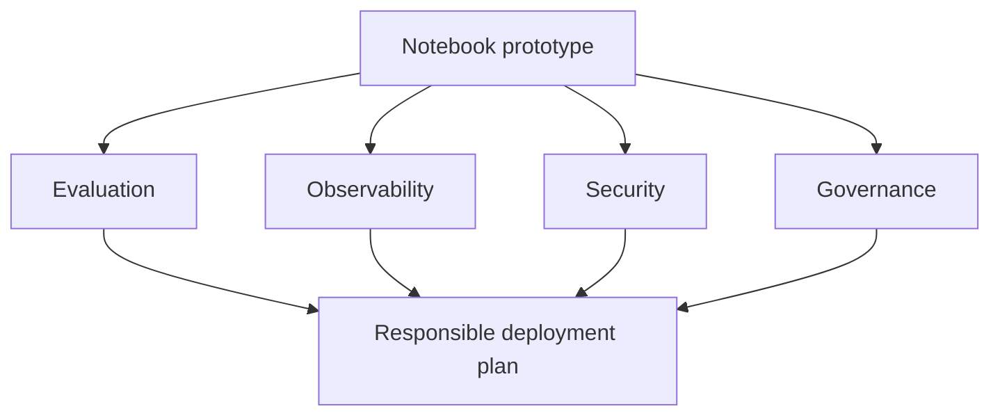

# Module 5 Overview: Responsible Agentic AI

**Time:** 8 hours

Module 5 adds four areas to the notebook agents built earlier in the course, and the capstone folds all four into a single deployment plan.

## Introduction

The agents you built in this course ran in a notebook. Module 5 introduces what is needed to bring an agent to production, focusing on evaluation and responsible AI practices. This is not an all-inclusive guide, but it covers the key areas you need to be aware of.

This module introduces four areas:

- **Evaluation:** Measure whether changes improve or degrade performance across accuracy, cost, safety, and robustness.
- **Observability:** See what your agent did step by step, not just what it returned. Instrument with LangSmith, read traces, diagnose failures.
- **Security:** Identify and mitigate the OWASP Top 10 risks specific to LLM applications — prompt injection, excessive agency, vector store attacks — using the agent architectures you already built as concrete examples.
- **Governance:** Understand how the EU AI Act and NIST AI Risk Management Framework classify and regulate AI systems.

You will instrument a research agent with LangSmith, run a controlled experiment comparing configurations, and complete the course capstone: a discussion where you revisit your agent system design and add the security, oversight, and evaluation plan it would need for responsible deployment.

## Topics Covered

* From prototype to production: hidden technical debt and the production infrastructure stack
* Multi-dimensional agent evaluation: the six dimensions, LLM-as-judge, and CI/CD quality gates
* Agent observability: traces, agent-specific signals, and instrumentation with LangSmith
* Security risks for LLM applications: the OWASP Top 10, prompt injection, excessive agency, and vector store attacks
* Responsible AI governance: EU AI Act risk tiers, NIST AI RMF, governance artifacts, and human-in-the-loop

## Learning Objectives

* **Explain** what changes between a prototype agent and a production deployment, and what each infrastructure layer solves
* **Evaluate** an agent across the six evaluation dimensions and identify where automated metrics fall short
* **Instrument** a LangGraph agent with LangSmith tracing and analyze latency, token, and error data from real traces
* **Identify** OWASP Top 10 LLM security risks in an agent system and specify layered mitigations for the highest-priority risks
* **Classify** an agent system under the EU AI Act tiers and specify NIST AI RMF mitigations and oversight checkpoints

## Module 5 Checklist

| Chapter | Type | Primary LOs | Deliverable |
| :--: | :-- | :-- | :-- |
| **1** | From Prototype to Production — What Changes and Why | LO 1 | Chapter 1 Quiz |
| **2** | Evaluating AI Agents — Beyond "Does It Work?" | LO 2 | Chapter 2 Quiz |
| **3** | Observability — Seeing Inside Your Running Agent | LO 3 | Chapter 3 Quiz |
| **4** | Security Risks for LLM Applications — The OWASP Top 10 | LO 4 | Chapter 4 Quiz |
| **5** | Responsible AI — Governance, Compliance, and Accountability | LO 5 | Chapter 5 Quiz |
| **Lab** | Guided Lab Exercise | LO 3 | Colab Notebook: Instrument a research agent with LangSmith + Observability Report |
| **Project** | Hands-On Project | LO 2, 3 | Comparative Observability Study: controlled experiment + deployment recommendation |
| **Discussion** | **Course Capstone:** Responsible Deployment Plan for your own agent system | LO 1–5 | Discussion Post + Peer Reply |

## Grade Weight Summary

!!! info "Grade weight summary"

    Chapter Quizzes (Units 1–5): 100% of module grade — 20% each

    Capstone Discussion Post + Peer Reply: required for certificate — completion only, but this is where the whole course comes together, so give it and your classmates' posts real attention

Migrated from the [course wiki](https://github.com/UA-AI2S/AI-Automation-and-Agents-v2/wiki/Module-5:-Overview){target=_blank} (wiki page last changed 2026-08-28). Spotted a problem? [Edit this page](https://github.com/tyson-swetnam/AI-Automation-and-Agents/edit/main/docs/modules/module-5/overview.md){target=_blank}.

