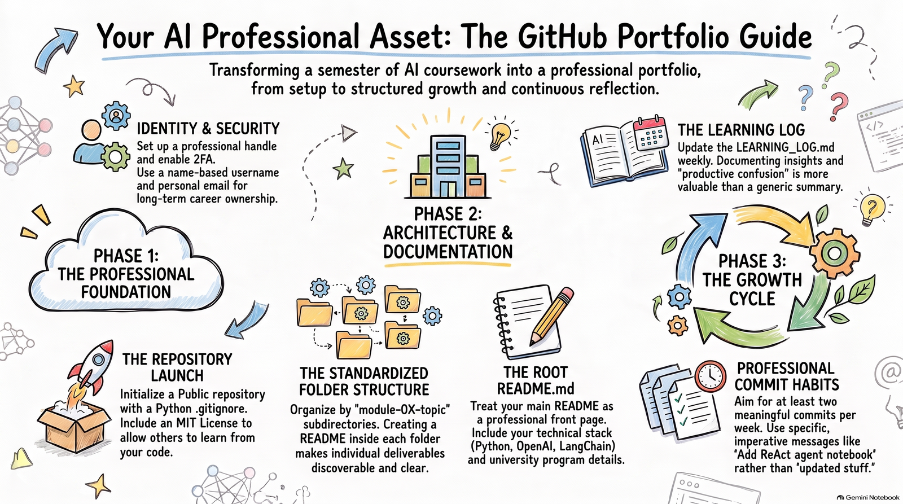

# GitHub Portfolio Setup Guide

{ width="1000" }

---

## Why a GitHub Portfolio?

Throughout this course you will produce a range of learning artifacts — code notebooks, agent configurations, reflection documents, workflow diagrams, and experimental results. A GitHub repository gives you a single, version-controlled, publicly visible home for all of it.

For any student in AI, a portfolio on GitHub is not just an academic requirement — it is a professional asset. Hiring managers and research collaborators routinely review GitHub profiles. A well-organized, consistently updated repository demonstrates initiative, technical fluency, and the ability to communicate complex work clearly.

By the end of this course, your repository will serve as a living record of your growth from foundational concepts through applied multi-agent system design.

## Opening a GitHub Account

If you already have a GitHub account, skip ahead to [Creating Your Course Repository](#creating-your-course-repository). If not, follow these steps to create one. GitHub accounts are free, and the free tier provides everything you need for this course.

!!! note "Note"

    Choose your username carefully — it will appear in every public URL associated with your work (e.g., `github.com/your-username`). Use a professional handle: your name, initials, or a combination thereof. Avoid usernames tied to a current institution in case you change affiliations.

**Step 1 — Navigate to GitHub**

Open your browser and go to [github.com](https://github.com){target=_blank}. Click the **Sign up** button in the top-right corner.

**Step 2 — Enter your email address**

GitHub will send a verification code to this address. Use an email you check regularly — ideally your personal address, since this account will outlast any university enrollment.

**Step 3 — Create a password and choose a username**

Your password must be at least 15 characters, or 8 characters with a mix of character types. After selecting your username, GitHub will confirm its availability in real time.

**Step 4 — Verify your account**

Complete the CAPTCHA puzzle, then check your inbox for the 6-digit verification code and enter it on the next screen.

**Step 5 — Complete the setup survey (optional)**

GitHub will ask about your experience level and intended use. You may fill this in or skip it — it has no effect on your account capabilities.

**Step 6 — Choose the Free plan**

Select **Continue for free**. The free plan includes unlimited public and private repositories and is sufficient for all coursework.

**Step 7 — Complete your profile**

Go to **Settings → Public profile** and add your name, a short bio mentioning your graduate program, and a professional photo. Recruiters and collaborators look at these details.

!!! tip "Tip"

    Enable two-factor authentication (2FA) immediately after account creation. Go to **Settings → Password and authentication → Two-factor authentication** and follow the prompts. This protects your work and is required by many organizations.

## Creating Your Course Repository

A repository (or *repo*) is a project folder on GitHub that tracks every version of every file inside it. You will create one repository for the entire course and organize your work into subdirectories by module.

**Step 1 — Click the + icon → New repository**

After logging in, look for the **+** button near the top-right corner of any GitHub page and select **New repository**.

**Step 2 — Name your repository**

Use a consistent, descriptive name. The recommended convention for this course is:

ai-automation-agents-portfolio

Repository names must use hyphens instead of spaces and should be lowercase.

**Step 3 — Set visibility to Public**

Select **Public** so that anyone can view your portfolio without signing in. This is required for the course and makes your work discoverable by future employers.

**Step 4 — Initialize with a README**

Check the box labeled **Add a README file**. This creates the repository's root `README.md` and establishes the `main` branch. Without this, you must initialize the repo locally, which is a more involved process.

**Step 5 — Add a .gitignore and license (recommended)**

From the **Add .gitignore** dropdown, select **Python** (or the language most relevant to your work). For the license, **MIT** is a standard open-source choice that allows others to learn from your code while preserving your attribution.

**Step 6 — Click Create repository**

Your repository is now live at `github.com/your-username/ai-automation-agents-portfolio`. Share this URL with the instructor.

## Repository Structure

A consistent folder structure makes your portfolio easy to navigate and signals professional organization habits. The minimum required structure for this course is shown below. Each module directory maps to a unit of the course, and the learning log lives at the root level for easy access.

```text
ai-automation-agents-portfolio/
│  
├── README.md                    ← Portfolio overview (required) 
├── LEARNING_LOG.md              ← Running record of reflections (required)   
├── .gitignore                   ← Files Git should not track  
├── LICENSE                      ← Open-source license (MIT recommended)   
│ 
├── module-01-introduction/  
│   └── README.md                ← Module summary & deliverables list   
│ 
├── module-02-agent-reasoning-architectures/  
│   └── README.md 
│ 
├── module-03-agents-memory/ 
│   └── README.md 
│ 
├── module-04-multi-agent-systems/ 
│   └── README.md  
│
├── module-05-responsible-agentic-ai/ 
│   └── README.md 


```

!!! note "Note"

    As you progress through the course, add your actual deliverables — notebooks, scripts, reports, diagrams — inside the corresponding module directory. The structure above shows the minimum skeleton to set up on Day 1.

### Creating directories on GitHub.com

GitHub does not allow you to create empty folders directly. The simplest approach is to create the module `README.md` files one by one:

**Step 1 — Click Add file → Create new file**

From your repository's main page, use the **Add file** dropdown.

**Step 2 — Type the path including the directory name**

In the filename field, type `module-01-introduction/README.md`. GitHub recognizes the slash as a directory separator and creates the folder automatically.

**Step 3 — Add a placeholder, then commit**

Enter a line such as `# Module 01 — Introduction` in the editor, scroll down, and click **Commit new file**. Repeat for each module.

## Writing Your README.md

The root `README.md` is the front page of your portfolio. When someone visits your repository, this is the first thing they read. It should concisely describe who you are, what this portfolio contains, and how to navigate it.

Replace every placeholder in the template below with your own information before the first week of class is over.

```markdown
# AI Automation and Agents — Digital Portfolio

**Student:** Your Full Name

**Program:** AZ Online

**Date:** Fall 2026

**Instructors:** Name1, Name2, ...

---

## About This Portfolio

This repository documents my learning journey through the graduate course

AI Automation and Agents. It contains notebooks, scripts, reflections,

and project deliverables organized by module.

---

## Repository Structure

| Directory | Description |
|---|---|
| `module-01-introduction/` | Foundations of AI agents; environment setup |
| `module-02-agent-reasoning-architectures/` | How how an agent actually reasons and acts|
| `module-03-agents-memory/` | Design, implementation, and evaluation of memory architectures  |
| `module-04-multi-agent-systems/` | Design, implementation, and evaluation of multi-agent systems (MAS)  |
| `module-05-responsible-agentic-ai/` | Requirements for moving agents to production, focusing on evaluation and responsible AI practices |
| `LEARNING_LOG.md` | Chronological log of reflections and insights |

---

## Technical Stack

- Python 3.11+, Jupyter Lab

- OpenAI API, Anthropic API, HuggingFace

- LangChain / LangGraph, CrewAI

---

## Contact

your@email · [LinkedIn URL]
```

!!! tip "Tip"

    Markdown renders automatically on GitHub — no HTML required. Use `#` for headings, `**text**` for bold, backticks for inline code, and triple backticks for code blocks. GitHub's [Markdown guide](https://docs.github.com/en/get-started/writing-on-github/getting-started-with-writing-and-formatting-on-github/basic-writing-and-formatting-syntax){target=_blank} covers all available syntax.

## Setting Up Module Directories

Each module directory should contain its own `README.md` that serves as an index for everything you produce during that unit. As you add deliverables, link to them from this file. Below is a template for a module README.

```markdown
# Module 01 — Introduction to AI Agents

**Status:** In Progress · **Completed:** YYYY-MM-DD

---

## Learning Objectives

- Understand the definition and taxonomy of AI agents

- Distinguish reactive, deliberative, and hybrid agent architectures

- Configure a local development environment for agent experiments

---

## Deliverables

| File | Type | Description |
|---|---|---|
| `environment_setup.ipynb` | Notebook | API keys, dependencies, smoke tests |
| `agent_taxonomy_notes.md` | Notes | Annotated reading notes on agent types |
| `reflection.md` | Reflection | Personal reflection on module concepts |

---

## Key Concepts Encountered

- Rational agent model (Russell & Norvig, Ch. 2)

- PEAS framework (Performance, Environment, Actuators, Sensors)

- Tool use as the foundation of agentic behavior

---

## Questions & Open Problems

- How does memory granularity affect long-horizon task performance?

- What evaluation metrics best capture agent reliability?
```

Update the module README as you add files. A well-maintained module README makes your portfolio readable to someone who has never seen the course syllabus.

## The Learning Log

The `LEARNING_LOG.md` is a chronological journal at the root of your repository. Unlike the module READMEs — which are structured indexes — the learning log is a personal, reflective record. It documents *how* your thinking evolves over the course, not just what you produced.

Make at least one entry per week, ideally after each class session or significant work session. Entries do not need to be long; two to four paragraphs of honest reflection are more valuable than a lengthy but generic summary.

```markdown
# Learning Log — AI Automation and Agents

Student: Your Name

Repository: https://github.com/username/ai-automation-agents-portfolio

---

## Entry Template

Copy and paste the block below for each new entry.

Entries are ordered newest-first (prepend each new entry at the top).

---

### Week N · YYYY-MM-DD

**Module:** Module N — Topic Name

**Activity:** Brief description of what you worked on

#### What I did

Describe the tasks, experiments, or readings you engaged with this session.

Be specific — mention tool names, datasets, and code outcomes.

#### What I learned

Articulate the key insight or skill you gained. Connect it to prior knowledge

where possible. What surprised you? What confirmed your expectations?

#### What I struggled with

Describe any technical or conceptual obstacles you encountered.

How did you attempt to resolve them? What remains unresolved?

#### Next steps

What will you do before the next session to deepen or extend this learning?
```

!!! note "Note"

    The learning log is assessed on **regularity and depth of reflection**, not length. A log that shows genuine intellectual engagement — including productive confusion — is far more valuable than a polished summary that conceals your actual reasoning process.

## Maintaining Your Portfolio

A portfolio that is updated only at deadlines tells a weaker story than one with a continuous commit history. Aim to commit at least twice per week. Each commit is a timestamped record of progress visible on your GitHub profile's contribution graph.

### Editing files directly on GitHub.com

For Markdown files (README, learning log, notes), the simplest workflow is to edit directly in your browser. Navigate to any `.md` file and click the **pencil icon** to open the editor. When done, scroll down, write a short commit message, and click **Commit changes**.

### Uploading files from your computer

To add a completed notebook, script, or output file, navigate to the appropriate module directory on GitHub and use **Add file → Upload files**. Drag your files into the drop zone and commit.

### Writing good commit messages

A commit message is a one-line description of what changed and why. Use the imperative mood and keep it under 72 characters:

```text
# Good — specific, imperative, informative

Add ReAct agent notebook for Module 05 activity 3

Update learning log: Week 4 reflection on memory mechanisms

Fix API key loading in environment_setup.ipynb

# Poor — vague, past tense, or uninformative

updated stuff

final version

changes
```

### Using Git locally (optional, recommended)

For more complex work — running code, managing multiple files, using Jupyter — installing Git locally and cloning your repository gives you a faster workflow:

```bash
# Clone your repository to your local machine (run once)

git clone https://github.com/your-username/ai-automation-agents-portfolio.git

# Navigate into the project folder

cd ai-automation-agents-portfolio

# After making changes, stage and commit

git add .

git commit -m "Add prompt engineering experiments for Module 03"

# Push your commits to GitHub

git push origin main
```

!!! tip "Tip"

    Install the [GitHub CLI](https://cli.github.com/){target=_blank} (`gh`) to authenticate securely and manage your repo from the terminal without managing SSH keys manually. Run `gh auth login` once and you are set.

## Quick Reference & Resources

### Checklist — Day 1 Setup

- [ ] GitHub account created with a professional username  
- [ ] Two-factor authentication (2FA) enabled  
- [ ] Public profile completed (name, bio, photo)  
- [ ] Repository `ai-automation-agents-portfolio` created (Public)  
- [ ] Root `README.md` filled in with your personal information  
- [ ] `LEARNING_LOG.md` created with Week 1 entry  
- [ ] All seven module directories created with stub `README.md` files  
- [ ] Repository URL submitted to the instructor

### Naming Conventions

```text
# Repository name

ai-automation-agents-portfolio        # lowercase, hyphens only

# Module directories

module-01-introduction/               # zero-padded number + slug

module-02-llm-foundations/

# Deliverable files

week3_react_agent_experiment.ipynb    # descriptive, no spaces

module05_reflection.md

agent_evaluation_results.csv

# Avoid

Final Version (2).ipynb               # spaces, ambiguous versioning

Untitled.ipynb                        # non-descriptive
```

### Essential Documentation

- [GitHub Getting Started Guide](https://docs.github.com/en/get-started){target=_blank} — official onboarding documentation covering account setup, repositories, and basic Git.  
- [GitHub Markdown Syntax Reference](https://docs.github.com/en/get-started/writing-on-github/getting-started-with-writing-and-formatting-on-github/basic-writing-and-formatting-syntax){target=_blank} — all formatting options available in README and log files.  
- [Pro Git (free book)](https://git-scm.com/book/en/v2){target=_blank} — the definitive reference for Git version control; Chapters 1–3 cover everything needed for this course.  
- [GitHub CLI Manual](https://cli.github.com/manual/){target=_blank} — command-line interface for managing repositories without leaving your terminal.

<p class="course-provenance" markdown>Migrated from the [course wiki](https://github.com/UA-AI2S/AI-Automation-and-Agents-v2/wiki/Github-Portfolio-Tutorial){target=_blank} (wiki page last changed 2026-09-02). Spotted a problem? [Edit this page](https://github.com/tyson-swetnam/AI-Automation-and-Agents/edit/main/docs/start-here/github-portfolio-setup.md){target=_blank}.</p>
