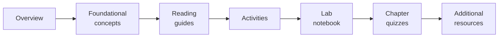

# How this course works

*AI Automation and Agents* is Course 2 of the University of Arizona AI Education
Series: five self-paced modules of about eight hours each (40 hours in total),
offered as non-credit professional development with optional instructor-led
cohort sessions. Every module has the same shape, so once you have worked
through Module 1 you know how the other four will go. This page explains that
shape, how your time is budgeted, what is graded, and which tools you will need.

!!! tip "Do the diagnostic survey before anything else"

    Module 1 opens with a 12-question, ungraded
    [Diagnostic Knowledge Survey](../modules/module-1/diagnostic-survey.md)
    (about 10 minutes). Complete it *before* you read anything: its purpose is
    to capture your current mental models, and its last question seeds the
    Workflow Audit described below.

## The learner path in every module

Work through the pages of a module in this order. The navigation sidebar lists
them the same way.

1. **Overview** - the module's introduction, topics, learning objectives, a
   checklist table of chapters and deliverables with time estimates, and the
   *Grade weight summary* for that module. Read it first and come back to it
   as your checklist.
2. **Foundational concepts** - the five chapter lessons. Each chapter ends
   with its learning resources and a button to that chapter's quiz.
3. **Reading guides** - structured guides to the readings and videos each
   chapter draws on, with the questions you should be able to answer
   afterwards.
4. **Activities** - self-check prompts, the guided lab instructions, the
   hands-on project with its rubric, and the discussion post and peer reply.
   Follow the *What to submit* boxes.
5. **Lab notebook** (Modules 2-5) - the Colab notebook for the guided lab,
   rendered as a page with an *Open in Colab* button and a download link. See
   [Labs, Colab, and API keys](labs-and-notebooks.md) before your first lab.
   Module 1's two labs (Ollama and Openwork) run on your own computer and are
   described in full on the
   [Module 1 activities page](../modules/module-1/activities.md).
6. **Chapter quizzes** - the five self-evaluating quizzes for the module.
   Answers and feedback are on the page, collapsed under *Show answer and
   feedback*; check them after you have committed to an answer.
7. **Additional resources** (Modules 1-3) - optional further reading and
   tools.

Module 1 has a few extra pages because it is the conceptual foundation: the
[diagnostic survey](../modules/module-1/diagnostic-survey.md), three
**readings** (what an agent is, an automation-and-multi-agent-frameworks
comparison, and a summary of Wooldridge and Jennings' *Intelligent Agents*),
two **worksheets** (the AI agents glossary and the automation paradigms
comparison), and the auto-graded
[Module 1 concept quiz](../modules/module-1/concept-quiz.md).

## Time budget

Plan on **about 8 hours per module, 40 hours for the course**. The learning
design gives every module the same standard activity structure, which is
where those eight hours go:

| Activity type | Bloom's level | Est. hours | What it looks like |
| :-- | :-- | :--: | :-- |
| Reading and video content | L1 - Remember | 1.5 h | Curated readings from official documentation, textbook chapters or research summaries, plus two or three short videos |
| Concept quiz / retrieval check | L1-L2 | 0.5 h | 10-15 auto-graded questions on vocabulary, framework concepts and compare/contrast distinctions |
| Guided lab exercise | L2-L3 - Apply | 2.0 h | A step-by-step walkthrough that replicates a demonstrated workflow (a Colab notebook in Modules 2-5) |
| Hands-on project | L3 - Apply | 2.5 h | An open-ended project anchored to your own Workflow Audit, producing a deliverable |
| Case study / comparative analysis | L4 - Analyze | 1.0 h | A structured written analysis using a provided rubric |
| Discussion / peer review | L2-L4 | 0.5 h | An asynchronous discussion prompt or structured peer review |

Each module overview carries a checklist table with the exact per-chapter
breakdown for that module; the totals differ slightly from module to module.
The time estimates on lesson headings (*Estimated time: ~10 min*) are for the
reading itself, not for the activities.

The course follows a **Bloom's spiral**: Modules 1-2 are weighted toward
Remember and Understand (vocabulary and mental models), Modules 3-4 toward
Understand and Apply (integrating tools and building working agent systems),
and Module 5 toward Apply and Analyze (auditing, evaluating and governing
complete systems). The
[formal learning design](../course-design/learning-design.md) documents the
skills each module develops and the research behind the structure.

## What is assessed, and how it is weighted

Every module uses the same kinds of assessment; the weights differ between
Module 1 and Modules 2-5. Each module overview states its own *Grade weight
summary*; this table summarises the pattern.

| Item | Module 1 | Modules 2-5 |
| :-- | :-- | :-- |
| Chapter quizzes (five per module) | Self-check | **100% of the module grade, 20% each** |
| [Concept quiz](../modules/module-1/concept-quiz.md) (Module 1 only) | Formative: two attempts, best score retained | - |
| Guided lab | Formative: required for your portfolio, not graded numerically | Submit the executed notebook to your GitHub portfolio |
| Hands-on project | **Workflow Audit Project: the primary module grade**, scored with its rubric | Portfolio deliverable described on the activities page |
| Discussion post and peer reply | Completion grade (participation, not content quality) | Required for the certificate; completion only |
| Diagnostic survey | Ungraded baseline | - |

!!! info "Your LMS is authoritative"

    Weights, attempt limits and due dates are configured in the learning
    management system for your cohort. The syllabus (v2.0) states that a
    digital certificate of completion requires completing the module projects
    and passing the concept quizzes at 70% or above, and that learners who
    complete both Course 1 and Course 2 receive the AI Education Series
    professional badge. When this site and your LMS disagree, follow the LMS
    and tell your instructor.

## The Workflow Audit: your anchor artifact

The one deliverable you will keep coming back to is the **Workflow Audit
Project** from Module 1. You identify three repetitive tasks from your own
work or studies, map each one with the Workflow Mapping Template (trigger,
steps, tools, conditional branches, output), score them on two dimensions
(how rule-based the task is and how severe the consequences of an error would
be), rank them by automation potential, and reflect on which automation
paradigm fits your top-ranked task.

Every later module builds on it: Module 2 begins with your top-ranked
workflow, Modules 3 and 4 ask you to design retrieval and multi-agent systems
for your own domain, and the Module 5 capstone discussion asks you for a
responsible deployment plan for your own agent system. The
diagnostic survey's open-ended question ("Name one repetitive task at work or
school that you wish you could hand off") is where the audit starts. Choose
genuine workflows from your practice, not generic examples; the quality of
everything that follows depends on it.

## Tools you will use

The course is deliberately tool-light in Module 1 and introduces frameworks
one at a time afterwards. Nothing requires a paid subscription.

| Tool | Where you use it | Cost |
| :-- | :-- | :-- |
| [Ollama](https://ollama.com/){target=_blank} | Module 1 Lab A (run Llama 3.2 locally); the free provider option in every Colab lab | Free, runs on your computer (about 2-2.5 GB of disk for the model) |
| [Openwork](https://openworklabs.com/){target=_blank} | Module 1 Lab B: a free, open-source local agent interface pointed at your Ollama model | Free |
| [Claude Desktop](https://claude.ai/download){target=_blank} (Chat, Cowork and Code tabs) | Introduced conceptually in Module 1; Cowork can substitute for Openwork in Lab B if you have access to it | Cowork requires a paid Claude plan; optional |
| [Google Colab](https://colab.research.google.com/){target=_blank} | The guided lab notebooks in Modules 2-5 | Free tier is sufficient; needs a Google account |
| [LangChain](https://www.langchain.com/){target=_blank} | Module 2 (ReAct agent with tools) and Module 3 (RAG pipeline with Chroma) | Open source |
| [LangGraph](https://www.langchain.com/langgraph){target=_blank} | Module 4 (three-role pipeline) and Module 5 (instrumented agent) | Open source |
| [CrewAI](https://crewai.com/){target=_blank} | Module 4 (the same pipeline, for a framework comparison) | Open source |
| [LangSmith](https://smith.langchain.com){target=_blank} | Module 5 (tracing and evaluation) | Free account |
| A model provider for the labs | OpenAI, Hugging Face Inference Providers, Groq or NVIDIA API keys, or Ollama locally | Free options exist for every lab; see [Labs, Colab, and API keys](labs-and-notebooks.md) |

### The free-tier path

The syllabus guarantees a **no-cost completion path** using Ollama, Google
Colab and free community tools, and learners who complete every activity that
way are eligible for the same certificate. In practice each Colab notebook
has a free provider option (a local Ollama model, Hugging Face's free tier, or
a small local embedding and generation model), and Module 1's labs use only
free software. The syllabus also names n8n Community Edition as a free
no-code platform; the current Module 1 activities use Openwork for the same
role.

## Your portfolio

Lab notebooks and project deliverables go into a public GitHub repository
named `ai-automation-agents-portfolio`, with one folder per module and a
running learning log. Set it up before your first lab by following
[GitHub portfolio setup](github-portfolio-setup.md). Employers and
collaborators can see it, so keep API keys out of it (the labs page explains
how).

## Where to go next

- Read the [syllabus](syllabus.md) for the course information table and
  learning outcomes, then start with the
  [Module 1 overview](../modules/module-1/overview.md).
- Module overviews: [Module 1](../modules/module-1/overview.md) -
  [Module 2](../modules/module-2/overview.md) -
  [Module 3](../modules/module-3/overview.md) -
  [Module 4](../modules/module-4/overview.md) -
  [Module 5](../modules/module-5/overview.md).
- Before Module 2, read [Labs, Colab, and API keys](labs-and-notebooks.md).
